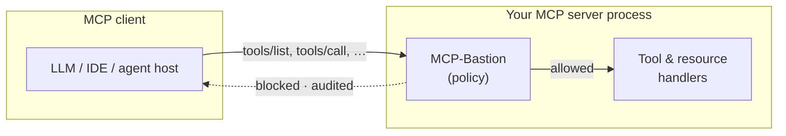
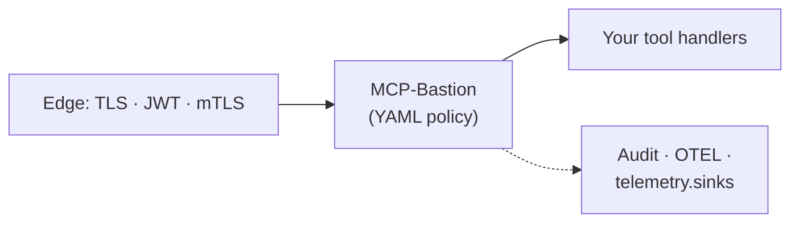
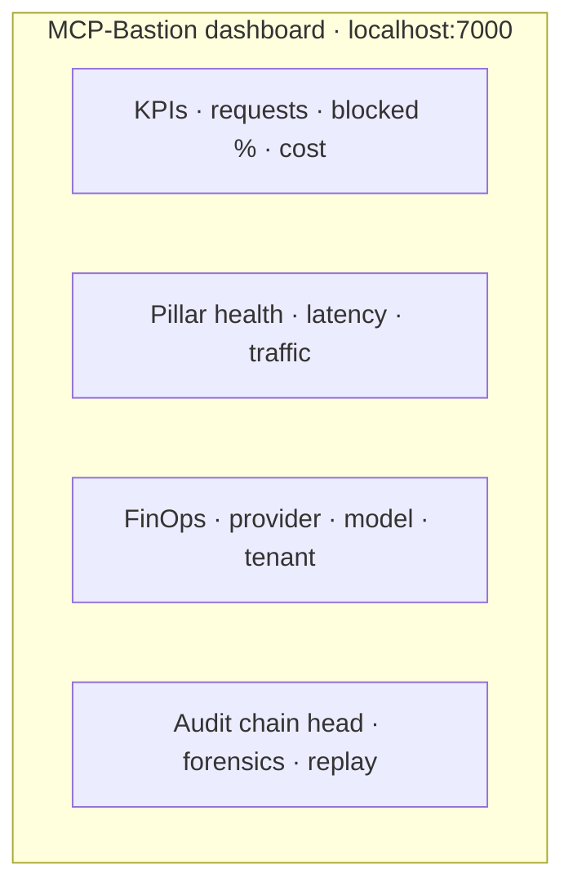
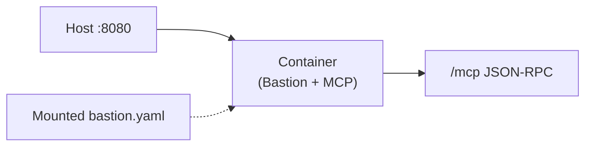
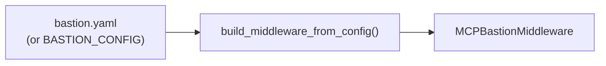
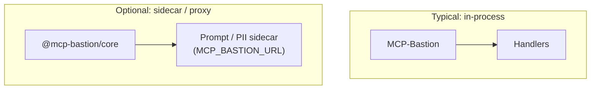
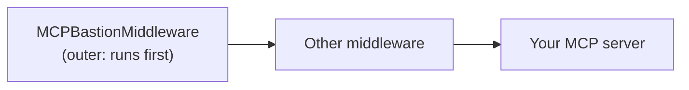

# MCP-Bastion

<!-- mcp-name: io.github.vaquarkhan/mcp-bastion -->

<p align="center">
  
</p>

<p align="center">
  <a href="https://pepy.tech/projects/mcp-bastion-python"></a>
  <a href="https://pypi.org/project/mcp-bastion-python/"></a>
  <a href="https://github.com/vaquarkhan/MCP-Bastion/tree/main/packages/core"></a>
  <a href="LICENSE"></a>
</p>

<p align="center"><strong>One gateway; every tool call screened, metered, and proven.</strong></p>

> **Scope:** Policy runs on MCP JSON-RPC (`tools/list`, `tools/call`, resources) before your handlers execute. Use it together with transport security, identity, and least-privilege access outside this library.

## Contents

| Link | What you will find |
|------|---------------------|
| [Overview](#overview) | Product summary, request-flow diagram, release channels |
| [Security](#security-context-and-controls) | OWASP MCP Top 10 alignment, layered defense diagram, risk context, observability |
| [Core features](#core-features) | Pillars, feature matrix, dashboard layout diagram |
| [Documentation](#documentation-use-cases-attacks-metrics-tutorials) | Tutorials, policy, metrics, attacks |
| [Installation](#installation) | PyPI, npm, prerequisites, integrations |
| [Repository layout](#structure) | Directories and example files |
| [Citing MCP-Bastion](#citing-mcp-bastion) | Citation file, BibTeX, and acknowledgements |
| [Changelog](CHANGELOG.md) | Version history and release notes |
| [Error codes](docs/ERRORS.md) | JSON-RPC codes `-32001`–`-32016` and Python exceptions |

## Overview

MCP-Bastion is **policy-as-code middleware** for the Model Context Protocol: prompt and content checks, PII handling, rate and cost limits, RBAC, optional OPA/Cedar, audit and hash chains, multi-tenant routing, red-team reporting, and an optional **dashboard** for metrics and forensics. Run it on your own hosts or in your VPC.

**Packages:** [PyPI `mcp-bastion-python`](https://pypi.org/project/mcp-bastion-python/), [npm `@mcp-bastion/core`](https://www.npmjs.com/package/@mcp-bastion/core). Releases are published via GitHub Actions on tag push.

### Request flow

Policy runs on MCP JSON-RPC before your handlers. Both `tools/list` and `tools/call` should traverse the same middleware when you enable list-side guards (for example `tool_metadata_guard`).



## Security context and controls

Industry discussion of MCP incidents (tool metadata abuse, over-privileged service accounts, supply chain) lines up with the **[OWASP MCP Top 10](https://owasp.org/www-project-mcp-top-10/)**. Bastion maps product features to those categories in [docs/OWASP_MCP_TOP10.md](docs/OWASP_MCP_TOP10.md). For narrative context and **suggested documentation wording**, see [docs/MCP_SECURITY_LANDSCAPE.md](docs/MCP_SECURITY_LANDSCAPE.md). **Corrections and discussion:** [open a GitHub issue](https://github.com/vaquarkhan/MCP-Bastion/issues/new?labels=documentation%2Csecurity).

**Defense in depth:** MCP-Bastion sits in the MCP server process; pair it with strong transport and identity at the edge. Telemetry and audit hooks connect to your existing observability stack.



With policy enabled and both `tools/list` and `tools/call` flowing through this middleware, many common abuse classes (including poisoned tool descriptions when `tool_metadata_guard` is enabled) are blocked or stripped before tools run; structured audit can go to your SIEM via `telemetry.sinks` ([bastion.yaml.example](bastion.yaml.example)).

**Out of scope for middleware alone:** Third-party RCE bugs, stolen build tokens, and organization-wide IAM still need vendor patches, sandboxes, vaults, and least privilege outside this library.

**Observability:** `telemetry.sinks` in `bastion.yaml` POST JSON to Datadog, New Relic, Splunk HEC, or any HTTPS intake (for example API Gateway, Azure Logic Apps, or GCP). For traces, see [docs/OTEL.md](docs/OTEL.md).

MCP is JSON-RPC over stdio or HTTP. Install Bastion as middleware around your existing Python or TypeScript server so checks run in the same process as your tool handlers (typical overhead is on the order of a few milliseconds; see [docs/METRICS.md](docs/METRICS.md)). You keep business logic in your server; policy lives in `bastion.yaml` and optional code hooks.

---

## Core features

**Prompt injection (optional PromptGuard)**  
Local classifier on tool-related payloads when enabled; blocks many jailbreak-style patterns before tools run.

**PII handling (optional Presidio)**  
Entity detection and masking on outbound tool results (redaction, substitution, or generalization).

**Rate, circuit, and cost controls**  
Per-session iteration limits, timeouts, token budgets, circuit breaker, and cost tracker to cap runaway sessions.

**Local execution**  
With local classifiers enabled, classification and redaction stay in-process; remote sinks are opt-in via `telemetry.sinks`.

**Latency**  
Middleware-only path is designed for low overhead (see [docs/METRICS.md](docs/METRICS.md)).

**SDK integration**  
Python and TypeScript MCP SDK patterns, including FastMCP-style stacks, without rewriting tool implementations.

### All Features

| Feature | Description |
|---------|-------------|
| Prompt injection | Block jailbreaks via Meta PromptGuard |
| PII redaction | Mask many entity types via Presidio (e.g. SSN, email, phone, credit card, passport, IBAN, medical license; see Presidio docs) |
| Rate limiting | Max iterations, timeout, token budget |
| Audit logging | Log who, what, when, blocked/allowed |
| Content filter | Block paths/code/URLs, plus allowlist and denylist patterns |
| Circuit breaker | Disable failing tools after N failures |
| RBAC | Tool-level permissions by role |
| Schema validation | Validate tool input types |
| Replay guard | Block duplicate nonces |
| Cost tracker | Per-session cost budget |
| Semantic cache | Cache similar queries |
| Semantic firewall | MCP-aware tool intent / dangerous-chain detection |
| Tool metadata guard | Scan **`tools/list`** responses (name, description, `inputSchema`) for poisoning; strip or block (`tool_metadata_guard`) |
| Sensitive classifier | Model-weighted detection of sensitive business content (beyond PII regex) |
| Tamper-evident audit | SHA-256 hash chain on forensic/audit exports; optional anchor webhooks |
| Behavior fingerprint | Per-session tool-sequence drift anomalies |
| FinOps attribution | Cost rollups by user, LLM provider, model, tool, dataset (`BASTION_PRICING_OVERRIDES`) |
| External policy | Optional OPA (Rego) or Cedar evaluation alongside YAML RBAC |
| Multi-tenant | One process; per-tenant `bastion.yaml` under `multi_tenant.config_dir` |
| Red-team CLI | `mcp-bastion redteam`: OWASP LLM plus **MCP Top 10** tags and JSON report (`mcp_top10_summary`) |
| Telemetry sinks | `telemetry.sinks`: POST audits to Datadog, New Relic, Splunk, or any HTTPS intake (cloud and SIEM) |
| Zero-config OTEL | Auto-detect Grafana OTLP, Datadog agent, or AWS CloudWatch fallback ([OTEL.md](docs/OTEL.md)) |

### Real-Time Dashboard and Alerts

Run the optional dashboard for a live view of requests, blocked count, PII redacted, cost, top tools, and recent alerts:

```bash
mcp-bastion dashboard --port 7000
# or: PYTHONPATH=src python dashboard/app.py
```

| URL | What it returns |
|-----|-----------------|
| [http://localhost:7000/](http://localhost:7000/) | Command-center UI: KPIs, pillar health, traffic, FinOps charts (user / provider / model), tamper-evident audit head, tenant chips & filter, forensics + replay, auto-tune anomalies |
| [http://localhost:7000/api/metrics](http://localhost:7000/api/metrics) | JSON metrics plus `cost_attribution`, `tenants`, `audit_chain`, `auto_tune`, `tenant_view?tenant_id=` |
| [http://localhost:7000/api/audit/verify](http://localhost:7000/api/audit/verify) | `POST` body `{ "events": [...] }` to verify exported audit hash chain |
| [http://localhost:7000/api/health](http://localhost:7000/api/health) | `{"status": "ok"}` |
| [http://localhost:7000/metrics](http://localhost:7000/metrics) | Prometheus text format for Grafana/Datadog |

**Dashboard layout (conceptual)**



*Run the server to see the live UI: KPIs, blocked-by-reason bars, top tools, cost by user, tenant filter, tamper-evident audit head, and recent alerts.*

- **Alerts:** Slack webhook and cost-threshold alerts. See [dashboard/README.md](dashboard/README.md).

### Documentation: Use Cases, Attacks, Metrics, Tutorials

| Doc | Description |
|-----|-------------|
| [docs/index.md](docs/index.md) | GitHub Pages-ready docs home |
| [docs/DETAILED_TUTORIAL.md](docs/DETAILED_TUTORIAL.md) | Step-by-step implementation tutorial for new teams |
| [docs/USE_CASES.md](docs/USE_CASES.md) | Real use cases: enterprise gateway, LLM products, internal tools, SaaS, compliance |
| [docs/ATTACK_PREVENTION.md](docs/ATTACK_PREVENTION.md) | Examples showing how MCP-Bastion prevents real attacks (injection, PII leak, rate exhaustion, path traversal, RBAC, replay) |
| [docs/METRICS.md](docs/METRICS.md) | Performance overhead (&lt;5ms) and effectiveness metrics (dashboard, Prometheus, OTEL) |
| [docs/TUTORIALS.md](docs/TUTORIALS.md) | Tutorials: integrating with FastMCP, TypeScript, GitHub MCP, and open-source MCP servers |
| [docs/GITHUB_PAGES.md](docs/GITHUB_PAGES.md) | Publish docs as a GitHub Pages website from this same repo |
| [docs/FEATURES.md](docs/FEATURES.md) | Consolidated enterprise & security feature matrix |
| [docs/ERRORS.md](docs/ERRORS.md) | JSON-RPC error codes (`-32001`–`-32016`) and Python exceptions |

### One-Line Docker

```bash
docker build -t mcp-bastion/proxy .
docker run -p 8080:8080 mcp-bastion/proxy
```



MCP endpoint: `http://localhost:8080/mcp`. The image defaults to `BASTION_CONFIG=/app/bastion.yaml.example` (bundled). For production, mount your `bastion.yaml` and set `BASTION_CONFIG` to its path inside the container. Use `docker compose up -d` for the bundled [docker-compose.yml](docker-compose.yml); add `--profile with-dashboard` for the dashboard. See [DOCKER.md](DOCKER.md).

### Policy-as-Code (bastion.yaml)

Single config file controls all pillars. Copy `bastion.yaml.example` to `bastion.yaml`, then:



```python
from mcp_bastion import build_middleware_from_config
middleware = build_middleware_from_config()
```

See [docs/POLICY_AS_CODE.md](docs/POLICY_AS_CODE.md).

Tip: set `hot_reload.enabled: true` in `bastion.yaml` to apply policy changes without restarting your MCP server when using `build_middleware_from_config()`.

### CLI for developers

```bash
mcp-bastion validate              # validate bastion.yaml
mcp-bastion serve --http 8080     # run MCP server with config
mcp-bastion dashboard --port 7000 # run metrics dashboard
mcp-bastion redteam -c bastion.yaml -o redteam-report.json  # security scorecard
```

See [docs/CLI.md](docs/CLI.md).

### OpenTelemetry and observability

Explicit `OTEL_EXPORTER_OTLP_ENDPOINT` still works. **Zero-config mode** also picks up Grafana Cloud OTLP (`GRAFANA_CLOUD_OTLP_*`), probes the Datadog agent OTLP port, or emits **AWS CloudWatch** custom metrics when OTLP is unavailable. Install optional deps: `pip install mcp-bastion-python[otel]` (+ `boto3` on AWS). See [docs/OTEL.md](docs/OTEL.md).

### Webhook alerts

Use Slack webhook, a single generic webhook (`webhook_url` or `BASTION_WEBHOOK_URL`), or multiple URLs (`alerts.webhooks` in bastion.yaml). Each blocked event can POST to your endpoint (e.g. PagerDuty, custom API). Webhook delivery now supports retry/backoff controls in `bastion.yaml` (`retry_attempts`, `retry_backoff_seconds`, `retry_backoff_max_seconds`, `timeout_seconds`).

---

## Architectural notes



- **In-process default:** wrap MCP handlers in Python or TypeScript so policy runs before your tool code, without an extra network hop unless you deploy a proxy on purpose.
- **Optional local models:** PromptGuard and Presidio run on the host when those pillars are enabled and dependencies are installed.
- **Session-scoped state:** rate limits, replay nonces, and cost counters are keyed per session as defined in configuration.
- **Policy surface:** most controls are declared in `bastion.yaml`; OPA, Cedar, and webhooks extend that for pipelines that already use those systems.

---

## Structure

| Path | Description |
|------|-------------|
| `src/mcp_bastion/` | Python package: PromptGuard, Presidio, rate limiting, RBAC, etc. |
| `packages/core/` | TypeScript package: rate limiting in-process; prompt/PII via sidecar (MCP_BASTION_URL) |
| `examples/` | Python examples ([examples/README.md](examples/README.md)) |
| `dashboard/` | Real-time dashboard UI and metrics API ([dashboard/README.md](dashboard/README.md)) |
| `bastion.yaml.example` | Policy-as-code sample; copy to `bastion.yaml` ([docs/POLICY_AS_CODE.md](docs/POLICY_AS_CODE.md)) |
| `scripts/validate_checklist.py` | Enterprise validation runner |
| `VALIDATION_CHECKLIST.md` | Validation guide and MCP Inspector steps |
| `SETUP_GUIDE.md` | Setup, config, and validation |
| `DOCKER.md` | Docker one-line run and compose |

### Example Files

| File | Purpose |
|------|---------|
| `examples/python_server_example.py` | Minimal middleware chain |
| `examples/full_demo.py` | All 11 features (rate limit, PII, RBAC, etc.) |
| `examples/advanced_features_demo.py` | Semantic firewall, sensitive classifier, session limits, tool metadata guard |
| `examples/owasp_security_showcase.py` | OWASP MCP Top 10–style controls (secrets, allowlist, edge auth, replay) |
| `examples/connect_any_mcp_tool_example.py` | Arbitrary tool names via `await bastion(ctx, downstream)` |
| `examples/policy_simulator_example.py` | Shadow policy replay (`simulate_policy`) |
| `examples/bastion.advanced.example.yaml` | Sample YAML for newer pillars |
| `examples/llm_server.py` | Shared MCP server for LLM clients |
| `examples/llm_openai_example.py` | OpenAI |
| `examples/llm_claude_example.py` | Claude |
| `examples/llm_gemini_example.py` | Gemini |
| `examples/llm_mistral_example.py` | Mistral |
| `examples/llm_grok_example.py` | Grok (xAI) |
| `examples/server_with_config.py` | Policy-as-code (bastion.yaml) |

## Installation

**Python**

```bash
uv add mcp-bastion-python
# or
pip install mcp-bastion-python
# pinned latest
pip install mcp-bastion-python==1.0.15
```

**Prerequisites (recommended)**

- **PII redaction:** Presidio expects the spaCy English model. After install, run:  
  `python -m spacy download en_core_web_sm`  
  Without it, PII analysis can fail at runtime.
- **Policy-as-Code (`bastion.yaml`):** install YAML support:  
  `pip install mcp-bastion-python[policy]`  
  (adds `pyyaml`; otherwise you may get `ImportError` when loading policy files).
- **PromptGuard fail-open:** if the PromptGuard model fails to load or inference errors, MCP-Bastion **allows** the request and logs a warning. Treat this as a security degradation and fix the model/runtime before production.

The PyPI wheel ships the full `mcp_bastion` tree (including `config`, `cli`, `otel`, dashboard metrics, and alert sinks). If you use an older wheel that omits modules, upgrade to the current release.

**TypeScript**

```bash
npm install @mcp-bastion/core
```

[npm](https://www.npmjs.com/package/@mcp-bastion/core)

### Framework Integrations

Drop-in security for your favorite LLM framework. Each package auto-installs `mcp-bastion-python`:

```bash
pip install mcp-bastion-langchain      # LangChain agents and tools
pip install mcp-bastion-openai         # OpenAI GPT API calls
pip install mcp-bastion-anthropic      # Anthropic Claude API calls
pip install mcp-bastion-bedrock        # AWS Bedrock runtime
pip install mcp-bastion-gemini         # Google Gemini
pip install mcp-bastion-crewai         # CrewAI agent crews
pip install mcp-bastion-llamaindex     # LlamaIndex RAG pipelines
pip install mcp-bastion-groq           # Groq inference
pip install mcp-bastion-mistral        # Mistral AI
pip install mcp-bastion-cohere         # Cohere
pip install mcp-bastion-azure          # Azure OpenAI Service
pip install mcp-bastion-vertexai       # Google Cloud Vertex AI
pip install mcp-bastion-huggingface    # Hugging Face Inference
pip install mcp-bastion-deepseek       # DeepSeek AI
pip install mcp-bastion-together       # Together AI
pip install mcp-bastion-fireworks      # Fireworks AI
pip install mcp-bastion-fastmcp       # FastMCP servers
```

| Package | Protects | Version | Downloads |
|---------|----------|---------|-----------|
| [mcp-bastion-langchain](https://pypi.org/project/mcp-bastion-langchain/) | LangChain | 0.1.0 | [stats](https://pypistats.org/packages/mcp-bastion-langchain) |
| [mcp-bastion-openai](https://pypi.org/project/mcp-bastion-openai/) | OpenAI GPT | 0.1.0 | [stats](https://pypistats.org/packages/mcp-bastion-openai) |
| [mcp-bastion-anthropic](https://pypi.org/project/mcp-bastion-anthropic/) | Anthropic Claude | 0.1.0 | [stats](https://pypistats.org/packages/mcp-bastion-anthropic) |
| [mcp-bastion-bedrock](https://pypi.org/project/mcp-bastion-bedrock/) | AWS Bedrock | 0.1.0 | [stats](https://pypistats.org/packages/mcp-bastion-bedrock) |
| [mcp-bastion-gemini](https://pypi.org/project/mcp-bastion-gemini/) | Google Gemini | 0.1.0 | [stats](https://pypistats.org/packages/mcp-bastion-gemini) |
| [mcp-bastion-crewai](https://pypi.org/project/mcp-bastion-crewai/) | CrewAI | 0.1.0 | [stats](https://pypistats.org/packages/mcp-bastion-crewai) |
| [mcp-bastion-llamaindex](https://pypi.org/project/mcp-bastion-llamaindex/) | LlamaIndex | 0.1.0 | [stats](https://pypistats.org/packages/mcp-bastion-llamaindex) |
| [mcp-bastion-groq](https://pypi.org/project/mcp-bastion-groq/) | Groq | 0.1.0 | [stats](https://pypistats.org/packages/mcp-bastion-groq) |
| [mcp-bastion-mistral](https://pypi.org/project/mcp-bastion-mistral/) | Mistral AI | 0.1.0 | [stats](https://pypistats.org/packages/mcp-bastion-mistral) |
| [mcp-bastion-cohere](https://pypi.org/project/mcp-bastion-cohere/) | Cohere | 0.1.0 | [stats](https://pypistats.org/packages/mcp-bastion-cohere) |
| [mcp-bastion-azure](https://pypi.org/project/mcp-bastion-azure/) | Azure OpenAI | 0.1.1 | [stats](https://pypistats.org/packages/mcp-bastion-azure) |
| [mcp-bastion-vertexai](https://pypi.org/project/mcp-bastion-vertexai/) | Vertex AI | 0.1.0 | [stats](https://pypistats.org/packages/mcp-bastion-vertexai) |
| [mcp-bastion-huggingface](https://pypi.org/project/mcp-bastion-huggingface/) | Hugging Face | 0.1.1 | [stats](https://pypistats.org/packages/mcp-bastion-huggingface) |
| [mcp-bastion-deepseek](https://pypi.org/project/mcp-bastion-deepseek/) | DeepSeek AI | 0.1.1 | [stats](https://pypistats.org/packages/mcp-bastion-deepseek) |
| [mcp-bastion-together](https://pypi.org/project/mcp-bastion-together/) | Together AI | 0.1.1 | [stats](https://pypistats.org/packages/mcp-bastion-together) |
| [mcp-bastion-fireworks](https://pypi.org/project/mcp-bastion-fireworks/) | Fireworks AI | 0.1.1 | [stats](https://pypistats.org/packages/mcp-bastion-fireworks) |
| [mcp-bastion-fastmcp](https://pypi.org/project/mcp-bastion-fastmcp/) | FastMCP servers | 0.1.0 | [stats](https://pypistats.org/packages/mcp-bastion-fastmcp) |

## Publish (PyPI / npm)

- **PyPI:** `python -m build && twine upload dist/*` (or use GitHub Actions on tag).
- **npm:** From repo root, `cd packages/core && npm publish --access public` (or use Trusted Publishers).
- Version is set in `pyproject.toml` (Python), `packages/core/package.json` (npm), and `server.json` (MCP registry). Bump before releasing.

## Developer Guide

Integration examples for Python and TypeScript.

---

### Quick Start (Python)

Add MCP-Bastion to an existing MCP server in three steps:

```python
from mcp_bastion import MCPBastionMiddleware, compose_middleware

# 1. Create the security middleware
bastion = MCPBastionMiddleware(
    enable_prompt_guard=True,
    enable_pii_redaction=True,
    enable_rate_limit=True,
)

# 2. Compose with your middleware chain (Bastion runs first)
middleware = compose_middleware(bastion)

# 3. Pass the composed middleware to your MCP server
# (integration depends on your server framework)
```



**Examples:**

| Example | Description |
|---------|-------------|
| `examples/python_server_example.py` | Basic middleware chain |
| `examples/full_demo.py` | All features: add, PII, rate limit, prompt injection |
| `examples/llm_openai_example.py` | MCP server for OpenAI |
| `examples/llm_claude_example.py` | MCP server for Claude |
| `examples/llm_gemini_example.py` | MCP server for Gemini |
| `examples/llm_mistral_example.py` | MCP server for Mistral |
| `examples/llm_grok_example.py` | MCP server for Grok (xAI, HTTP only) |

```bash
# Windows: $env:PYTHONPATH="src"; python examples/full_demo.py
# Linux/Mac: PYTHONPATH=src python examples/full_demo.py
```

**LLM integration:** See [docs/LLM_INTEGRATION.md](docs/LLM_INTEGRATION.md) for copy-paste config for OpenAI, Claude, Gemini, Mistral, and Grok.

**Enterprise validation:**

```bash
PYTHONPATH=src python scripts/validate_checklist.py
```

See `VALIDATION_CHECKLIST.md` and `SETUP_GUIDE.md`.

---

### Python Tutorial: FastMCP Server

FastMCP server with MCP-Bastion.

**Step 1: Install dependencies**

```bash
pip install mcp mcp-bastion-python
```

**Step 2: Create your server file** (`server.py`)

```python
from mcp.server.fastmcp import FastMCP
from mcp_bastion import MCPBastionMiddleware, compose_middleware

# Create the MCP server
mcp = FastMCP("My Secure Server")

# Create MCP-Bastion middleware
# It intercepts tool calls and resource reads before they execute
bastion = MCPBastionMiddleware(
    enable_prompt_guard=True,   # Block malicious prompts via PromptGuard
    enable_pii_redaction=True,  # Mask PII in outgoing content
    enable_rate_limit=True,     # Cap at 15 iterations, 60s timeout
)

# Compose middleware chain (pass to your server's middleware config if supported)
middleware = compose_middleware(bastion)

# Register a tool (protected when middleware is wired into your server)
@mcp.tool()
def get_weather(city: str) -> str:
    """Get weather for a city."""
    return f"Weather in {city}: 22C, sunny"

# Resource (PII redacted)
@mcp.resource("user://profile/{user_id}")
def get_profile(user_id: str) -> str:
    """Get user profile. PII redacted."""
    return f"User {user_id}: John Doe, SSN 123-45-6789, john@example.com"

if __name__ == "__main__":
    mcp.run(transport="streamable-http")
```

**Step 3: Run the server**

```bash
python server.py
```

MCP-Bastion:
- Scans tool args for prompt injection
- Redacts PII from resource responses
- Blocks sessions over 15 calls or 60s

**Alternative: Policy-as-Code**

Use `bastion.yaml` instead of code. Copy `bastion.yaml.example` to `bastion.yaml`, then:

```python
from mcp_bastion import build_middleware_from_config
middleware = build_middleware_from_config()
```

See [docs/POLICY_AS_CODE.md](docs/POLICY_AS_CODE.md) and `examples/server_with_config.py`.

---

### Python: Custom Rate Limits

Custom config example:

```python
from mcp_bastion import MCPBastionMiddleware
from mcp_bastion.pillars.rate_limit import TokenBucketRateLimiter
from mcp_bastion.pillars.prompt_guard import PromptGuardEngine

# Stricter limits
rate_limiter = TokenBucketRateLimiter(
    max_iterations=10,
    timeout_seconds=30,
    token_budget=25_000,
)

# Higher threshold = fewer blocks, more risk
prompt_guard = PromptGuardEngine(threshold=0.92)

bastion = MCPBastionMiddleware(
    prompt_guard=prompt_guard,
    rate_limiter=rate_limiter,
    enable_prompt_guard=True,
    enable_pii_redaction=True,
    enable_rate_limit=True,
)

# Disable PII redaction if your data has no PII
bastion_no_pii = MCPBastionMiddleware(enable_pii_redaction=False)
```

---

### Python: Custom Middleware

Extend `Middleware` to add logging, metrics, or custom logic:

```python
from mcp_bastion.base import Middleware, MiddlewareContext, compose_middleware

class LoggingMiddleware(Middleware):
    async def on_message(self, context, call_next):
        result = await call_next(context)
        # log method, elapsed, etc.
        return result

middleware = compose_middleware(bastion, LoggingMiddleware())
```

See `examples/full_demo.py` for a complete example.

---

### TypeScript: Wrap an MCP Server

**Step 1: Install dependencies**

```bash
npm install @modelcontextprotocol/sdk @mcp-bastion/core
```

**Step 2: Create your server** (`server.ts`)

```typescript
import { Server } from "@modelcontextprotocol/sdk/server/index.js";
import { StdioServerTransport } from "@modelcontextprotocol/sdk/server/stdio.js";
import {
  wrapWithMcpBastion,
  wrapCallToolHandler,
} from "@mcp-bastion/core";

const server = new Server({ name: "my-mcp-server", version: "1.0.0" });

// Wrap the server with MCP-Bastion (rate limiting only by default)
// For prompt injection and PII, run the Python sidecar and set sidecarUrl
wrapWithMcpBastion(server, {
  enableRateLimit: true,
  maxIterations: 15,
  timeoutMs: 60_000,
  // Optional: enable ML features via Python sidecar
  sidecarUrl: process.env.MCP_BASTION_SIDECAR || "",
  enablePromptGuard: !!process.env.MCP_BASTION_SIDECAR,
  enablePiiRedaction: !!process.env.MCP_BASTION_SIDECAR,
});

// Register tools (handlers are automatically wrapped)
server.setRequestHandler("tools/call" as any, async (request) => {
  if (request.params?.name === "get_weather") {
    return {
      content: [{ type: "text", text: "Sunny, 22C" }],
      isError: false,
    };
  }
  throw new Error("Unknown tool");
});

async function main() {
  const transport = new StdioServerTransport();
  await server.connect(transport);
}

main();
```

**Step 3: Run with rate limiting only**

```bash
npx tsx server.ts
```

**Step 4: Run with full ML features (Python sidecar)**

For prompt injection and PII redaction, run a Python HTTP service that exposes `/prompt-guard` and `/pii-redact` endpoints (see the Python package for sidecar implementation). Then:

```bash
# Start the Python sidecar, then the TypeScript server
MCP_BASTION_SIDECAR=http://localhost:8000 npx tsx server.ts
```

---

### TypeScript: Wrap Individual Handlers

Wrap specific handlers only:

```typescript
import {
  wrapCallToolHandler,
  wrapReadResourceHandler,
} from "@mcp-bastion/core";
import {
  CallToolRequestSchema,
  ReadResourceRequestSchema,
} from "@modelcontextprotocol/sdk/types.js";

// Wrap only the tool handler
const safeToolHandler = wrapCallToolHandler(
  async (request) => {
    // Your tool logic
    return { content: [{ type: "text", text: "OK" }], isError: false };
  },
  { enableRateLimit: true, maxIterations: 10 }
);

// Wrap only the resource handler (for PII redaction)
const safeResourceHandler = wrapReadResourceHandler(
  async (request) => {
    const contents = await fetchResource(request.params.uri);
    return { contents };
  },
  { sidecarUrl: "http://localhost:8000", enablePiiRedaction: true }
);

server.setRequestHandler(CallToolRequestSchema, safeToolHandler);
server.setRequestHandler(ReadResourceRequestSchema, safeResourceHandler);
```

---

### Configuration Reference

| Option | Python | TypeScript | Default | Description |
|--------|--------|------------|---------|-------------|
| `enable_prompt_guard` | Yes | Yes | `True` (Python) / `False` (TS) | Block malicious prompts via PromptGuard |
| `enable_pii_redaction` | Yes | Yes | `True` (Python) / `False` (TS) | Mask PII in outgoing content |
| `enable_rate_limit` | Yes | Yes | `True` | Enforce iteration and timeout caps |
| `max_iterations` | Via `TokenBucketRateLimiter` | Yes | 15 | Max tool calls per session |
| `timeout_seconds` / `timeoutMs` | Via `TokenBucketRateLimiter` | Yes | 60 | Session timeout |
| `token_budget` | Via `TokenBucketRateLimiter` | - | 50,000 | FinOps token cap per request |
| `sidecarUrl` | - | Yes | `""` | Python sidecar URL for ML features |
| `threshold` | Via `PromptGuardEngine` | - | 0.85 | Malicious probability cutoff |
| `setLogLevel` | - | Yes | `"info"` | TypeScript: `"debug"` \| `"info"` \| `"warn"` \| `"error"` |

---

### Error Handling

When MCP-Bastion blocks a request, it returns standard MCP/JSON-RPC errors:

| Code | Exception | When |
|------|-----------|------|
| -32001 | `PromptInjectionError` | Tool args contain jailbreak/injection |
| -32002 | `RateLimitExceededError` | Session exceeds iteration or timeout limit |
| -32003 | `TokenBudgetExceededError` | Session exceeds token budget |
| -32004 | `CircuitBreakerOpenError` | Tool’s circuit breaker is open after failures |
| -32005 | `ContentFilterError` | Content filter matched a blocked pattern |
| -32006 | `RBACError` | Caller not allowed to use this tool |
| -32007 | `SchemaValidationError` | Tool arguments failed schema validation |
| -32008 | `ReplayAttackError` | Duplicate nonce / replay detected |
| -32009 | `CostBudgetExceededError` | Session cost budget exceeded |

```python
# Python: exceptions
from mcp_bastion.errors import (
    PromptInjectionError,
    RateLimitExceededError,
    TokenBudgetExceededError,
    CircuitBreakerOpenError,
    ContentFilterError,
    RBACError,
    SchemaValidationError,
    ReplayAttackError,
    CostBudgetExceededError,
)
import logging
logger = logging.getLogger(__name__)

try:
    result = await middleware(context, call_next)
except (
    PromptInjectionError,
    RateLimitExceededError,
    TokenBudgetExceededError,
    CircuitBreakerOpenError,
    ContentFilterError,
    RBACError,
    SchemaValidationError,
    ReplayAttackError,
    CostBudgetExceededError,
) as e:
    logger.warning("blocked: %s", e.to_mcp_error())
```

```typescript
// TypeScript: handlers return isError: true
import { logger, setLogLevel } from "@mcp-bastion/core";
setLogLevel("debug");  // optional: "debug" | "info" | "warn" | "error"
const result = await guardedHandler(request);
if (result.isError) {
  logger.error("blocked", result.content);
}
```

---

### Testing

MCP Inspector:

```bash
# Start your guarded server
python server.py   # or: npx tsx server.ts

# In another terminal, launch the Inspector
npx -y @modelcontextprotocol/inspector
```

Connect via HTTP (`http://localhost:8000/mcp`) or stdio, then:
1. List tools and call one with benign arguments (should succeed)
2. Call a tool with "Ignore previous instructions" (should be blocked)
3. Trigger 16+ tool calls in one session (should hit rate limit)

---

## Testing

```bash
# Python (PYTHONPATH=src on Windows: $env:PYTHONPATH="src")
pytest tests/ -v

# TypeScript
npm run test --workspace=@mcp-bastion/core

# Full validation checklist (build, pillars, latency)
PYTHONPATH=src python scripts/validate_checklist.py

# MCP Inspector (manual)
npx -y @modelcontextprotocol/inspector
```

## Third-Party Components

See `NOTICE` for licenses. MCP-Bastion uses Meta Llama Prompt Guard 2 (Llama 4 Community License) and Microsoft Presidio. For OWASP-relevant mitigations, dependency audit, and reporting vulnerabilities, see [docs/SECURITY.md](docs/SECURITY.md).

## Citing MCP-Bastion

Use the repository [CITATION.cff](CITATION.cff) (Citation File Format). On GitHub, open the **Cite this repository** control on the repo home page to copy **APA**, **BibTeX**, or other formats derived from that file.

**Plain text (example):**

Khan, V. (2026). *MCP-Bastion* (Version 1.0.15) [Computer software]. https://github.com/vaquarkhan/MCP-Bastion

**BibTeX (software entry; adjust `version` / `year` if you cite a specific release):**

```bibtex
@software{khan_mcp_bastion_2026,
  author  = {Khan, Viquar},
  title   = {MCP-Bastion: Security middleware for the {Model Context Protocol}},
  year    = {2026},
  version = {1.0.15},
  url     = {https://github.com/vaquarkhan/MCP-Bastion},
  note    = {Python package \texttt{mcp-bastion-python}; npm scope \texttt{@mcp-bastion/core}}
}
```

Non-commercial use of this project requires attribution consistent with [LICENSE](LICENSE), including citation metadata when you publish work that builds on the software.

## License

MCP-Bastion is distributed under the **MCP-Bastion Community and Commercial License**.

- Non-commercial use is permitted with required attribution/citation.
- Commercial use requires a separate paid agreement.

See:

- [LICENSE](LICENSE)
- [COMMERCIAL_LICENSE.md](COMMERCIAL_LICENSE.md)
- [CITATION.cff](CITATION.cff)
