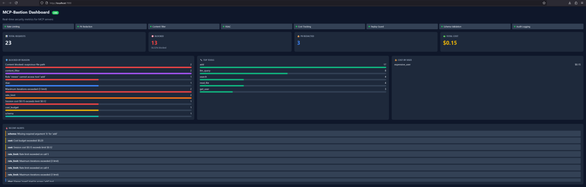

# MCP-Bastion

<!-- mcp-name: io.github.vaquarkhan/mcp-bastion -->

[](https://pepy.tech/projects/mcp-bastion-python)
[](https://pypi.org/project/mcp-bastion-python/)
[](https://pypi.org/project/mcp-bastion-python/)
[](https://pypi.org/project/mcp-bastion-python/)
[](https://www.npmjs.com/package/@mcp-bastion/core)
[](https://opensource.org/licenses/MIT)
[](https://pepy.tech/projects/mcp-bastion-python)

**Enterprise-Grade Security Middleware for the Model Context Protocol**

> Releases are published to npm and PyPI via GitHub Actions on tag push.

The Model Context Protocol (MCP) has rapidly become the universally accepted standard for connecting AI agents to enterprise databases and APIs. However, this connectivity introduces a massive new attack surface: unpredictable, non-deterministic agentic behavior.

MCP-Bastion is a lightweight, drop-in security middleware designed to wrap around any existing Python or TypeScript MCP server. Instead of relying on passive logging, human-in-the-loop approvals, or third-party APIs, MCP-Bastion provides an active, 100% local defense layer. It intercepts standard JSON-RPC traffic to stop threats before they cross the enterprise boundary.

Under 5ms proxy overhead. MCP-Bastion provides:

- **Prompt Injection Defense:** Meta PromptGuard runs locally to block adversarial payloads and jailbreaks.
- **PII Redaction:** Uses Microsoft Presidio to detect and mask PII before it reaches the LLM context.
- **Infinite Loop Protection:** Token buckets and cycle detection stop runaway agents from burning API budget.

Secure your MCP server without changing business logic.

---

## Core Features

**Zero-Click Prompt Injection Prevention**

Integrates Meta's PromptGuard model locally to detect and block malicious payloads, jailbreaks, and adversarial tokenization before they reach your external tools.

**PII Redaction**

Microsoft Presidio scans outbound tool results and masks PII (redaction, substitution, generalization).

**Infinite Loop and Denial of Wallet Protection**

Implements stateful cycle detection and configurable FinOps token-bucket algorithms to automatically terminate runaway agents and prevent massive API bill overruns.

**100% Local Execution (Data Privacy)**

All security classification and data redaction happen entirely within the local memory space of your server. Sensitive data never leaves your enterprise network for third-party safety evaluations.

**Low Latency**

Drop-in middleware, under 5ms overhead.

**Framework Integration**

Hooks into MCP SDKs (TypeScript, Python) and FastMCP via standard middleware. No business logic changes.

### All Features

| Feature | Description |
|---------|-------------|
| Prompt injection | Block jailbreaks via Meta PromptGuard |
| PII redaction | Mask SSN, email, phone via Presidio |
| Rate limiting | Max iterations, timeout, token budget |
| Audit logging | Log who, what, when, blocked/allowed |
| Content filter | Block paths, code, custom patterns |
| Circuit breaker | Disable failing tools after N failures |
| RBAC | Tool-level permissions by role |
| Schema validation | Validate tool input types |
| Replay guard | Block duplicate nonces |
| Cost tracker | Per-session cost budget |
| Semantic cache | Cache similar queries |

### Real-Time Dashboard and Alerts

Run the optional dashboard for a live view of requests, blocked count, PII redacted, cost, top tools, and recent alerts:

```bash
mcp-bastion dashboard --port 7000
# or: PYTHONPATH=src python dashboard/app.py
```

| URL | What it returns |
|-----|-----------------|
| [http://localhost:7000/](http://localhost:7000/) | Visual dashboard with charts (requests, blocked by reason, top tools, cost by user, recent alerts) |
| [http://localhost:7000/api/metrics](http://localhost:7000/api/metrics) | JSON: `requests_total`, `blocked_total`, `blocked_pct`, `pii_redacted_total`, `cost_total`, `blocked_by_reason`, `top_tools`, `cost_by_user`, `alerts` |
| [http://localhost:7000/api/health](http://localhost:7000/api/health) | `{"status": "ok"}` |
| [http://localhost:7000/metrics](http://localhost:7000/metrics) | Prometheus text format for Grafana/Datadog |



*Dashboard: total requests, blocked count and %, PII redacted, cost; blocked-by-reason bars; top tools; cost by user; recent alerts.*

- **Alerts:** Slack webhook and cost-threshold alerts. See [dashboard/README.md](dashboard/README.md).

### Documentation: Use Cases, Attacks, Metrics, Tutorials

| Doc | Description |
|-----|-------------|
| [docs/USE_CASES.md](docs/USE_CASES.md) | Real use cases: enterprise gateway, LLM products, internal tools, SaaS, compliance |
| [docs/ATTACK_PREVENTION.md](docs/ATTACK_PREVENTION.md) | Examples showing how MCP-Bastion prevents real attacks (injection, PII leak, rate exhaustion, path traversal, RBAC, replay) |
| [docs/METRICS.md](docs/METRICS.md) | Performance overhead (&lt;5ms) and effectiveness metrics (dashboard, Prometheus, OTEL) |
| [docs/TUTORIALS.md](docs/TUTORIALS.md) | Tutorials: integrating with FastMCP, TypeScript, GitHub MCP, and open-source MCP servers |

### One-Line Docker

```bash
docker build -t mcp-bastion/proxy .
docker run -p 8080:8080 mcp-bastion/proxy
```

MCP endpoint: `http://localhost:8080/mcp`. Use `docker-compose up -d` for proxy; add `--profile with-dashboard` for the dashboard. See [DOCKER.md](DOCKER.md).

### Policy-as-Code (bastion.yaml)

Single config file controls all pillars. Copy `bastion.yaml.example` to `bastion.yaml`, then:

```python
from mcp_bastion import build_middleware_from_config
middleware = build_middleware_from_config()
```

See [docs/POLICY_AS_CODE.md](docs/POLICY_AS_CODE.md).

### CLI for developers

```bash
mcp-bastion validate              # validate bastion.yaml
mcp-bastion serve --http 8080     # run MCP server with config
mcp-bastion dashboard --port 7000 # run metrics dashboard
```

See [docs/CLI.md](docs/CLI.md).

### OpenTelemetry

Set `OTEL_EXPORTER_OTLP_ENDPOINT` to export tool-call spans to OTLP. Install optional deps: `pip install mcp-bastion-python[otel]`. See [docs/OTEL.md](docs/OTEL.md).

### Webhook alerts

Use Slack webhook, a single generic webhook (`webhook_url` or `BASTION_WEBHOOK_URL`), or multiple URLs (`alerts.webhooks` in bastion.yaml). Each blocked event can POST to your endpoint (e.g. PagerDuty, custom API).

---

## Why MCP-Bastion (Competitive Comparison)

Early security packages (mcp-guardian, mcp-shield) focus on logging or static scanning. MCP-Bastion adds an active defense layer.

### 1. Active Defense vs. Passive Logging

| The Competition | MCP-Bastion |
|-----------------|-------------|
| Tools like mcp-guardian focus on tracing, logging, human-in-the-loop approvals. | Automated interception. MCP-Bastion scrubs PII before it leaves the server. |

### 2. Local Inference vs. Third-Party APIs

| The Competition | MCP-Bastion |
|-----------------|-------------|
| Many guardrail proxies send prompts to external APIs to check for malice. | PromptGuard-86M and Presidio run locally. Data stays on your network. |

### 3. Stateful Denial of Wallet Protection

| The Competition | MCP-Bastion |
|-----------------|-------------|
| Most tools focus on static vulns or basic rate limits. | Tracks tool call history per session. Stops runaway loops before they burn API budget. |

### 4. Drop-in Middleware vs. Standalone Gateway

| The Competition | MCP-Bastion |
|-----------------|-------------|
| Some solutions need standalone proxy servers. | Library hooks into `server.setRequestHandler` (TS) or middleware (Python). No extra infra. |

---

## Structure

| Path | Description |
|------|-------------|
| `src/mcp_bastion/` | Python package: PromptGuard, Presidio, rate limiting, RBAC, etc. |
| `packages/core/` | TypeScript package: rate limiting in-process; prompt/PII via sidecar (MCP_BASTION_URL) |
| `examples/` | Python examples ([examples/README.md](examples/README.md)) |
| `dashboard/` | Real-time dashboard UI and metrics API ([dashboard/README.md](dashboard/README.md)) |
| `bastion.yaml.example` | Policy-as-code sample; copy to `bastion.yaml` ([docs/POLICY_AS_CODE.md](docs/POLICY_AS_CODE.md)) |
| `scripts/validate_checklist.py` | Enterprise validation runner |
| `VALIDATION_CHECKLIST.md` | Validation guide and MCP Inspector steps |
| `SETUP_GUIDE.md` | Setup, config, and validation |
| `DOCKER.md` | Docker one-line run and compose |

### Example Files

| File | Purpose |
|------|---------|
| `examples/python_server_example.py` | Minimal middleware chain |
| `examples/full_demo.py` | All 11 features (rate limit, PII, RBAC, etc.) |
| `examples/llm_server.py` | Shared MCP server for LLM clients |
| `examples/llm_openai_example.py` | OpenAI |
| `examples/llm_claude_example.py` | Claude |
| `examples/llm_gemini_example.py` | Gemini |
| `examples/llm_mistral_example.py` | Mistral |
| `examples/llm_grok_example.py` | Grok (xAI) |
| `examples/server_with_config.py` | Policy-as-code (bastion.yaml) |

## Installation

**Python**

```bash
uv add mcp-bastion-python
# or
pip install mcp-bastion-python
```

**TypeScript**

```bash
npm install @mcp-bastion/core
```

[npm](https://www.npmjs.com/package/@mcp-bastion/core)

### Framework Integrations

Drop-in security for your favorite LLM framework. Each package auto-installs `mcp-bastion-python`:

```bash
pip install mcp-bastion-langchain      # LangChain agents and tools
pip install mcp-bastion-openai         # OpenAI GPT API calls
pip install mcp-bastion-anthropic      # Anthropic Claude API calls
pip install mcp-bastion-bedrock        # AWS Bedrock runtime
pip install mcp-bastion-gemini         # Google Gemini
pip install mcp-bastion-crewai         # CrewAI agent crews
pip install mcp-bastion-llamaindex     # LlamaIndex RAG pipelines
pip install mcp-bastion-groq           # Groq inference
pip install mcp-bastion-mistral        # Mistral AI
pip install mcp-bastion-cohere         # Cohere
pip install mcp-bastion-azure          # Azure OpenAI Service
pip install mcp-bastion-vertexai       # Google Cloud Vertex AI
pip install mcp-bastion-huggingface    # Hugging Face Inference
pip install mcp-bastion-deepseek       # DeepSeek AI
pip install mcp-bastion-together       # Together AI
pip install mcp-bastion-fireworks      # Fireworks AI
pip install mcp-bastion-fastmcp       # FastMCP servers
```

| Package | Protects | Version | Downloads |
|---------|----------|---------|-----------|
| [mcp-bastion-langchain](https://pypi.org/project/mcp-bastion-langchain/) | LangChain | 0.1.0 | [stats](https://pypistats.org/packages/mcp-bastion-langchain) |
| [mcp-bastion-openai](https://pypi.org/project/mcp-bastion-openai/) | OpenAI GPT | 0.1.0 | [stats](https://pypistats.org/packages/mcp-bastion-openai) |
| [mcp-bastion-anthropic](https://pypi.org/project/mcp-bastion-anthropic/) | Anthropic Claude | 0.1.0 | [stats](https://pypistats.org/packages/mcp-bastion-anthropic) |
| [mcp-bastion-bedrock](https://pypi.org/project/mcp-bastion-bedrock/) | AWS Bedrock | 0.1.0 | [stats](https://pypistats.org/packages/mcp-bastion-bedrock) |
| [mcp-bastion-gemini](https://pypi.org/project/mcp-bastion-gemini/) | Google Gemini | 0.1.0 | [stats](https://pypistats.org/packages/mcp-bastion-gemini) |
| [mcp-bastion-crewai](https://pypi.org/project/mcp-bastion-crewai/) | CrewAI | 0.1.0 | [stats](https://pypistats.org/packages/mcp-bastion-crewai) |
| [mcp-bastion-llamaindex](https://pypi.org/project/mcp-bastion-llamaindex/) | LlamaIndex | 0.1.0 | [stats](https://pypistats.org/packages/mcp-bastion-llamaindex) |
| [mcp-bastion-groq](https://pypi.org/project/mcp-bastion-groq/) | Groq | 0.1.0 | [stats](https://pypistats.org/packages/mcp-bastion-groq) |
| [mcp-bastion-mistral](https://pypi.org/project/mcp-bastion-mistral/) | Mistral AI | 0.1.0 | [stats](https://pypistats.org/packages/mcp-bastion-mistral) |
| [mcp-bastion-cohere](https://pypi.org/project/mcp-bastion-cohere/) | Cohere | 0.1.0 | [stats](https://pypistats.org/packages/mcp-bastion-cohere) |
| [mcp-bastion-azure](https://pypi.org/project/mcp-bastion-azure/) | Azure OpenAI | 0.1.1 | [stats](https://pypistats.org/packages/mcp-bastion-azure) |
| [mcp-bastion-vertexai](https://pypi.org/project/mcp-bastion-vertexai/) | Vertex AI | 0.1.0 | [stats](https://pypistats.org/packages/mcp-bastion-vertexai) |
| [mcp-bastion-huggingface](https://pypi.org/project/mcp-bastion-huggingface/) | Hugging Face | 0.1.1 | [stats](https://pypistats.org/packages/mcp-bastion-huggingface) |
| [mcp-bastion-deepseek](https://pypi.org/project/mcp-bastion-deepseek/) | DeepSeek AI | 0.1.1 | [stats](https://pypistats.org/packages/mcp-bastion-deepseek) |
| [mcp-bastion-together](https://pypi.org/project/mcp-bastion-together/) | Together AI | 0.1.1 | [stats](https://pypistats.org/packages/mcp-bastion-together) |
| [mcp-bastion-fireworks](https://pypi.org/project/mcp-bastion-fireworks/) | Fireworks AI | 0.1.1 | [stats](https://pypistats.org/packages/mcp-bastion-fireworks) |
| [mcp-bastion-fastmcp](https://pypi.org/project/mcp-bastion-fastmcp/) | FastMCP servers | 0.1.0 | [stats](https://pypistats.org/packages/mcp-bastion-fastmcp) |

## Publish (PyPI / npm)

- **PyPI:** `python -m build && twine upload dist/*` (or use GitHub Actions on tag).
- **npm:** From repo root, `cd packages/core && npm publish --access public` (or use Trusted Publishers).
- Version is set in `pyproject.toml` (Python), `packages/core/package.json` (npm), and `server.json` (MCP registry). Bump before releasing.

## Developer Guide

Integration examples for Python and TypeScript.

---

### Quick Start (Python)

Add MCP-Bastion to an existing MCP server in three steps:

```python
from mcp_bastion import MCPBastionMiddleware, compose_middleware

# 1. Create the security middleware
bastion = MCPBastionMiddleware(
    enable_prompt_guard=True,
    enable_pii_redaction=True,
    enable_rate_limit=True,
)

# 2. Compose with your middleware chain (Bastion runs first)
middleware = compose_middleware(bastion)

# 3. Pass the composed middleware to your MCP server
# (integration depends on your server framework)
```

**Examples:**

| Example | Description |
|---------|-------------|
| `examples/python_server_example.py` | Basic middleware chain |
| `examples/full_demo.py` | All features: add, PII, rate limit, prompt injection |
| `examples/llm_openai_example.py` | MCP server for OpenAI |
| `examples/llm_claude_example.py` | MCP server for Claude |
| `examples/llm_gemini_example.py` | MCP server for Gemini |
| `examples/llm_mistral_example.py` | MCP server for Mistral |
| `examples/llm_grok_example.py` | MCP server for Grok (xAI, HTTP only) |

```bash
# Windows: $env:PYTHONPATH="src"; python examples/full_demo.py
# Linux/Mac: PYTHONPATH=src python examples/full_demo.py
```

**LLM integration:** See [docs/LLM_INTEGRATION.md](docs/LLM_INTEGRATION.md) for copy-paste config for OpenAI, Claude, Gemini, Mistral, and Grok.

**Enterprise validation:**

```bash
PYTHONPATH=src python scripts/validate_checklist.py
```

See `VALIDATION_CHECKLIST.md` and `SETUP_GUIDE.md`.

---

### Python Tutorial: FastMCP Server

FastMCP server with MCP-Bastion.

**Step 1: Install dependencies**

```bash
pip install mcp mcp-bastion-python
```

**Step 2: Create your server file** (`server.py`)

```python
from mcp.server.fastmcp import FastMCP
from mcp_bastion import MCPBastionMiddleware, compose_middleware

# Create the MCP server
mcp = FastMCP("My Secure Server")

# Create MCP-Bastion middleware
# It intercepts tool calls and resource reads before they execute
bastion = MCPBastionMiddleware(
    enable_prompt_guard=True,   # Block malicious prompts via PromptGuard
    enable_pii_redaction=True,  # Mask PII in outgoing content
    enable_rate_limit=True,     # Cap at 15 iterations, 60s timeout
)

# Compose middleware chain (pass to your server's middleware config if supported)
middleware = compose_middleware(bastion)

# Register a tool (protected when middleware is wired into your server)
@mcp.tool()
def get_weather(city: str) -> str:
    """Get weather for a city."""
    return f"Weather in {city}: 22C, sunny"

# Resource (PII redacted)
@mcp.resource("user://profile/{user_id}")
def get_profile(user_id: str) -> str:
    """Get user profile. PII redacted."""
    return f"User {user_id}: John Doe, SSN 123-45-6789, john@example.com"

if __name__ == "__main__":
    mcp.run(transport="streamable-http")
```

**Step 3: Run the server**

```bash
python server.py
```

MCP-Bastion:
- Scans tool args for prompt injection
- Redacts PII from resource responses
- Blocks sessions over 15 calls or 60s

**Alternative: Policy-as-Code**

Use `bastion.yaml` instead of code. Copy `bastion.yaml.example` to `bastion.yaml`, then:

```python
from mcp_bastion import build_middleware_from_config
middleware = build_middleware_from_config()
```

See [docs/POLICY_AS_CODE.md](docs/POLICY_AS_CODE.md) and `examples/server_with_config.py`.

---

### Python: Custom Rate Limits

Custom config example:

```python
from mcp_bastion import MCPBastionMiddleware
from mcp_bastion.pillars.rate_limit import TokenBucketRateLimiter
from mcp_bastion.pillars.prompt_guard import PromptGuardEngine

# Stricter limits
rate_limiter = TokenBucketRateLimiter(
    max_iterations=10,
    timeout_seconds=30,
    token_budget=25_000,
)

# Higher threshold = fewer blocks, more risk
prompt_guard = PromptGuardEngine(threshold=0.92)

bastion = MCPBastionMiddleware(
    prompt_guard=prompt_guard,
    rate_limiter=rate_limiter,
    enable_prompt_guard=True,
    enable_pii_redaction=True,
    enable_rate_limit=True,
)

# Disable PII redaction if your data has no PII
bastion_no_pii = MCPBastionMiddleware(enable_pii_redaction=False)
```

---

### Python: Custom Middleware

Extend `Middleware` to add logging, metrics, or custom logic:

```python
from mcp_bastion.base import Middleware, MiddlewareContext, compose_middleware

class LoggingMiddleware(Middleware):
    async def on_message(self, context, call_next):
        result = await call_next(context)
        # log method, elapsed, etc.
        return result

middleware = compose_middleware(bastion, LoggingMiddleware())
```

See `examples/full_demo.py` for a complete example.

---

### TypeScript: Wrap an MCP Server

**Step 1: Install dependencies**

```bash
npm install @modelcontextprotocol/sdk @mcp-bastion/core
```

**Step 2: Create your server** (`server.ts`)

```typescript
import { Server } from "@modelcontextprotocol/sdk/server/index.js";
import { StdioServerTransport } from "@modelcontextprotocol/sdk/server/stdio.js";
import {
  wrapWithMcpBastion,
  wrapCallToolHandler,
} from "@mcp-bastion/core";

const server = new Server({ name: "my-mcp-server", version: "1.0.0" });

// Wrap the server with MCP-Bastion (rate limiting only by default)
// For prompt injection and PII, run the Python sidecar and set sidecarUrl
wrapWithMcpBastion(server, {
  enableRateLimit: true,
  maxIterations: 15,
  timeoutMs: 60_000,
  // Optional: enable ML features via Python sidecar
  sidecarUrl: process.env.MCP_BASTION_SIDECAR || "",
  enablePromptGuard: !!process.env.MCP_BASTION_SIDECAR,
  enablePiiRedaction: !!process.env.MCP_BASTION_SIDECAR,
});

// Register tools (handlers are automatically wrapped)
server.setRequestHandler("tools/call" as any, async (request) => {
  if (request.params?.name === "get_weather") {
    return {
      content: [{ type: "text", text: "Sunny, 22C" }],
      isError: false,
    };
  }
  throw new Error("Unknown tool");
});

async function main() {
  const transport = new StdioServerTransport();
  await server.connect(transport);
}

main();
```

**Step 3: Run with rate limiting only**

```bash
npx tsx server.ts
```

**Step 4: Run with full ML features (Python sidecar)**

For prompt injection and PII redaction, run a Python HTTP service that exposes `/prompt-guard` and `/pii-redact` endpoints (see the Python package for sidecar implementation). Then:

```bash
# Start the Python sidecar, then the TypeScript server
MCP_BASTION_SIDECAR=http://localhost:8000 npx tsx server.ts
```

---

### TypeScript: Wrap Individual Handlers

Wrap specific handlers only:

```typescript
import {
  wrapCallToolHandler,
  wrapReadResourceHandler,
} from "@mcp-bastion/core";
import {
  CallToolRequestSchema,
  ReadResourceRequestSchema,
} from "@modelcontextprotocol/sdk/types.js";

// Wrap only the tool handler
const safeToolHandler = wrapCallToolHandler(
  async (request) => {
    // Your tool logic
    return { content: [{ type: "text", text: "OK" }], isError: false };
  },
  { enableRateLimit: true, maxIterations: 10 }
);

// Wrap only the resource handler (for PII redaction)
const safeResourceHandler = wrapReadResourceHandler(
  async (request) => {
    const contents = await fetchResource(request.params.uri);
    return { contents };
  },
  { sidecarUrl: "http://localhost:8000", enablePiiRedaction: true }
);

server.setRequestHandler(CallToolRequestSchema, safeToolHandler);
server.setRequestHandler(ReadResourceRequestSchema, safeResourceHandler);
```

---

### Configuration Reference

| Option | Python | TypeScript | Default | Description |
|--------|--------|------------|---------|-------------|
| `enable_prompt_guard` | Yes | Yes | `True` (Python) / `False` (TS) | Block malicious prompts via PromptGuard |
| `enable_pii_redaction` | Yes | Yes | `True` (Python) / `False` (TS) | Mask PII in outgoing content |
| `enable_rate_limit` | Yes | Yes | `True` | Enforce iteration and timeout caps |
| `max_iterations` | Via `TokenBucketRateLimiter` | Yes | 15 | Max tool calls per session |
| `timeout_seconds` / `timeoutMs` | Via `TokenBucketRateLimiter` | Yes | 60 | Session timeout |
| `token_budget` | Via `TokenBucketRateLimiter` | - | 50,000 | FinOps token cap per request |
| `sidecarUrl` | - | Yes | `""` | Python sidecar URL for ML features |
| `threshold` | Via `PromptGuardEngine` | - | 0.85 | Malicious probability cutoff |
| `setLogLevel` | - | Yes | `"info"` | TypeScript: `"debug"` \| `"info"` \| `"warn"` \| `"error"` |

---

### Error Handling

When MCP-Bastion blocks a request, it returns standard MCP/JSON-RPC errors:

| Code | Exception | When |
|------|-----------|------|
| -32001 | `PromptInjectionError` | Tool args contain jailbreak/injection |
| -32002 | `RateLimitExceededError` | Session exceeds iteration or timeout limit |
| -32003 | `TokenBudgetExceededError` | Session exceeds token budget |

```python
# Python: exceptions
from mcp_bastion.errors import (
    PromptInjectionError,
    RateLimitExceededError,
    TokenBudgetExceededError,
)
import logging
logger = logging.getLogger(__name__)

try:
    result = await middleware(context, call_next)
except PromptInjectionError as e:
    logger.warning("blocked: %s", e.to_mcp_error())
except RateLimitExceededError as e:
    logger.warning("blocked: %s", e.to_mcp_error())
except TokenBudgetExceededError as e:
    logger.warning("blocked: %s", e.to_mcp_error())
```

```typescript
// TypeScript: handlers return isError: true
import { logger, setLogLevel } from "@mcp-bastion/core";
setLogLevel("debug");  // optional: "debug" | "info" | "warn" | "error"
const result = await guardedHandler(request);
if (result.isError) {
  logger.error("blocked", result.content);
}
```

---

### Testing

MCP Inspector:

```bash
# Start your guarded server
python server.py   # or: npx tsx server.ts

# In another terminal, launch the Inspector
npx -y @modelcontextprotocol/inspector
```

Connect via HTTP (`http://localhost:8000/mcp`) or stdio, then:
1. List tools and call one with benign arguments (should succeed)
2. Call a tool with "Ignore previous instructions" (should be blocked)
3. Trigger 16+ tool calls in one session (should hit rate limit)

---

## Testing

```bash
# Python (PYTHONPATH=src on Windows: $env:PYTHONPATH="src")
pytest tests/ -v

# TypeScript
npm run test --workspace=@mcp-bastion/core

# Full validation checklist (build, pillars, latency)
PYTHONPATH=src python scripts/validate_checklist.py

# MCP Inspector (manual)
npx -y @modelcontextprotocol/inspector
```

## Third-Party Components

See `NOTICE` for licenses. MCP-Bastion uses Meta Llama Prompt Guard 2 (Llama 4 Community License) and Microsoft Presidio. For OWASP-relevant mitigations, dependency audit, and reporting vulnerabilities, see [docs/SECURITY.md](docs/SECURITY.md).

## License

#MIT
