# MCP-Bastion

<!-- mcp-name: io.github.vaquarkhan/mcp-bastion -->

<p align="center">
  <a href="#mcp-bastion"><strong>README</strong></a>
  ·
  <a href="https://vaquarkhan.github.io/MCP-Bastion/guide/bible.html"><strong>Documentation</strong></a>
  ·
  <a href="https://vaquarkhan.github.io/MCP-Bastion/guide/demos.html"><strong>Demos</strong></a>
  ·
  <a href="https://vaquarkhan.github.io/MCP-Bastion/guide/observability.html"><strong>Dashboard / Observability</strong></a>
  ·
  <a href="https://vaquarkhan.github.io/MCP-Bastion/guide/multi-language.html"><strong>Multi-language</strong></a>
  ·
  <a href="CONTRIBUTING.md"><strong>Contributing</strong></a>
  ·
  <a href="LICENSE"><strong>License</strong></a>
  ·
  <a href="SECURITY.md"><strong>Security</strong></a>
</p>

<p align="center">
  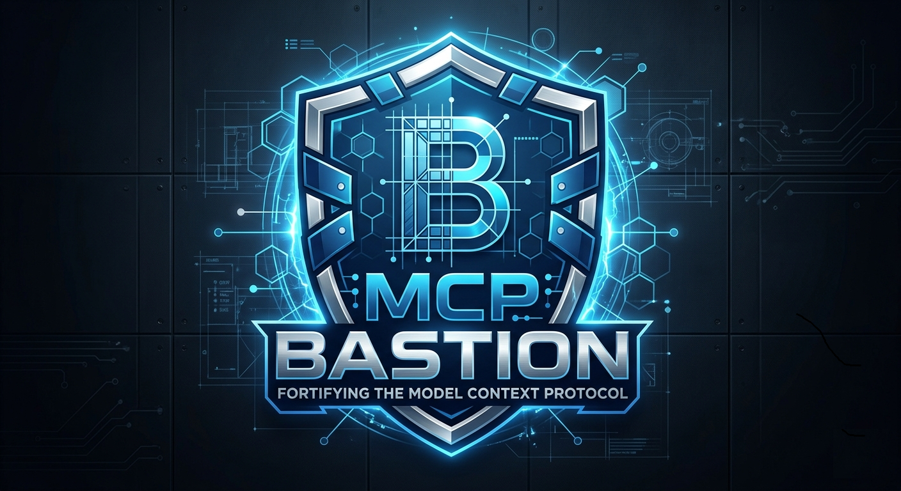
</p>

[](https://pypi.org/project/mcp-bastion-python/4.0.0/)
[](https://pepy.tech/projects/mcp-bastion-python)
[](https://pypi.org/project/mcp-bastion-python/)
[](https://github.com/vaquarkhan/MCP-Bastion/actions/workflows/ci.yml)
[](https://github.com/vaquarkhan/MCP-Bastion/pkgs/container/mcp-bastion-proxy)
[](https://github.com/vaquarkhan/MCP-Bastion/pkgs/container/mcp-bastion-dashboard)
[](https://vaquarkhan.github.io/MCP-Bastion/guide/)
[](https://vaquarkhan.github.io/MCP-Bastion/guide/demos.html)
[](https://vaquarkhan.github.io/MCP-Bastion/guide/multi-language.html)
[](LICENSE)
[](https://vaquarkhan.github.io/MCP-Bastion/)

**Current release: [4.0.0](https://pypi.org/project/mcp-bastion-python/4.0.0/)** · Docker `v4.0.0` · 18 PyPI packages · [CHANGELOG](CHANGELOG.md)

| Go to | Link |
|-------|------|
| **Documentation bible** | https://vaquarkhan.github.io/MCP-Bastion/guide/bible.html |
| **Demos** (attacks, dashboard, payloads, all languages) | https://vaquarkhan.github.io/MCP-Bastion/guide/demos.html |
| **Dashboard & observability** (OTEL optional) | https://vaquarkhan.github.io/MCP-Bastion/guide/observability.html |
| **Multi-language suite** | https://vaquarkhan.github.io/MCP-Bastion/guide/multi-language.html · [suite repo](https://github.com/vaquarkhan/mcp-bastion-suite) |
| **Docs hub** | https://vaquarkhan.github.io/MCP-Bastion/guide/ |

**The Zero-Trust control plane for MCP agents.** Your agent can call databases, APIs, and shell tools. One bad prompt can leak PII; one runaway loop can burn your API budget in minutes; three agents on one server with no identity boundary is a confused-deputy incident waiting to happen. MCP-Bastion wraps your MCP server with **local** guardrails: **agent IAM**, supply-chain checksums, injection blocking, PII redaction, and **denial-of-wallet caps**, under **5ms overhead**, with no third-party safety API.

**Guiding rule:** Stay a **zero-infra, drop-in library**  -  the guardrail brain that composes with any gateway, not a gateway itself. Strategy: [docs/ZERO_INFRA_STRATEGY.md](docs/ZERO_INFRA_STRATEGY.md).

<p align="center">
  
</p>

### Scan → Test → Enforce (no other tool has all three)

| Phase | What | Command |
|-------|------|---------|
| **Scan** | Static tool-definition checks before deploy (injection, secrets, homoglyphs, fingerprint drift, schema preconditions) | `mcp-bastion scan tools.json` |
| **Audit** | Local MCP client-config risk report (over-broad tools, standing credentials, filesystem servers) | `mcp-bastion audit` |
| **Test** | Integrated red-team harness against your `bastion.yaml` policy | `mcp-bastion redteam` |
| **Enforce** | Runtime middleware on every MCP method | `secure_fastmcp(mcp)` or `bastion.yaml` |

**`scan` vs `audit` - different inputs, different questions**

| | **`mcp-bastion scan`** | **`mcp-bastion audit`** |
|---|------------------------|-------------------------|
| **Looks at** | A **tool catalog** (`tools.json` / `tools/list` export) | **MCP client configs** on disk (`mcp.json`, Claude Desktop config, etc.) |
| **Asks** | “Is this **tool metadata** poisoned or drifted?” | “What can agents **already reach** on this machine?” |
| **Finds** | Injection in descriptions, secrets in schemas, homoglyphs, fingerprint drift, weak/unbounded inputSchema shapes | Over-broad tool grants (`*`), standing credentials in `env`, filesystem-server hints |
| **When** | Before you ship or attach a server’s tools (CI / pre-deploy) | Before you tighten policy on a laptop or workspace (local hygiene) |

They complement each other: **audit** the host surface, then **scan** the tools you attach. Neither replaces runtime **enforce**.

`mcp-bastion scan` also accepts `--skills DIR` for offline agent skill-file checks. Dependency CVEs: `mcp-bastion osv-refresh` then `mcp-bastion osv-scan` (local DB default; `--online` opt-in, fail-open).

```bash
# 1. Scan a tools/list export (or hand-authored catalog) - client-side, no cloud
mcp-bastion scan examples/fixtures/tools-poisoned.json
mcp-bastion fingerprint tools.json -o baseline.json
mcp-bastion scan tools.json --baseline baseline.json --format json -o report.json
mcp-bastion scan --skills ./skills/

# 1b. Audit local MCP client configs (what agents can already reach)
mcp-bastion audit --root .
mcp-bastion audit --format json -o risk-audit.json --fail-on none

# 2. Test policy effectiveness
mcp-bastion redteam --config bastion.yaml

# 3. Enforce at runtime (filesystem path guards when agents can read local files)
#    merge examples/bastion-filesystem-guards.yaml into bastion.yaml
mcp-bastion validate --config bastion.yaml
```

<p align="center">
  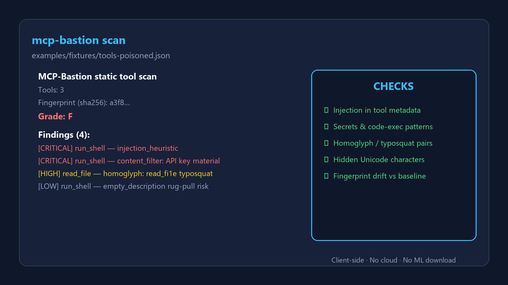
</p>
<p align="center"><sub><code>mcp-bastion scan</code> - client-side static scanner; no cloud, no ML download</sub></p>

<p align="center">
  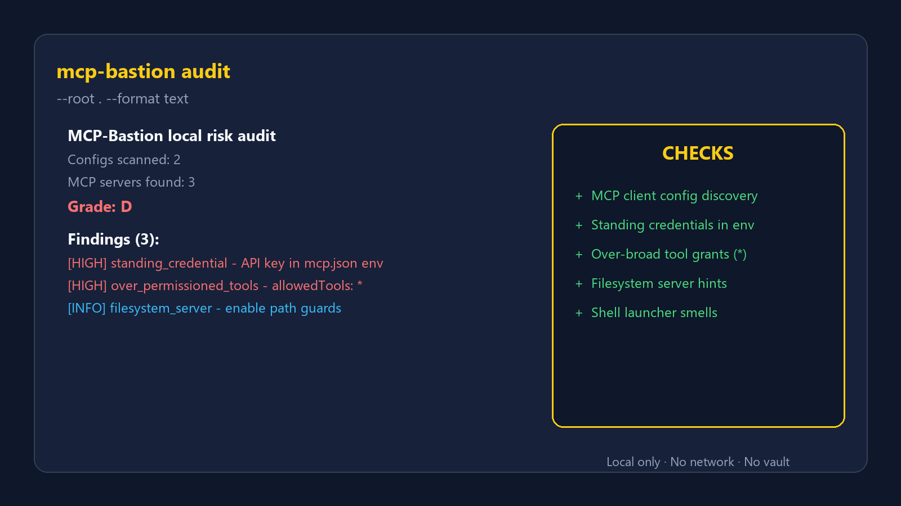
</p>
<p align="center"><sub><code>mcp-bastion audit</code> - map the local MCP surface before you enforce; no network, no vault</sub></p>

<p align="center">
  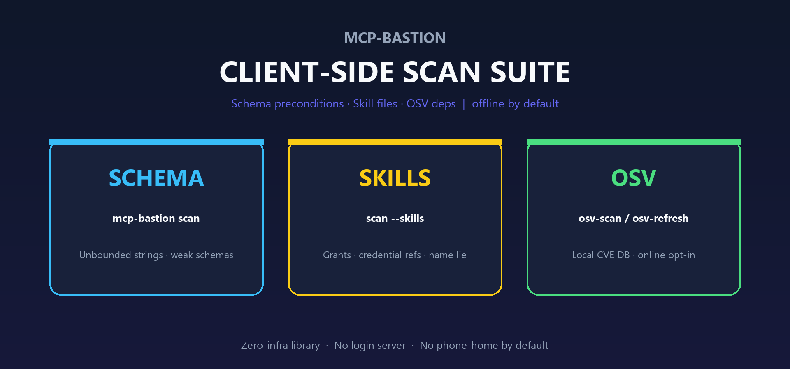
</p>
<p align="center"><sub>Schema · Skills · OSV - offline by default; no login server; no phone-home</sub></p>

<p align="center">
  <a href="images/mcp-bastion-dashboard-tour.gif" title="MCP-Bastion dashboard feature tour (GIF)">
    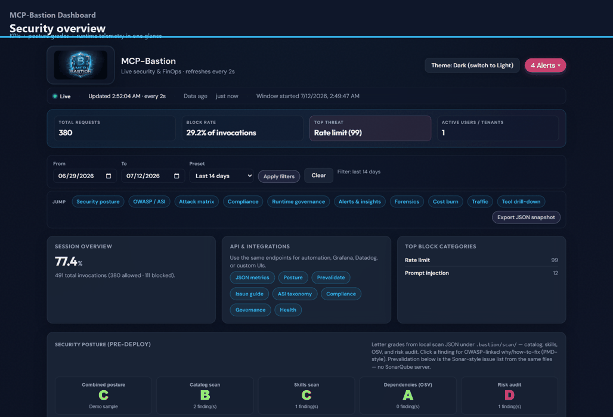
  </a>
</p>
<p align="center"><sub>Feature tour</sub></p>
<p align="center">
  <a href="images/deshboard-walkthrow.gif" title="MCP-Bastion dashboard walkthrough (GIF)">
    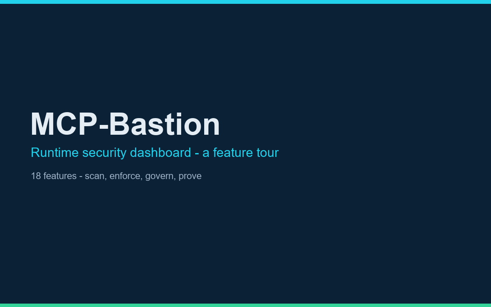
  </a>
</p>
<p align="center"><sub>Dashboard walkthrough</sub></p>
<p align="center">
  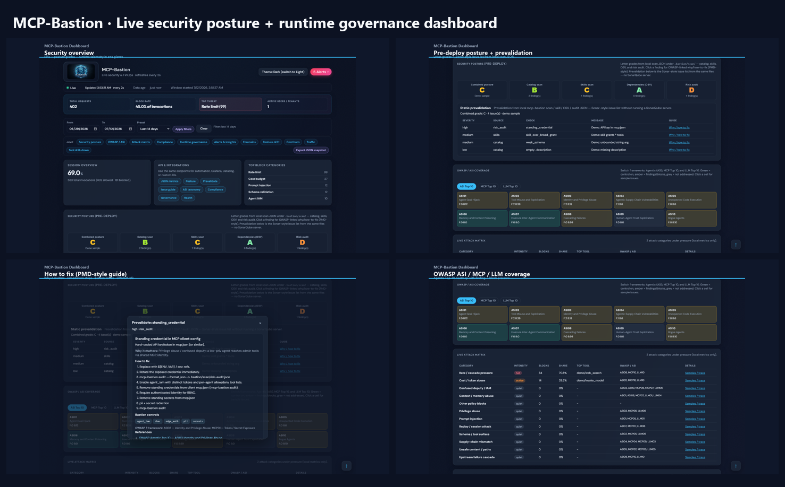
</p>
<p align="center"><strong>Live security posture + runtime dashboard</strong> - local-only, zero infra. <code>mcp-bastion dashboard --demo</code> · <a href="dashboard/README.md">Dashboard docs</a> · <a href="https://vimeo.com/1186084574">Older Vimeo walkthrough</a></p>

<p align="center">
  
</p>

<p align="center">
  
</p>
<p align="center">
  
</p>
<p align="center"><strong>Hybrid stateful / stateless MCP (3.2.0)</strong> - opt-in <code>mcp_transport</code> for SEP-2575 readiness without breaking legacy sessions. <a href="docs/HYBRID_MCP_TRANSPORT.md">Architecture</a> · <a href="docs/HYBRID_TRANSPORT_TUTORIAL.md">Tutorial</a></p>

## Why MCP-Bastion? (Solving the 2026 MCP Security Crisis)

As noted in the NSA's recent Cybersecurity Information Sheet on MCP security and the OWASP MCP Top 10, traditional AppSec tools cannot secure agentic workflows. The gap is **runtime governance** and the **confused deputy problem**: multiple AI agents sharing one MCP server with no native identity boundary. Public registry typosquatting and unverified servers have made supply-chain verification a board-level concern.

MCP-Bastion acts as the **Zero-Trust Control Plane** for your agents, addressing the hardest production problems:

1. **The Confused Deputy (Agent IAM):** Identity-aware routing binds API tokens to **Agent Identities** and enforces strict per-tool RBAC. Your customer-support bot can call `search_docs`, not `delete_user`.
2. **Supply chain & typosquatting defense:** Cryptographic SHA-256 manifest verification blocks traffic when MCP server artifacts drift from your signed-off checksums.
3. **Data exfiltration & injection prevention:** PromptGuard heuristics + ML block jailbreaks locally; Presidio scrubs outbound PII before it hits a model context window.

### Define your agent policies (`bastion.yaml`)

```yaml
# Stop the Confused Deputy Problem  -  Identity-Aware Routing
agent_iam:
  enabled: true
  token_metadata_key: bastion_agent_token
  agents:
    - id: customer_support_bot
      token_env: BASTION_TOKEN_SUPPORT
      allowed_tools: ["search_docs", "get_ticket_status"]
      blocked_tools: ["execute_sql", "delete_user"]
      rate_limit:
        max_iterations: 5

# Supply-chain checksums before any tool executes
server_verification:
  enabled: true
  on_mismatch: block
  base_path: .
  manifest_path: mcp-server.manifest.json
```

Generate a manifest after a trusted build: `mcp-bastion manifest server.py pyproject.toml -o mcp-server.manifest.json`

Deep dive: [docs/RUNTIME_GOVERNANCE.md](docs/RUNTIME_GOVERNANCE.md) · [docs/ENTERPRISE_RUNTIME_CONTROLS.md](docs/ENTERPRISE_RUNTIME_CONTROLS.md) (3.0 pillars)

### Runtime governance pillars (3.0.0+, current **4.0.0**)

Opt-in enterprise controls for production MCP runtimes. All default **off** so 2.x behavior is unchanged until you enable them.

| Pillar | Config | What it does |
|--------|--------|--------------|
| **Exfiltration canary** | `canary_goallock` | Session token in context; blocks tool args that echo it (**-32025**) |
| **ATR YAML rules** | `atr_rules` | Community threat rules merged into `content_filter` (**-32027**) |
| **Local LLM scanner** | `llm_scanner` | Optional Ollama tier after heuristics; fail-open (**-32026**) |
| **Threat intel feeds** | `threat_feeds` | Background refresh of remote regex patterns |
| **Auto-repave** | `auto_repave` | Threshold-based containment (rotate canary, reset scope) |
| **Secret redaction** | `secrets.redact_patterns` | `replace` / `hash` / `mask` / `remove` on tool outputs |
| **Observe mode** | `mode: observe` | Log `would_block` without denying |

```yaml
mode: enforce

canary_goallock:
  enabled: true

atr_rules:
  enabled: true
  rules_dir: ./atr-rules

secrets:
  redact_patterns:
    - rule: "sk-[A-Za-z0-9]{20,}"
      strategy: mask
```

CLI compliance evidence: `mcp-bastion report --framework soc2 --audit ./audit.jsonl`

<p align="center">
  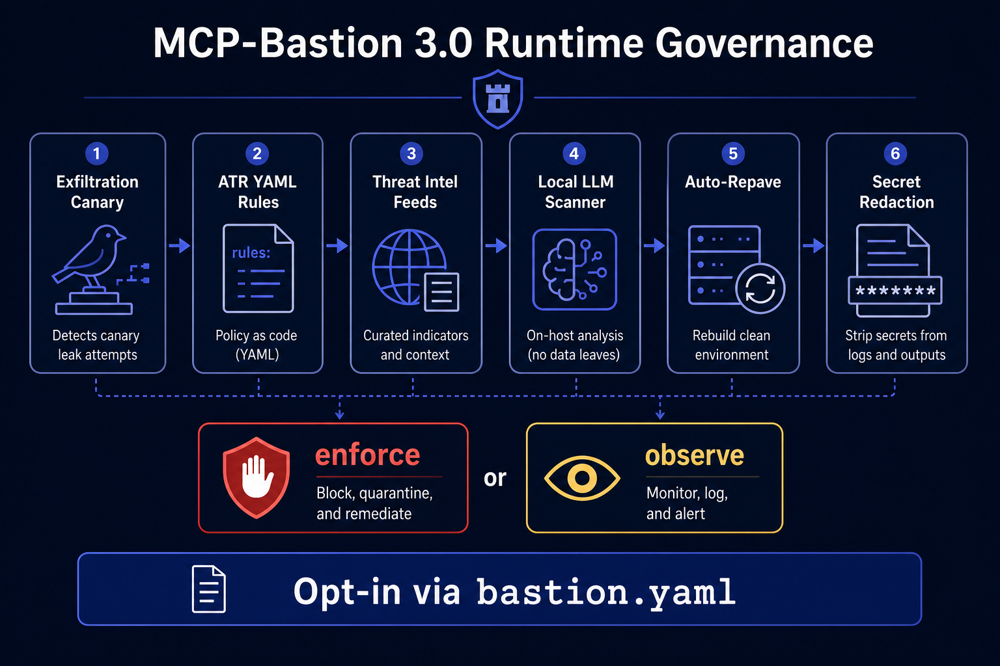
</p>

<p align="center">
  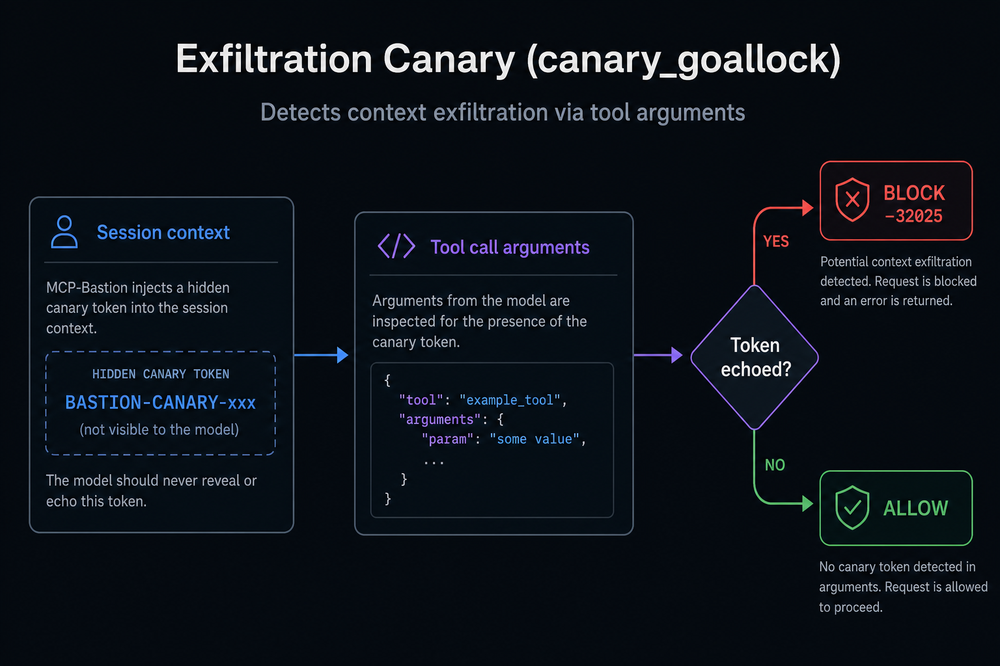
</p>

### Full MCP surface + horizontal scale (2.0.0)

Previously, most pillars ran only on **`tools/call`**. **2.0.0** extends the pipeline to **`resources/read`**, **`prompts/get`**, **`sampling/createMessage`**, and **`elicitation/create`**  -  closing exfil/injection gaps on the rest of the MCP surface.

For **multi-replica** deployments, enable **`state_backend.type: redis`** so rate limits, replay nonces, cost budgets, and session tool scope are shared across pods (default `memory` is single-process).

```yaml
state_backend:
  type: redis
  redis_url: redis://127.0.0.1:6379/0
```

`pip install mcp-bastion-python[redis]` · Deep dive: [docs/MCP_SURFACE_AND_SCALE.md](docs/MCP_SURFACE_AND_SCALE.md)

### Production hardening adopted in 2.0.0

Battle-tested patterns from the broader MCP gateway ecosystem, wired into the middleware stack:

| Feature | What you get |
|--------|----------------|
| **JSONPath argument guards** | Block or redact tool arguments by **tool glob + JSONPath + regex** before execution (argv-array evasion aware). `pip install mcp-bastion-python[policy]` |
| **RBAC fnmatch globs** | Role permissions like `read_*` / `files_*` with **specificity-aware** matching |
| **Audit JSONL + `mcp-bastion tail`** | Append-only compliance log; `audit.jsonl_path` in config or `mcp-bastion tail -p audit.jsonl` |
| **Cost checkpoint** | Optional disk persistence for session totals across restarts (`cost_tracker.checkpoint_path`, memory backend only) |
| **Cost-aware policy (`cost_policy`)** | Live spend rules: degrade model, force discovery filter, require approval; expensive-chain blocking |
| **Governance attestation** | `mcp-bastion attest export --session …`  -  signed session bundle with policy hash + controls fired |
| **Boundary mode** | Mandatory proxy auth on every request (`boundary_mode` + `edge_auth` / `agent_iam`)  -  [GATEWAY_BOUNDARY.md](docs/GATEWAY_BOUNDARY.md) |
| **Ungated PromptGuard** | `prompt_guard.use_ungated_default: true` → ProtectAI DeBERTa classifier (no HF gate) |

```yaml
cost_policy:
  enabled: true
  rules:
    - when: { session_spend_pct_gte: 80 }
      action: degrade_model
      target_model: gpt-4o-mini
    - when: { session_spend_pct_gte: 95 }
      action: require_approval
  expensive_chain:
    enabled: true
    max_projected_cost_usd: 1.0

governance:
  attestation_enabled: true

boundary_mode:
  enabled: true   # requires edge_auth or agent_iam

argument_guards:
  enabled: true
  rules:
    - name: block_shell
      match: "run_*"
      arg: "$.command"
      pattern: "(rm\\s+-rf|curl\\s+.*\\|.*sh)"
      action: block

audit:
  jsonl_path: .bastion/audit.jsonl

cost_tracker:
  checkpoint_path: .bastion/cost-checkpoint.json
```

<p align="center">
  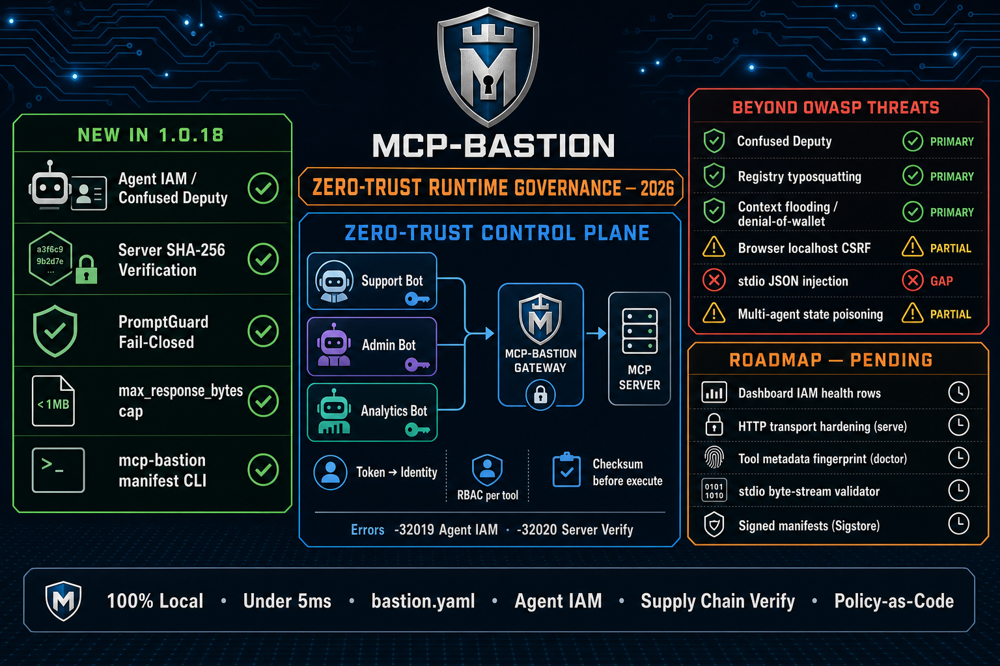
</p>

### Why developers adopt it

| You need… | MCP-Bastion gives you… |
|-----------|-------------------------|
| **Guardrails without a rewrite** | Drop-in middleware: `secure_fastmcp(mcp)` or one `bastion.yaml` |
| **Privacy your legal team accepts** | PromptGuard + Presidio run **in your process**; data stays on your network |
| **Stop runaway agents & budget burn** | **On by default:** 15 tool calls/session, 60s timeout, 50k token budget. **Optional:** per-tool caps, USD session/day limits, response offload |
| **Shrink context & cut token spend** | **Opt-in:** discovery filter (fewer tools in `tools/list`), output budget + session offload (**up to ~99% on oversized tool outputs**), lexical similarity cache  -  [measured benchmarks](docs/BENCHMARKS.md) |
| **Something that ships today** | PyPI, npm, Docker on GHCR, FastMCP, TypeScript wrapper, CI validate, live dashboard |
| **Policy your team can review** | `bastion.yaml` in Git, hot reload, OWASP-aligned controls ([docs/PILLARS.md](docs/PILLARS.md)) |

### FinOps & abuse protection (denial-of-wallet)

Agents can loop on expensive tools (search, LLM calls, paid APIs) until your bill spikes. Bastion enforces **session-level FinOps at the MCP boundary** before each `tools/call`:

| Attack pattern | What Bastion does | Default |
|----------------|---------------------|---------|
| **Infinite tool loop** | Blocks after max iterations per session | **On** (15 calls) |
| **Long-running session abuse** | Session timeout | **On** (60s) |
| **Token / context budget burn** | Token budget per session; optional output offload | **On** (50k tokens); offload opt-in |
| **Same tool hammered** | Per-tool call cap (`max_per_tool`) | Opt-in |
| **Paid API spend runaway** | USD caps via cost tracker | Opt-in |
| **Flaky or hostile tool cascade** | Circuit breaker opens after failures | Opt-in in example config |
| **Tool sprawl in one session** | Cap distinct tools per session | Opt-in |

Blocked calls return standard errors (`RateLimitExceededError` **-32002**, `TokenBudgetExceededError` **-32003**, `CostBudgetExceededError` **-32009**) and show up in the dashboard and audit log. See [docs/ATTACK_PREVENTION.md](docs/ATTACK_PREVENTION.md#3-rate-exhaustion--denial-of-wallet).

### Token reduction & cost saving

Bastion does not only **block** runaway spend  -  it **reduces** how much **tool output and tool-catalog** tokens reach the model on each turn (not the user’s LLM prompt text itself):

| Savings lever | What it does | Default |
|---------------|--------------|---------|
| **Discovery filter** | Hides unused tools from `tools/list` so agents carry a smaller tool catalog in context (~**85%** fewer catalog tokens in [benchmarks](docs/BENCHMARKS.md) with 20→3 tools) | Opt-in |
| **Output budget + offload** | Truncates oversized tool responses; stores the rest in-session for `bastion_get_offloaded` (**up to ~99.7%** on 50k-token dumps; **0%** when already under budget) | Opt-in |
| **Lexical similarity cache** | Skips redundant tool calls when queries are near-identical (Jaccard word overlap  -  not embedding “semantic” search) | Opt-in |
| **Token budget caps** | Hard stop before session token burn exceeds your limit | **On** (50k tokens) |
| **USD session/day limits** | Dollar ceilings via cost tracker | Opt-in |

There is **no honest single “X% prompt reduction”** figure  -  savings are **input-dependent**. See **[docs/BENCHMARKS.md](docs/BENCHMARKS.md)** for reproducible pytest benchmarks and live numbers.

<p align="center">
  
</p>
<p align="center"><sub>Reproduce: <code>PYTHONPATH=src python -m pytest tests/test_benchmarks_finops_rbac.py -v</code> · Regenerate report: <code>python scripts/generate_benchmark_report.py</code></sub></p>

Less tool output and catalog noise per turn means lower LLM input cost  -  without sending prompts to a third-party optimizer API.

**Bottom line:** MCP turned every server into an agent gateway overnight. Bastion is the firewall that makes that gateway safe to run in production  -  in **three lines of code** or one config file.

### OWASP MCP Top 10 + production attacks

All **10** [OWASP MCP Top 10](https://owasp.org/www-project-mcp-top-10/) risks are mitigated at the MCP boundary (see controls below). Bastion also blocks **FinOps and abuse** patterns that OWASP does not list separately.

<p align="center">
  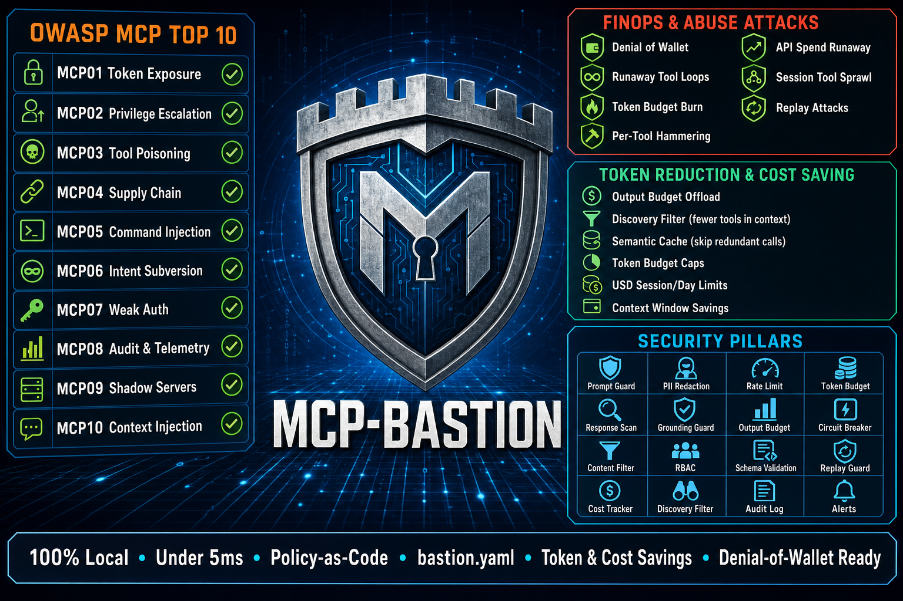
</p>

**OWASP MCP Top 10** (all addressed)

| ID | Risk | Bastion controls |
|----|------|------------------|
| MCP01 | Token / secret exposure | PII redaction, audit trail, outbound response scan |
| MCP02 | Privilege escalation | RBAC, **agent IAM**, rate limits, cost caps, session tool scope |
| MCP03 | Tool poisoning | Prompt guard, content filter, response scan, metadata guard, grounding guard |
| MCP04 | Supply chain | Circuit breaker, **`server_verification` checksums**, `doctor` CLI, `mcp-bastion manifest`, audit |
| MCP05 | Command injection | Prompt guard, content filter, schema validation |
| MCP06 | Intent subversion | Rate limits, replay guard, per-tool caps, semantic firewall |
| MCP07 | Weak authentication | RBAC, edge auth, **agent IAM** (per-agent tokens) |
| MCP08 | Audit & telemetry | Audit log, dashboard, Prometheus, OTEL, alerts |
| MCP09 | Shadow MCP servers | Central `bastion.yaml` policy, metrics, discovery filter |
| MCP10 | Context injection | PII redaction, response scan, output budget, discovery filter |

**FinOps & abuse attacks (beyond OWASP)**

| Attack | Controls |
|--------|----------|
| Denial of wallet | Iteration cap, token budget, cost tracker, output budget |
| Runaway tool loops | Session timeout, rate limiter, circuit breaker |
| Per-tool hammering | `max_per_tool` session caps |
| API spend runaway | USD session/day caps |
| Session tool sprawl | Distinct-tool limit per session |
| Replay abuse | Replay guard + nonces |

**Token reduction & cost saving**

| Lever | Controls | Benchmark |
|-------|----------|-----------|
| Smaller tool catalog in context | Discovery filter on `tools/list` | ~85% catalog tokens (20→3 tools)  -  [BENCHMARKS.md](docs/BENCHMARKS.md) |
| Less tool output in every turn | Output budget, session offload, `bastion_get_offloaded` | Up to ~99.7% on oversized dumps; 0% when under budget |
| Fewer redundant calls | Lexical similarity cache (Jaccard overlap) | Exact repeat hits; paraphrase misses at 0.9 |
| Predictable spend | Token budget caps, USD session/day limits | Session defaults on |

Deep-dive mapping and integration hooks: [docs/SECURITY_OBSERVABILITY.md](docs/SECURITY_OBSERVABILITY.md) · [docs/ATTACK_PREVENTION.md](docs/ATTACK_PREVENTION.md)

### Secure your MCP server in 3 lines (FastMCP)

```bash
pip install mcp mcp-bastion-fastmcp
```

```python
from mcp.server.fastmcp import FastMCP
from mcp_bastion_fastmcp import secure_fastmcp

mcp = FastMCP("My Server")
secure_fastmcp(mcp)  # wires prompt guard, PII redaction, rate limits into tools/call
```

**Policy-as-code instead?** Copy `bastion.yaml.example` → `bastion.yaml`, then `pip install mcp-bastion-python[policy]`:

```python
from mcp_bastion import build_middleware_from_config

middleware = build_middleware_from_config()  # loads bastion.yaml
```

More paths (TypeScript, CI validate, Docker): **[docs/QUICK_START.md](docs/QUICK_START.md)** · **[docs/README.md](docs/README.md)** · **[website](https://vaquarkhan.github.io/MCP-Bastion/)**

- **Prompt injection defense:** Heuristic jailbreak blocking out of the box; Meta PromptGuard ML when Hugging Face access is configured.
- **PII redaction:** Presidio masks SSN, email, phone in outbound content.
- **Denial-of-wallet protection:** Token buckets, iteration caps, token budget, cost tracking.
- **Response scan:** Blocks jailbreak patterns in outbound tool/resource text.
- **Output budget & grounding guard:** Optional response truncation and path verification (opt-in).

### How it works

MCP-Bastion sits **in-process** on your MCP server and inspects every `tools/call` before it reaches databases, APIs, or shell tools  -  then redacts sensitive data on the way back.

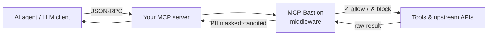

### Three ways to adopt

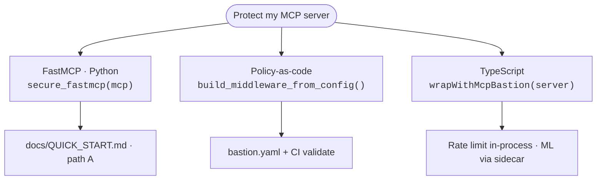

> **Releases:** npm, PyPI, and prebuilt **Docker** on GHCR  -  see [DOCKER.md](DOCKER.md). **Community:** [SUPPORT.md](SUPPORT.md) · [CONTRIBUTING.md](CONTRIBUTING.md) · [FUNDING.md](FUNDING.md) · **Security:** [SECURITY.md](SECURITY.md).

---

## Core Features

**Zero-Click Prompt Injection Prevention**

Integrates Meta's PromptGuard model locally to detect and block malicious payloads, jailbreaks, and adversarial tokenization before they reach your external tools.

**PII Redaction**

Microsoft Presidio scans outbound tool results and masks PII (redaction, substitution, generalization).

**Infinite Loop and Denial of Wallet Protection**

Implements stateful cycle detection and configurable FinOps token-bucket algorithms to automatically terminate runaway agents and prevent massive API bill overruns.

**100% Local Execution (Data Privacy)**

All security classification and data redaction happen entirely within the local memory space of your server. Sensitive data never leaves your enterprise network for third-party safety evaluations.

**Low Latency**

Drop-in middleware, under 5ms overhead.

**Framework Integration**

Hooks into MCP SDKs (TypeScript, Python) and FastMCP via standard middleware. No business logic changes.

### Complete feature catalog

**Pillar definitions:** Security controls, `bastion.yaml` sections, and how they relate to dashboard health rows are documented in [docs/PILLARS.md](docs/PILLARS.md) (canonical reference; avoids ambiguous “total pillar” counts). The same page lists **extended** features restored in 1.0.16+ (semantic firewall, sensitive classifier, external policy, edge auth, tool allowlist, session scope, tool metadata guard, multi-tenant, audit hash chain, pricing hooks, telemetry sinks, **red team** and **doctor** CLIs, etc.), **FinOps/context** pillars in 1.0.17+ (output budget, discovery filter, response scan, grounding guard), and **runtime governance** (agent IAM, server verification  -  introduced in 1.0.18+, **shipped in 2.0.0**).

> **Deeper context:** [docs/SECURITY_OBSERVABILITY.md](docs/SECURITY_OBSERVABILITY.md)  -  **OWASP MCP Top 10** alignment, attack scenarios, and SIEM/log integrations. **Framework add-ons** (LangChain, OpenAI, Bedrock, …) are listed under [Framework Integrations](#framework-integrations) below.

#### Threat prevention & content safety

| Feature | What you get |
|--------|----------------|
| **Prompt injection defense** | Meta **PromptGuard** scores tool arguments; malicious / jailbreak-style payloads can be blocked before execution (local inference, no third-party API). |
| **Content filter** | Block **shell/code execution** patterns, **sensitive file paths**, and **URLs**; optional **allowlist** / **denylist** regex or substring rules. |
| **PII redaction** | **Microsoft Presidio** detects many entity types in outbound tool/resource text (SSN, email, phone, cards, passport, IBAN, licenses, etc. - see Presidio docs). |

#### Access control, integrity & abuse

| Feature | What you get |
|--------|----------------|
| **Agent IAM (Confused Deputy)** | Bind **API tokens** to **agent identities**; per-agent `allowed_tools` / `blocked_tools`, **resource URI** allow/block, optional rate limits  -  stops a support bot from calling admin tools or reading secret resources. See [docs/RUNTIME_GOVERNANCE.md](docs/RUNTIME_GOVERNANCE.md). |
| **Full MCP surface guards (2.0.0)** | **`resources/read`**, **`prompts/get`**, **`sampling/createMessage`**, **`elicitation/create`**  -  same inbound/outbound pillars as tool calls (not only `tools/call`). [docs/MCP_SURFACE_AND_SCALE.md](docs/MCP_SURFACE_AND_SCALE.md) |
| **Distributed state (2.0.0)** | **`state_backend: redis`**  -  shared rate limits, replay nonces, cost caps, session scope across replicas. `pip install mcp-bastion-python[redis]` |
| **Behavioral fingerprinting (3.3.0, opt-in)** | **`behavior_fingerprint.enabled`** - per-agent tool baseline drift + rate spikes; default OFF. [docs/BEHAVIOR_FINGERPRINT.md](docs/BEHAVIOR_FINGERPRINT.md) |
| **Hybrid MCP transport (opt-in)** | **`mcp_transport`**  -  stateful sessions **and** stateless explicit state handles; per-request protocol version; proxy discovery card; agent stability monitor. [docs/HYBRID_MCP_TRANSPORT.md](docs/HYBRID_MCP_TRANSPORT.md) |
| **Server verification (supply chain)** | SHA-256 **manifest checksums** verified at startup and on every `tools/call`; `mcp-bastion manifest` generates trusted manifests after a signed-off build. |
| **RBAC** | **Tool-level** allow/deny by **role** (from request metadata); **fnmatch globs** (`read_*`) with specificity-aware matching in `bastion.yaml`. **Pair with Agent IAM or edge auth**  -  alone, roles are only as trustworthy as whatever sets `metadata["role"]`. [Live matrix →](docs/BENCHMARKS.md#rbac-tool-level-opt-in) |
| **Argument guards (2.0.0)** | **JSONPath + regex** block/redact on `tools/call` arguments before schema validation  -  stops shell injection and secret exfil in argv-style payloads. |
| **Schema validation** | Validate `tools/call` arguments against **JSON Schema** before the tool runs (block malformed or bypass attempts). |
| **Replay guard** | **Nonce** tracking to reject replayed requests (configurable **require_nonce**). |
| **Rate limiting** | **Token-bucket** style limits: **max iterations** per session, **timeout**, **token budget** - stops runaway loops and brute-force patterns. |
| **Circuit breaker** | Stop calling tools that fail repeatedly (limits blast radius of bad upstreams or poisoned tools). |

#### FinOps & performance

| Feature | What you get |
|--------|----------------|
| **Cost tracker** | Per-**session** and optional per-**day** USD caps; blocks when budget is exceeded. Optional **disk checkpoint** for restart-safe totals (memory backend). |
| **Semantic cache** (lexical) | Optional **Jaccard word-overlap** cache for near-identical tool queries  -  not embedding-based; see [benchmarks](docs/BENCHMARKS.md#lexical-similarity-cache-opt-in-semantic-cache-in-config). |
| **Low overhead** | Middleware on the hot path targeting **&lt;5 ms** typical overhead (see [docs/METRICS.md](docs/METRICS.md)). |

#### Audit, metrics & alerting

| Feature | What you get |
|--------|----------------|
| **Audit logging** | Structured **allow/deny** decisions with **reason**, **tool**, **tenant_id**, **trace_id**, **request_id** - feed SOC / compliance. Optional **JSONL file sink** + **`mcp-bastion tail`**. |
| **Alert sinks** | **Slack** incoming webhook; **generic HTTP** webhooks (PagerDuty, Teams, custom APIs); **multiple URLs**; **retry**, **backoff**, **timeout** in `bastion.yaml`. |
| **In-memory metrics** | **Global MetricsStore**: requests, blocks, PII counts, cost, per-tool stats, latency samples, rolling **time series** buckets. |
| **Real-time dashboard** | **Local web UI** (additive panels): **pre-deploy posture grades** + **Sonar-style prevalidation** from `.bastion/scan/`, **PMD-style issue guides** (why / how to fix / OWASP), **OWASP ASI + MCP + LLM heatmaps**, **live attack matrix**, **compliance evidence + dated reports**, **date filters**, **observe-mode banner**, **agents / trends / onboarding**, **forensics with why/pillar/trace**, **FinOps cost burn** (actual vs would-have-been, tokens saved + avoided by blocks, charts), plus classic KPIs. **APIs:** `/api/metrics`, `/api/posture`, `/api/prevalidate`, `/api/issue-guide`, `/api/taxonomy`, `/api/attack-matrix`, `/api/compliance`. Dark/light theme. See [dashboard/README.md](dashboard/README.md). |
| **OpenTelemetry** | Optional **OTLP** span export  -  `pip install mcp-bastion-python[otel]`  -  [docs/OTEL.md](docs/OTEL.md). |

#### Policy, packaging & developer experience

| Feature | What you get |
|--------|----------------|
| **Policy-as-code** | Single **`bastion.yaml`**: toggles for all request-path controls plus audit, alerts, and hot reload ([docs/PILLARS.md](docs/PILLARS.md)); load via `load_config` / `build_middleware_from_config`. |
| **Hot reload** | Optional **reload `bastion.yaml` on change** without restarting the MCP server ([docs/POLICY_AS_CODE.md](docs/POLICY_AS_CODE.md)). |
| **Composable middleware** | **`compose_middleware`** ordering; **`MCPBastionMiddleware`** flags for each pillar. |
| **CLI** | **`mcp-bastion scan`**, **`audit`**, **`validate`**, **`redteam`**, **`manifest`**, **`attest export`**, **`serve`**, **`dashboard`**, **`doctor`**, **`tail`**  -  [docs/CLI.md](docs/CLI.md). |
| **Python + multi-language** | **`mcp-bastion-python`** on PyPI (engine). For TypeScript / Java / Go / .NET / Kotlin / Rust adapters + shared `bastion.yaml`, use **[mcp-bastion-suite](https://github.com/vaquarkhan/mcp-bastion-suite)** — see [docs/MULTI_LANGUAGE_SUITE.md](docs/MULTI_LANGUAGE_SUITE.md). Optional in-repo TypeScript: **`@mcp-bastion/core`**. |
| **Containers** | **Dockerfile**, **docker-compose** profiles (proxy + optional dashboard)  -  [DOCKER.md](DOCKER.md). **Prebuilt images (GHCR):** [`mcp-bastion-proxy`](https://github.com/vaquarkhan/MCP-Bastion/pkgs/container/mcp-bastion-proxy), [`mcp-bastion-dashboard`](https://github.com/vaquarkhan/MCP-Bastion/pkgs/container/mcp-bastion-dashboard)  -  published on each `v*` tag ([publish-docker.yml](.github/workflows/publish-docker.yml)). |

### Real-Time Dashboard and Alerts

The dashboard is **optional and local** - a read-only view over **runtime metrics + local scan/audit artifacts**. No login server, no cloud DB (see [docs/ZERO_INFRA_STRATEGY.md](docs/ZERO_INFRA_STRATEGY.md)).

**Feature tour (GIF):** posture + how-to-fix → OWASP → attack matrix → compliance → RBAC/governance → forensics → agents → posture drift → **token & cost savings** → traffic.

<p align="center">
  
</p>
<p align="center"><sub>Feature tour</sub></p>
<p align="center">
  
</p>
<p align="center"><sub>Dashboard walkthrough</sub></p>
<p align="center">
  
</p>
<p align="center"><sub>Regenerate captures: <code>mcp-bastion dashboard --demo</code> then <code>python scripts/capture_dashboard_demo.py</code> · Seed: <code>--demo</code></sub></p>

#### What you get on the board

| Area | Panels / actions |
|------|------------------|
| **Pre-deploy posture** | Letter grades **A–F** for catalog scan, skill scan, OSV, risk audit + combined grade (reads `.bastion/scan/*.json`) |
| **Static prevalidation** | Sonar-style issue list from the same local JSON - not a SonarQube server (`/api/prevalidate`) |
| **Issue guides** | PMD-style why / how to fix / Bastion knobs / OWASP refs on every finding (`/api/issue-guide`) |
| **OWASP coverage** | Tabs for **ASI Top 10**, **MCP Top 10**, **LLM Top 10** - green/amber/grey heatmap with finding + block pressure |
| **Live attack matrix** | Categories under pressure with intensity, share, top tool, OWASP tags, sample/trace drill-down |
| **Compliance / reports** | Attestation + policy hash; generate **SOC2 / GDPR / ISO27001 / NIST AI RMF / ASI** evidence or zip (date-filtered) |
| **Runtime** | KPIs, governance, alerts + SSE, insights, forensics (**Why** + Details), agents / trends / onboarding, traffic/latency/PII charts |
| **FinOps** | Actual vs would-have-been spend/tokens; FinOps tokens saved; **tokens/$ avoided by blocks**; charts + blocked-issues table |
| **Filters** | Date range + presets (forensics, trends, attack matrix, reports) |

```bash
mcp-bastion dashboard --port 7000 --demo
# or: PYTHONPATH=src python dashboard/app.py
```

| URL | What it returns |
|-----|-----------------|
| [http://localhost:7000/](http://localhost:7000/) | Full UI (posture, prevalidate, OWASP, attack matrix, FinOps, forensics, …) |
| [http://localhost:7000/api/metrics](http://localhost:7000/api/metrics) | Runtime JSON (`cost_reduction`: used/saved/avoided + would-have cost) |
| [http://localhost:7000/api/posture](http://localhost:7000/api/posture) | Scan / skill / OSV / risk-audit grades from local JSON |
| [http://localhost:7000/api/prevalidate](http://localhost:7000/api/prevalidate) | Sonar-style issue list + grades (local scan suite) |
| [http://localhost:7000/api/issue-guide?check=weak_schema](http://localhost:7000/api/issue-guide?check=weak_schema) | PMD-style rule card (or `?id=ASI02`) |
| [http://localhost:7000/api/taxonomy](http://localhost:7000/api/taxonomy) | `?framework=asi\|mcp\|llm` heatmap |
| [http://localhost:7000/api/attack-matrix](http://localhost:7000/api/attack-matrix) | Live attack categories (+ date filter) |
| [http://localhost:7000/api/compliance/report](http://localhost:7000/api/compliance/report) | Evidence markdown (`framework`, `date_from`, `date_to`) |
| [http://localhost:7000/api/health](http://localhost:7000/api/health) | Build / `ui_revision` |
| [http://localhost:7000/metrics](http://localhost:7000/metrics) | Prometheus text |

<p align="center">
  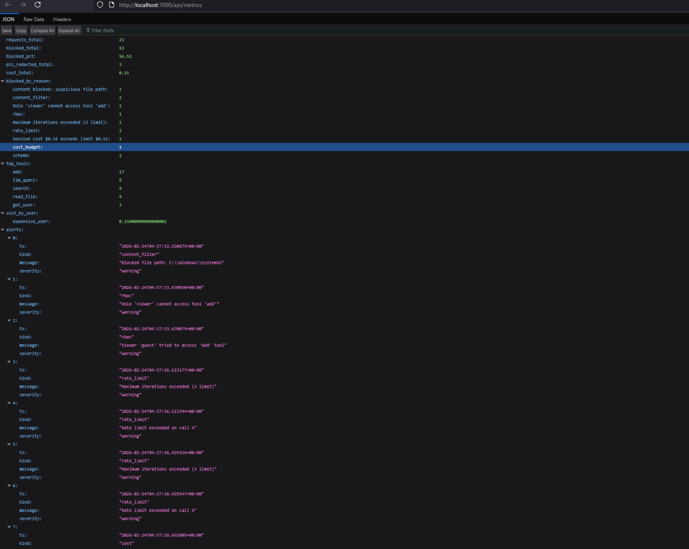
</p>
<p align="center"><sub><code>/api/metrics</code> JSON for Grafana, Datadog, or custom pollers</sub></p>

Feed scan/audit artifacts into the posture panels:

```bash
mkdir -p .bastion/scan
mcp-bastion scan tools.json --format json -o .bastion/scan/catalog.json
mcp-bastion scan --skills ./skills --format json -o .bastion/scan/skills.json
mcp-bastion osv-scan --format json -o .bastion/scan/osv.json
mcp-bastion audit --format json -o .bastion/scan/risk-audit.json
```

- **Alerts:** Slack webhook and cost-threshold alerts. Full UI reference: [dashboard/README.md](dashboard/README.md).

### Documentation: Use Cases, Attacks, Metrics, Tutorials

**Adoption paths (start-to-finish):**

| Goal | Read in order |
|------|----------------|
| **End-to-end handbook** | [docs/USER_GUIDE.md](docs/USER_GUIDE.md) → [published Docs](https://vaquarkhan.github.io/MCP-Bastion/guide/) |
| **Documentation bible (GIFs + dashboard)** | [docs/DOCUMENTATION_BIBLE.md](docs/DOCUMENTATION_BIBLE.md) → [live bible](https://vaquarkhan.github.io/MCP-Bastion/guide/bible.html) |
| **Feature deep dive + attack demos** | [docs/FEATURE_DEEP_DIVE.md](docs/FEATURE_DEEP_DIVE.md) → [docs/ATTACK_DEMOS.md](docs/ATTACK_DEMOS.md) |
| **Java / TypeScript / Go / .NET / Kotlin / Rust** | [docs/MULTI_LANGUAGE_SUITE.md](docs/MULTI_LANGUAGE_SUITE.md) → [mcp-bastion-suite](https://github.com/vaquarkhan/mcp-bastion-suite) |
| **Policy-as-code (`bastion.yaml`)** | [docs/PILLARS.md](docs/PILLARS.md) → [docs/POLICY_AS_CODE.md](docs/POLICY_AS_CODE.md) → `bastion.yaml.example` → [docs/CLI.md](docs/CLI.md) (`validate`) |
| **LLM clients (OpenAI, Claude, Gemini, …)** | [docs/LLM_INTEGRATION.md](docs/LLM_INTEGRATION.md) → [docs/INTEGRATION_MODELS.md](docs/INTEGRATION_MODELS.md) → [examples/](examples/) (`llm_*.py`) |
| **FastMCP / TypeScript / third-party MCP** | [docs/TUTORIALS.md](docs/TUTORIALS.md) → [docs/DETAILED_TUTORIAL.md](docs/DETAILED_TUTORIAL.md) |
| **Fleet rollout of `bastion.yaml` + SIEM / SOC audit** | [docs/SECURITY_OBSERVABILITY.md](docs/SECURITY_OBSERVABILITY.md) → [docs/POLICY_AS_CODE.md](docs/POLICY_AS_CODE.md) |
| **Minimal “hello world” + CI / registries** | [docs/QUICK_START.md](docs/QUICK_START.md) → [examples/ci/README.md](examples/ci/README.md) → [docs/DISCOVERY.md](docs/DISCOVERY.md) |

Full index: **[docs/README.md](docs/README.md)** · handbook site: **[Docs guide](https://vaquarkhan.github.io/MCP-Bastion/guide/)** · quick wrap: **[docs/QUICK_START.md](docs/QUICK_START.md)** · discovery: **[docs/DISCOVERY.md](docs/DISCOVERY.md)** · contribute: **[CONTRIBUTING.md](CONTRIBUTING.md)**.

| Doc | Description |
|-----|-------------|
| [docs/USER_GUIDE.md](docs/USER_GUIDE.md) | **End-to-end user guide** (concepts → install → proxy → vault → ops); published at `/guide/` |
| [docs/DOCUMENTATION_BIBLE.md](docs/DOCUMENTATION_BIBLE.md) | **System bible**: attack GIFs, dashboard tour, feature map, multi-language |
| [docs/FEATURE_DEEP_DIVE.md](docs/FEATURE_DEEP_DIVE.md) | **Feature-by-feature deep dive**: issue, how Bastion solves it, benefits (incl. dashboard) |
| [docs/ATTACK_DEMOS.md](docs/ATTACK_DEMOS.md) | Runnable attack → defense demos (keep heavy walkthroughs out of this README) |
| [docs/MULTI_LANGUAGE_SUITE.md](docs/MULTI_LANGUAGE_SUITE.md) | Multi-language connectors via [mcp-bastion-suite](https://github.com/vaquarkhan/mcp-bastion-suite) |
| [docs/index.md](docs/index.md) | Markdown docs home (source hub) |
| [docs/POLICY_AS_CODE.md](docs/POLICY_AS_CODE.md) | **`bastion.yaml` reference**: keys, examples, hot reload, alerts |
| [docs/LLM_INTEGRATION.md](docs/LLM_INTEGRATION.md) | **LLM integration**: OpenAI, Claude, Gemini, Mistral, Grok (stdio + HTTP configs) |
| [docs/DETAILED_TUTORIAL.md](docs/DETAILED_TUTORIAL.md) | Step-by-step implementation tutorial for new teams |
| [docs/USE_CASES.md](docs/USE_CASES.md) | Real use cases: enterprise gateway, LLM products, internal tools, SaaS, compliance |
| [docs/ATTACK_PREVENTION.md](docs/ATTACK_PREVENTION.md) | Examples showing how MCP-Bastion prevents real attacks (injection, PII leak, rate exhaustion, path traversal, RBAC, replay) |
| [docs/PILLARS.md](docs/PILLARS.md) | Canonical pillar counts: **18** request-path features (10 core + 8 extended), **14** dashboard `pillar_health` rows, **20+** `bastion.yaml` top-level areas  -  see the doc for scope |
| [docs/SUPPLY_CHAIN.md](docs/SUPPLY_CHAIN.md) | CI merge gates, releases, npm provenance, PyPI Trusted Publishing, CycloneDX SBOM |
| [docs/CRA_COMPLIANCE.md](docs/CRA_COMPLIANCE.md) | CRA / OpenSSF steward posture (Article 14 + SBOM; no runtime change) |
| [docs/CRA_SBOM_TUTORIAL.md](docs/CRA_SBOM_TUTORIAL.md) | Generate and download CycloneDX `bom.json` |
| [docs/PII_VAULT.md](docs/PII_VAULT.md) | Opt-in reversible PII tokenization (abstract + hydrate) |
| [docs/INTEGRATION_MODELS.md](docs/INTEGRATION_MODELS.md) | Middleware + `bastion.yaml` vs “change base URL”; bridge for Python, TS, Desktop, HTTP, integrations |
| [examples/ci/README.md](examples/ci/README.md) | Copy-paste GitHub Actions snippet to run `mcp-bastion validate` on your policy file |
| [docs/BENCHMARKS.md](docs/BENCHMARKS.md) | **Measured** RBAC matrix, output-budget reduction (up to ~99% on large tool outputs), discovery filter, lexical cache  -  pytest + report generator |
| [docs/REDTEAM.md](docs/REDTEAM.md) | Interpreting harness / red-team scores; which `bastion.yaml` pillars to enable; Node vs Python **scope** (`packages/core/README.md`) |
| [docs/SECURITY_OBSERVABILITY.md](docs/SECURITY_OBSERVABILITY.md) | **OWASP MCP Top 10**, integration hooks, **fleet-scale `bastion.yaml` rollout**, **SIEM / SOC audit** patterns |
| [docs/METRICS.md](docs/METRICS.md) | Performance overhead (&lt;5ms) and effectiveness metrics (dashboard, Prometheus, OTEL) |
| [docs/TUTORIALS.md](docs/TUTORIALS.md) | Tutorials: integrating with FastMCP, TypeScript, GitHub MCP, and open-source MCP servers |
| [docs/GITHUB_PAGES.md](docs/GITHUB_PAGES.md) | Publish docs as a GitHub Pages website from this same repo |
| [docs/QUICK_START.md](docs/QUICK_START.md) | Minimal FastMCP / `bastion.yaml` / CI snippets (time-to-value) |
| [docs/DISCOVERY.md](docs/DISCOVERY.md) | Registry and ecosystem discovery checklist |
| [docs/ENTERPRISE_RUNTIME_CONTROLS.md](docs/ENTERPRISE_RUNTIME_CONTROLS.md) | **3.0 runtime governance:** canary, ATR rules, LLM scanner, threat feeds, auto-repave, secret redaction, observe mode |
| [docs/ROADMAP.md](docs/ROADMAP.md) | Product roadmap: cost-aware governance, security depth, discoverability |
| [docs/COMPARISON.md](docs/COMPARISON.md) | vs unguarded MCP, thin proxy, full AI/MCP gateway |
| [docs/ENGINEERING_10_10.md](docs/ENGINEERING_10_10.md) | Strategic path to 10/10 on injection depth, tool poisoning, gateway maturity, FinOps metrics, project maturity |
| [CONTRIBUTING.md](CONTRIBUTING.md) | Contributor guide and **`good first issue`** ideas |

### One-Line Docker

**Prebuilt images (after the first [publish-docker](.github/workflows/publish-docker.yml) run, usually on a `v*` release tag):**

```bash
docker pull ghcr.io/vaquarkhan/mcp-bastion-proxy:latest
docker run -p 8080:8080 ghcr.io/vaquarkhan/mcp-bastion-proxy:latest
# Dashboard (optional, port 7000):
# docker pull ghcr.io/vaquarkhan/mcp-bastion-dashboard:latest
# docker run -p 7000:7000 ghcr.io/vaquarkhan/mcp-bastion-dashboard:latest
# Pin a release: ghcr.io/vaquarkhan/mcp-bastion-proxy:vX.Y.Z (published on each v* tag)
```

**Build locally** (any revision):

```bash
docker build -t mcp-bastion/proxy .
docker run -p 8080:8080 mcp-bastion/proxy
```

MCP endpoint: `http://localhost:8080/mcp`. Use `docker-compose up -d` for proxy; add `--profile with-dashboard` for the dashboard. See [DOCKER.md](DOCKER.md) (includes GHCR pull commands and **package** links for forks: replace `vaquarkhan` with your org or user in image paths).

### Policy-as-Code (bastion.yaml)

Single config file controls policy (see [docs/PILLARS.md](docs/PILLARS.md) for pillar definitions). Copy `bastion.yaml.example` to `bastion.yaml`, then:

```python
from mcp_bastion import build_middleware_from_config
middleware = build_middleware_from_config()
```

See [docs/POLICY_AS_CODE.md](docs/POLICY_AS_CODE.md).

Tip: set `hot_reload.enabled: true` in `bastion.yaml` to apply policy changes without restarting your MCP server when using `build_middleware_from_config()`.

### CLI for developers

```bash
mcp-bastion audit                 # local MCP client-config risk report
mcp-bastion scan tools.json       # static tool-definition scan
mcp-bastion validate              # validate bastion.yaml
mcp-bastion serve --http 8080     # run MCP server with config
mcp-bastion dashboard --port 7000 # run metrics dashboard
```

See [docs/CLI.md](docs/CLI.md).

### Continuous integration (this repository)

On every pull request and push to `main`, [`.github/workflows/ci.yml`](.github/workflows/ci.yml) runs:

1. `pip install -e ".[dev,policy,dashboard]"`  -  install the Python package with tests, YAML policy loading, and FastAPI for dashboard tests.
2. `mcp-bastion validate --config bastion.yaml.example`  -  ensure the example policy file loads.
3. `python -m pytest --cov=mcp_bastion --cov-fail-under=92`  -  full Python test suite with **≥92%** line coverage on `src/mcp_bastion` (see `[tool.coverage.*]` in `pyproject.toml` for measured paths and gates).
4. `npm ci` and `npm test`  -  TypeScript workspace tests.

To validate **your** repo’s `bastion.yaml` in CI without cloning MCP-Bastion, see [examples/ci/README.md](examples/ci/README.md).

### OpenTelemetry

Set `OTEL_EXPORTER_OTLP_ENDPOINT` to export tool-call spans to OTLP. Install optional deps: `pip install mcp-bastion-python[otel]`. See [docs/OTEL.md](docs/OTEL.md).

### Webhook alerts and external logging

Use **Slack** (`slack_webhook` / `SLACK_WEBHOOK_URL`), a **generic HTTP webhook** (`webhook_url` / `BASTION_WEBHOOK_URL`), or **multiple URLs** (`alerts.webhooks` in `bastion.yaml`). POSTs can drive **PagerDuty**, **Microsoft Teams**, **Datadog Events**, or any HTTP collector your SIEM exposes. Configure **retry/backoff** in `bastion.yaml` (`retry_attempts`, `retry_backoff_seconds`, `retry_backoff_max_seconds`, `timeout_seconds`).

**Metrics & traces:** scrape the dashboard **`/metrics`** (Prometheus) or poll **`/api/metrics`** (JSON) for Grafana, Datadog, or custom pollers. Set **`OTEL_EXPORTER_OTLP_ENDPOINT`** for traces to Jaeger, Honeycomb, **AWS ADOT**, etc. (`pip install mcp-bastion-python[otel]`). Route **Python logs** (including `LoggingAlertSink`) through **Fluent Bit**, **Vector**, or the **CloudWatch agent** into Splunk / Elastic / CloudWatch Logs.

See **[docs/SECURITY_OBSERVABILITY.md](docs/SECURITY_OBSERVABILITY.md)** for the full integration table and **OWASP MCP Top 10** alignment.

---

<p align="center">
  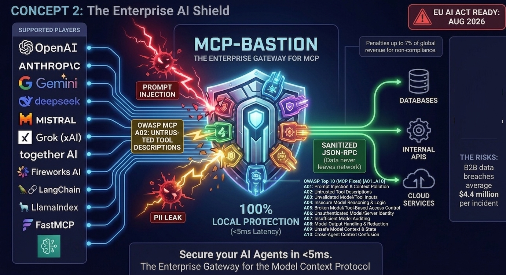
</p>

## Why MCP-Bastion

- **Active enforcement**  -  Intercepts MCP tool traffic so policies (prompt injection checks, PII handling, content rules, RBAC, and more) run before tools execute and before sensitive results propagate.
- **Local-first classification**  -  PromptGuard and Presidio run in your environment; you are not required to send prompts to a third-party API for guardrail scoring.
- **Stateful guardrails**  -  Per-session rate limits, iteration caps, token budgets, and cost tracking to reduce runaway loops and unexpected spend.
- **Composable integration**  -  Use `bastion.yaml` with `build_middleware_from_config()` or wire `MCPBastionMiddleware` / `wrapWithMcpBastion` in Python or TypeScript. For a separate process in front of an upstream MCP server, use a wrapper or proxy you control; see [docs/INTEGRATION_MODELS.md](docs/INTEGRATION_MODELS.md).

---

## Structure

| Path | Description |
|------|-------------|
| `src/mcp_bastion/` | Python package: PromptGuard, Presidio, rate limiting, RBAC, etc. |
| `packages/core/` | TypeScript package: rate limiting in-process; prompt/PII via sidecar (MCP_BASTION_URL) |
| `examples/` | Python examples ([examples/README.md](examples/README.md)) |
| `dashboard/` | Real-time dashboard UI and metrics API ([dashboard/README.md](dashboard/README.md)) |
| `bastion.yaml.example` | Policy-as-code sample; copy to `bastion.yaml` ([docs/POLICY_AS_CODE.md](docs/POLICY_AS_CODE.md)) |
| `scripts/validate_checklist.py` | Enterprise validation runner |
| `VALIDATION_CHECKLIST.md` | Validation guide and MCP Inspector steps |
| `SETUP_GUIDE.md` | Setup, config, and validation |
| `DOCKER.md` | Docker one-line run and compose |

### Example Files

| File | Purpose |
|------|---------|
| `examples/python_server_example.py` | Minimal middleware chain |
| `examples/full_demo.py` | Multi-pillar stack (core toggles: rate limit, PII, RBAC, …  -  see **docs/PILLARS.md**) |
| `examples/llm_server.py` | Shared MCP server for LLM clients |
| `examples/llm_openai_example.py` | OpenAI |
| `examples/llm_claude_example.py` | Claude |
| `examples/llm_gemini_example.py` | Gemini |
| `examples/llm_mistral_example.py` | Mistral |
| `examples/llm_grok_example.py` | Grok (xAI) |
| `examples/server_with_config.py` | Policy-as-code (bastion.yaml) |

## Installation

**Python**

```bash
uv add mcp-bastion-python
# or
pip install mcp-bastion-python
# pin a specific release (optional)
pip install mcp-bastion-python==4.0.0
```

**Prerequisites (recommended)**

- **PII redaction:** Presidio expects the spaCy English model. After install, run:  
  `python -m spacy download en_core_web_sm`  
  Without it, PII analysis can fail at runtime.
- **Policy-as-Code (`bastion.yaml`):** install YAML support:  
  `pip install mcp-bastion-python[policy]`  
  (adds `pyyaml`; otherwise you may get `ImportError` when loading policy files).
- **Prompt injection (PromptGuard):** two layers:
  1. **Regex heuristics** (always on) block obvious jailbreak strings such as “ignore previous instructions”  -  no model download required.
  2. **ML classifier (default ungated):** `ProtectAI/deberta-v3-base-prompt-injection-v2` via `use_ungated_default: true` (no Hugging Face login). Optional gated upgrade: set `use_ungated_default: false` and use `meta-llama/Llama-Prompt-Guard-2-86M` after `huggingface-cli login`. Unverified payloads are **blocked** when `fail_open: false` (default). Run `mcp-bastion doctor` to verify ML availability.

The PyPI wheel ships the full `mcp_bastion` tree (including `config`, `cli`, `otel`, dashboard metrics, and alert sinks). If you use an older wheel that omits modules, upgrade to the current release.

**TypeScript**

```bash
npm install @mcp-bastion/core
```

[npm](https://www.npmjs.com/package/@mcp-bastion/core)

### Framework Integrations

Drop-in security for your favorite LLM framework. Each package auto-installs `mcp-bastion-python`. **Version** and **download** columns use live [Shields.io](https://shields.io/) badges (no manual bump on release). **Trends:** [pypistats.org](https://pypistats.org/) · **Cumulative:** [pepy.tech](https://pepy.tech/).

| Package | Protects | Version | Downloads |
|---------|----------|---------|-----------|
| [mcp-bastion-python](https://pypi.org/project/mcp-bastion-python/) | Core middleware | [](https://pypi.org/project/mcp-bastion-python/) | [](https://pepy.tech/projects/mcp-bastion-python) · [pypistats](https://pypistats.org/packages/mcp-bastion-python) |
| [mcp-bastion-langchain](https://pypi.org/project/mcp-bastion-langchain/) | LangChain | [](https://pypi.org/project/mcp-bastion-langchain/) | [](https://pepy.tech/projects/mcp-bastion-langchain) · [pypistats](https://pypistats.org/packages/mcp-bastion-langchain) |
| [mcp-bastion-openai](https://pypi.org/project/mcp-bastion-openai/) | OpenAI GPT | [](https://pypi.org/project/mcp-bastion-openai/) | [](https://pepy.tech/projects/mcp-bastion-openai) · [pypistats](https://pypistats.org/packages/mcp-bastion-openai) |
| [mcp-bastion-anthropic](https://pypi.org/project/mcp-bastion-anthropic/) | Anthropic Claude | [](https://pypi.org/project/mcp-bastion-anthropic/) | [](https://pepy.tech/projects/mcp-bastion-anthropic) · [pypistats](https://pypistats.org/packages/mcp-bastion-anthropic) |
| [mcp-bastion-bedrock](https://pypi.org/project/mcp-bastion-bedrock/) | AWS Bedrock | [](https://pypi.org/project/mcp-bastion-bedrock/) | [](https://pepy.tech/projects/mcp-bastion-bedrock) · [pypistats](https://pypistats.org/packages/mcp-bastion-bedrock) |
| [mcp-bastion-gemini](https://pypi.org/project/mcp-bastion-gemini/) | Google Gemini | [](https://pypi.org/project/mcp-bastion-gemini/) | [](https://pepy.tech/projects/mcp-bastion-gemini) · [pypistats](https://pypistats.org/packages/mcp-bastion-gemini) |
| [mcp-bastion-crewai](https://pypi.org/project/mcp-bastion-crewai/) | CrewAI | [](https://pypi.org/project/mcp-bastion-crewai/) | [](https://pepy.tech/projects/mcp-bastion-crewai) · [pypistats](https://pypistats.org/packages/mcp-bastion-crewai) |
| [mcp-bastion-llamaindex](https://pypi.org/project/mcp-bastion-llamaindex/) | LlamaIndex | [](https://pypi.org/project/mcp-bastion-llamaindex/) | [](https://pepy.tech/projects/mcp-bastion-llamaindex) · [pypistats](https://pypistats.org/packages/mcp-bastion-llamaindex) |
| [mcp-bastion-groq](https://pypi.org/project/mcp-bastion-groq/) | Groq | [](https://pypi.org/project/mcp-bastion-groq/) | [](https://pepy.tech/projects/mcp-bastion-groq) · [pypistats](https://pypistats.org/packages/mcp-bastion-groq) |
| [mcp-bastion-mistral](https://pypi.org/project/mcp-bastion-mistral/) | Mistral AI | [](https://pypi.org/project/mcp-bastion-mistral/) | [](https://pepy.tech/projects/mcp-bastion-mistral) · [pypistats](https://pypistats.org/packages/mcp-bastion-mistral) |
| [mcp-bastion-cohere](https://pypi.org/project/mcp-bastion-cohere/) | Cohere | [](https://pypi.org/project/mcp-bastion-cohere/) | [](https://pepy.tech/projects/mcp-bastion-cohere) · [pypistats](https://pypistats.org/packages/mcp-bastion-cohere) |
| [mcp-bastion-azure](https://pypi.org/project/mcp-bastion-azure/) | Azure OpenAI | [](https://pypi.org/project/mcp-bastion-azure/) | [](https://pepy.tech/projects/mcp-bastion-azure) · [pypistats](https://pypistats.org/packages/mcp-bastion-azure) |
| [mcp-bastion-vertexai](https://pypi.org/project/mcp-bastion-vertexai/) | Vertex AI | [](https://pypi.org/project/mcp-bastion-vertexai/) | [](https://pepy.tech/projects/mcp-bastion-vertexai) · [pypistats](https://pypistats.org/packages/mcp-bastion-vertexai) |
| [mcp-bastion-huggingface](https://pypi.org/project/mcp-bastion-huggingface/) | Hugging Face | [](https://pypi.org/project/mcp-bastion-huggingface/) | [](https://pepy.tech/projects/mcp-bastion-huggingface) · [pypistats](https://pypistats.org/packages/mcp-bastion-huggingface) |
| [mcp-bastion-deepseek](https://pypi.org/project/mcp-bastion-deepseek/) | DeepSeek AI | [](https://pypi.org/project/mcp-bastion-deepseek/) | [](https://pepy.tech/projects/mcp-bastion-deepseek) · [pypistats](https://pypistats.org/packages/mcp-bastion-deepseek) |
| [mcp-bastion-together](https://pypi.org/project/mcp-bastion-together/) | Together AI | [](https://pypi.org/project/mcp-bastion-together/) | [](https://pepy.tech/projects/mcp-bastion-together) · [pypistats](https://pypistats.org/packages/mcp-bastion-together) |
| [mcp-bastion-fireworks](https://pypi.org/project/mcp-bastion-fireworks/) | Fireworks AI | [](https://pypi.org/project/mcp-bastion-fireworks/) | [](https://pepy.tech/projects/mcp-bastion-fireworks) · [pypistats](https://pypistats.org/packages/mcp-bastion-fireworks) |
| [mcp-bastion-fastmcp](https://pypi.org/project/mcp-bastion-fastmcp/) | FastMCP servers | [](https://pypi.org/project/mcp-bastion-fastmcp/) | [](https://pepy.tech/projects/mcp-bastion-fastmcp) · [pypistats](https://pypistats.org/packages/mcp-bastion-fastmcp) |

```bash
pip install mcp-bastion-langchain      # LangChain agents and tools
pip install mcp-bastion-openai         # OpenAI GPT API calls
pip install mcp-bastion-anthropic      # Anthropic Claude API calls
pip install mcp-bastion-bedrock        # AWS Bedrock runtime
pip install mcp-bastion-gemini         # Google Gemini
pip install mcp-bastion-crewai         # CrewAI agent crews
pip install mcp-bastion-llamaindex     # LlamaIndex RAG pipelines
pip install mcp-bastion-groq           # Groq inference
pip install mcp-bastion-mistral        # Mistral AI
pip install mcp-bastion-cohere         # Cohere
pip install mcp-bastion-azure          # Azure OpenAI Service
pip install mcp-bastion-vertexai       # Google Cloud Vertex AI
pip install mcp-bastion-huggingface    # Hugging Face Inference
pip install mcp-bastion-deepseek       # DeepSeek AI
pip install mcp-bastion-together       # Together AI
pip install mcp-bastion-fireworks      # Fireworks AI
pip install mcp-bastion-fastmcp        # FastMCP servers
```

## Publish (PyPI / npm)

- **PyPI:** `python -m build && twine upload dist/*` (or use GitHub Actions on tag).
- **npm:** From repo root, `cd packages/core && npm publish --access public` (or use Trusted Publishers).
- Version is set in `pyproject.toml` (Python), `packages/core/package.json` (npm), and `server.json` (MCP registry). Bump before releasing.

## Developer Guide

Integration examples for Python and TypeScript. Full contributor and feature docs:

| Doc | Description |
|-----|-------------|
| [docs/DEVELOPER_GUIDE.md](docs/DEVELOPER_GUIDE.md) | Repo layout, local dev, tests, release |
| [docs/FEATURES.md](docs/FEATURES.md) | How-to for all security pillars including 3.0 runtime governance |
| [docs/RBAC.md](docs/RBAC.md) | RBAC roles, fnmatch globs, Agent IAM pairing |
| [CONTRIBUTING.md](CONTRIBUTING.md) | PR checklist and good-first issues |
| [SUPPORT.md](SUPPORT.md) · [FUNDING.md](FUNDING.md) | Help and sponsorship |

---

### Quick Start (Python)

Add MCP-Bastion to an existing MCP server in three steps:

```python
from mcp_bastion import MCPBastionMiddleware, compose_middleware

# 1. Create the security middleware
bastion = MCPBastionMiddleware(
    enable_prompt_guard=True,
    enable_pii_redaction=True,
    enable_rate_limit=True,
)

# 2. Compose with your middleware chain (Bastion runs first)
middleware = compose_middleware(bastion)

# 3. Pass the composed middleware to your MCP server
# (integration depends on your server framework)
```

**Examples:**

| Example | Description |
|---------|-------------|
| `examples/python_server_example.py` | Basic middleware chain |
| `examples/full_demo.py` | Full middleware stack: add, PII, rate limit, prompt injection, etc. |
| `examples/llm_openai_example.py` | MCP server for OpenAI |
| `examples/llm_claude_example.py` | MCP server for Claude |
| `examples/llm_gemini_example.py` | MCP server for Gemini |
| `examples/llm_mistral_example.py` | MCP server for Mistral |
| `examples/llm_grok_example.py` | MCP server for Grok (xAI, HTTP only) |

```bash
# Windows: $env:PYTHONPATH="src"; python examples/full_demo.py
# Linux/Mac: PYTHONPATH=src python examples/full_demo.py
```

**LLM integration:** See [docs/LLM_INTEGRATION.md](docs/LLM_INTEGRATION.md) for copy-paste config for OpenAI, Claude, Gemini, Mistral, and Grok.

**Enterprise validation:**

```bash
PYTHONPATH=src python scripts/validate_checklist.py
```

See `VALIDATION_CHECKLIST.md` and `SETUP_GUIDE.md`.

---

### Python Tutorial: FastMCP Server

FastMCP server with MCP-Bastion via `secure_fastmcp` (patches tool dispatch  -  see [integrations/mcp-bastion-fastmcp/README.md](integrations/mcp-bastion-fastmcp/README.md)).

**Step 1: Install dependencies**

```bash
pip install mcp mcp-bastion-fastmcp
```

**Step 2: Create your server file** (`server.py`)

```python
from mcp.server.fastmcp import FastMCP
from mcp_bastion_fastmcp import secure_fastmcp

mcp = FastMCP("My Secure Server")
secure_fastmcp(mcp)  # call right after FastMCP(), before mcp.run()

@mcp.tool()
def get_weather(city: str) -> str:
    """Get weather for a city."""
    return f"Weather in {city}: 22C, sunny"

if __name__ == "__main__":
    mcp.run(transport="streamable-http")
```

**Step 3: Run the server**

```bash
python server.py
```

MCP-Bastion (via `secure_fastmcp`):
- Scans **tool arguments** for prompt injection before execution
- Redacts PII in **tool results** on the way out
- Enforces default rate limits (**15** calls per session, **60s** timeout  -  see `TokenBucketRateLimiter`)

For **full** `bastion.yaml` policy or **resource** (`resources/read`) PII redaction, use the low-level MCP `Server` with `build_middleware_from_config()`  -  see [docs/QUICK_START.md](docs/QUICK_START.md) path B.

**Alternative: Policy-as-Code**

Use `bastion.yaml` instead of code. Copy `bastion.yaml.example` to `bastion.yaml`, then:

```python
from mcp_bastion import build_middleware_from_config
middleware = build_middleware_from_config()
```

See [docs/POLICY_AS_CODE.md](docs/POLICY_AS_CODE.md) and `examples/server_with_config.py`.

---

### Python: Custom Rate Limits

Custom config example:

```python
from mcp_bastion import MCPBastionMiddleware
from mcp_bastion.pillars.rate_limit import TokenBucketRateLimiter
from mcp_bastion.pillars.prompt_guard import PromptGuardEngine

# Stricter limits
rate_limiter = TokenBucketRateLimiter(
    max_iterations=10,
    timeout_seconds=30,
    token_budget=25_000,
)

# Higher threshold = fewer blocks, more risk
prompt_guard = PromptGuardEngine(threshold=0.92)

bastion = MCPBastionMiddleware(
    prompt_guard=prompt_guard,
    rate_limiter=rate_limiter,
    enable_prompt_guard=True,
    enable_pii_redaction=True,
    enable_rate_limit=True,
)

# Disable PII redaction if your data has no PII
bastion_no_pii = MCPBastionMiddleware(enable_pii_redaction=False)
```

---

### Python: Custom Middleware

Extend `Middleware` to add logging, metrics, or custom logic:

```python
from mcp_bastion import MCPBastionMiddleware
from mcp_bastion.base import Middleware, MiddlewareContext, compose_middleware

class LoggingMiddleware(Middleware):
    async def on_message(self, context, call_next):
        result = await call_next(context)
        # log method, elapsed, etc.
        return result

bastion = MCPBastionMiddleware()  # or use the configured instance from above
middleware = compose_middleware(bastion, LoggingMiddleware())
```

See `examples/full_demo.py` for a complete example.

---

### TypeScript: Wrap an MCP Server

**Step 1: Install dependencies**

```bash
npm install @modelcontextprotocol/sdk @mcp-bastion/core
```

**Step 2: Create your server** (`server.ts`)

```typescript
import { Server } from "@modelcontextprotocol/sdk/server/index.js";
import { StdioServerTransport } from "@modelcontextprotocol/sdk/server/stdio.js";
import {
  wrapWithMcpBastion,
} from "@mcp-bastion/core";

const server = new Server({ name: "my-mcp-server", version: "1.0.0" });

// Wrap the server with MCP-Bastion (rate limiting only by default)
// For prompt injection and PII, run the Python sidecar and set sidecarUrl
wrapWithMcpBastion(server, {
  enableRateLimit: true,
  maxIterations: 15,
  timeoutMs: 60_000,
  // Optional: enable ML features via Python sidecar
  sidecarUrl: process.env.MCP_BASTION_SIDECAR || "",
  enablePromptGuard: !!process.env.MCP_BASTION_SIDECAR,
  enablePiiRedaction: !!process.env.MCP_BASTION_SIDECAR,
});

// Register tools (handlers are automatically wrapped)
server.setRequestHandler("tools/call" as any, async (request) => {
  if (request.params?.name === "get_weather") {
    return {
      content: [{ type: "text", text: "Sunny, 22C" }],
      isError: false,
    };
  }
  throw new Error("Unknown tool");
});

async function main() {
  const transport = new StdioServerTransport();
  await server.connect(transport);
}

main();
```

**Step 3: Run with rate limiting only**

```bash
npx tsx server.ts
```

**Step 4: Run with full ML features (Python sidecar)**

For prompt injection and PII redaction, run a Python HTTP service that exposes `/prompt-guard` and `/pii-redact` endpoints (see the Python package for sidecar implementation). Then:

```bash
# Start the Python sidecar, then the TypeScript server (sidecarUrl or MCP_BASTION_URL)
MCP_BASTION_SIDECAR=http://localhost:8000 npx tsx server.ts
```

---

### TypeScript: Wrap Individual Handlers

Wrap specific handlers only:

```typescript
import {
  wrapCallToolHandler,
  wrapReadResourceHandler,
} from "@mcp-bastion/core";
import {
  CallToolRequestSchema,
  ReadResourceRequestSchema,
} from "@modelcontextprotocol/sdk/types.js";

// Wrap only the tool handler
const safeToolHandler = wrapCallToolHandler(
  async (request) => {
    // Your tool logic
    return { content: [{ type: "text", text: "OK" }], isError: false };
  },
  { enableRateLimit: true, maxIterations: 10 }
);

// Wrap only the resource handler (for PII redaction)
const safeResourceHandler = wrapReadResourceHandler(
  async (request) => {
    const contents = await fetchResource(request.params.uri);
    return { contents };
  },
  { sidecarUrl: "http://localhost:8000", enablePiiRedaction: true }
);

server.setRequestHandler(CallToolRequestSchema, safeToolHandler);
server.setRequestHandler(ReadResourceRequestSchema, safeResourceHandler);
```

---

### Configuration Reference

| Option | Python | TypeScript | Default | Description |
|--------|--------|------------|---------|-------------|
| `enable_prompt_guard` | Yes | Yes | `True` (Python) / `False` (TS) | Block malicious prompts via PromptGuard |
| `enable_pii_redaction` | Yes | Yes | `True` (Python) / `False` (TS) | Mask PII in outgoing content |
| `enable_rate_limit` | Yes | Yes | `True` | Enforce iteration and timeout caps |
| `max_iterations` | Via `TokenBucketRateLimiter` | Yes | 15 | Max tool calls per session |
| `timeout_seconds` / `timeoutMs` | Via `TokenBucketRateLimiter` | Yes | 60 | Session timeout |
| `token_budget` | Via `TokenBucketRateLimiter` | - | 50,000 | FinOps token cap per request |
| `sidecarUrl` | - | Yes | `""` | Python sidecar URL for ML features |
| `threshold` | Via `PromptGuardEngine` | - | 0.85 | Malicious probability cutoff |
| `setLogLevel` | - | Yes | `"info"` | TypeScript: `"debug"` \| `"info"` \| `"warn"` \| `"error"` |

---

### Error Handling

When MCP-Bastion blocks a request, it returns standard MCP/JSON-RPC errors:

| Code | Exception | When |
|------|-----------|------|
| -32001 | `PromptInjectionError` | Tool args contain jailbreak/injection |
| -32002 | `RateLimitExceededError` | Session exceeds iteration or timeout limit |
| -32003 | `TokenBudgetExceededError` | Session exceeds token budget |
| -32004 | `CircuitBreakerOpenError` | Tool’s circuit breaker is open after failures |
| -32005 | `ContentFilterError` | Content filter matched a blocked pattern |
| -32006 | `RBACError` | Caller not allowed to use this tool |
| -32007 | `SchemaValidationError` | Tool arguments failed schema validation |
| -32008 | `ReplayAttackError` | Duplicate nonce / replay detected |
| -32009 | `CostBudgetExceededError` | Session cost budget exceeded |
| -32010 | `SemanticFirewallError` | Tool sequence / argument pattern failed semantic firewall |
| -32011 | `ExternalPolicyDeniedError` | OPA/Cedar (or other external) policy denied the request |
| -32012 | `SensitiveContentError` | Sensitive-business classifier above threshold |
| -32013 | `AuthenticationError` | Edge / gateway authentication (metadata token) failed |
| -32014 | `ToolNotAllowedError` | Tool not on allowlist |
| -32015 | `SessionScopeExceededError` | Too many distinct tools per session (scope creep) |
| -32016 | `ToolMetadataPoisoningError` | Tool list / metadata failed safety checks |
| -32017 | `GroundingViolationError` | Ungrounded file reference in tool output |
| -32018 | `PromptGuardUnavailableError` | PromptGuard ML unavailable and fail-closed (or heuristics disabled) |
| -32019 | `AgentAccessDeniedError` | Authenticated agent attempted a tool outside its IAM policy |
| -32020 | `ServerVerificationError` | MCP server file checksums do not match trusted manifest |

```python
# Python: exceptions
from mcp_bastion.errors import (
    PromptInjectionError,
    RateLimitExceededError,
    TokenBudgetExceededError,
    CircuitBreakerOpenError,
    ContentFilterError,
    RBACError,
    SchemaValidationError,
    ReplayAttackError,
    CostBudgetExceededError,
    SemanticFirewallError,
    ExternalPolicyDeniedError,
    SensitiveContentError,
    AuthenticationError,
    ToolNotAllowedError,
    SessionScopeExceededError,
    ToolMetadataPoisoningError,
    GroundingViolationError,
    PromptGuardUnavailableError,
    AgentAccessDeniedError,
    ServerVerificationError,
)
import logging
logger = logging.getLogger(__name__)

try:
    result = await middleware(context, call_next)
except (
    PromptInjectionError,
    RateLimitExceededError,
    TokenBudgetExceededError,
    CircuitBreakerOpenError,
    ContentFilterError,
    RBACError,
    SchemaValidationError,
    ReplayAttackError,
    CostBudgetExceededError,
    SemanticFirewallError,
    ExternalPolicyDeniedError,
    SensitiveContentError,
    AuthenticationError,
    ToolNotAllowedError,
    SessionScopeExceededError,
    ToolMetadataPoisoningError,
    GroundingViolationError,
    PromptGuardUnavailableError,
    AgentAccessDeniedError,
    ServerVerificationError,
) as e:
    logger.warning("blocked: %s", e.to_mcp_error())
```

```typescript
// TypeScript: handlers return isError: true
import { logger, setLogLevel } from "@mcp-bastion/core";
setLogLevel("debug");  // optional: "debug" | "info" | "warn" | "error"
const result = await guardedHandler(request);
if (result.isError) {
  logger.error("blocked", result.content);
}
```

---

### Testing

MCP Inspector:

```bash
# Start your guarded server
python server.py   # or: npx tsx server.ts

# In another terminal, launch the Inspector
npx -y @modelcontextprotocol/inspector
```

Connect via HTTP (`http://localhost:8000/mcp`) or stdio, then:
1. List tools and call one with benign arguments (should succeed)
2. Call a tool with "Ignore previous instructions" (should be blocked)
3. Trigger 16+ tool calls in one session (should hit rate limit)

---

## Testing

```bash
# Python (PYTHONPATH=src on Windows: $env:PYTHONPATH="src")
python -m pytest tests/ -v

# TypeScript
npm run test --workspace=@mcp-bastion/core

# Full validation checklist (build, pillars, latency)
PYTHONPATH=src python scripts/validate_checklist.py

# MCP Inspector (manual)
npx -y @modelcontextprotocol/inspector
```

## Third-Party Components

See `NOTICE` for licenses. MCP-Bastion uses Meta Llama Prompt Guard 2 (Llama 4 Community License) and Microsoft Presidio. For OWASP-relevant mitigations and dependency audit, see [docs/SECURITY.md](docs/SECURITY.md). To report vulnerabilities privately, see [SECURITY.md](SECURITY.md).

## License

MCP-Bastion is distributed under the **MCP-Bastion Community and Commercial License** ([LICENSE](LICENSE)).

- **Free** for non‑commercial use when you **cite MCP-Bastion** and the **copyright** notice (see [CITATION.cff](CITATION.cff); you can list *your* name, team, or org as authors or as who used the software, while still including the project and repository in the credit).
- **Copyright** is retained. Do not remove license or copyright text, and do not republish a duplicate of the work as if it were unrelated software without meeting the License terms.
- **Commercial use** (as defined in the License) may still require a **separate written agreement**  -  see [COMMERCIAL_LICENSE.md](COMMERCIAL_LICENSE.md).

See also:

- [LICENSE](LICENSE)
- [COMMERCIAL_LICENSE.md](COMMERCIAL_LICENSE.md)
- [FUNDING.md](FUNDING.md)  -  sponsorship and sustainability
- [SUPPORT.md](SUPPORT.md)  -  docs, issues, response expectations
- [CITATION.cff](CITATION.cff)

---

## Product overview deck

**[MCP-Bastion features deck (PDF)](docs/mcp-bastian-features-deck.pdf)**  -  cost-aware runtime governance, pillar map, FinOps benchmarks, and deployment patterns in a short slide deck for evaluators and stakeholders.
