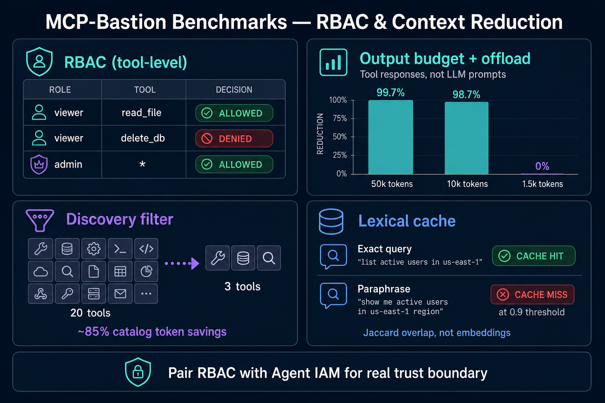

# MCP-Bastion benchmarks (RBAC & context reduction)

> Auto-generated by `scripts/generate_benchmark_report.py` — re-run after pillar changes.
>
> **Version:** `2.0.0-finops-rbac-v1` · **Generated:** 2026-07-05T07:40:44.977841+00:00  
> **Token counter:** tiktoken cl100k_base when installed, else ~4 chars/token

## Honest summary

No single flat 'X% prompt reduction' applies. Savings target oversized tool outputs and tool catalogs, not user/LLM prompt text. Small responses are unchanged.

| Feature | What we measured | Headline result |
|---------|------------------|-----------------|
| **RBAC** | Tool-level allow/deny by role | Viewer/admin/nobody matrix **passes** (see below) |
| **Output budget + offload** | Oversized **tool response** text | **Up to ~99.72%** reduction on 50k-token dumps; **0%** when under budget |
| **Discovery filter** | `tools/list` JSON size (20 → 3 tools) | **~84.87%** fewer catalog tokens (opt-in) |
| **Lexical cache** | Repeat vs paraphrased tool queries | Exact repeat **hits**; paraphrase **misses** at 0.9 threshold |
| **Injection efficacy (offline heuristics)** | Known jailbreak bypass set vs benign traffic | **`tests/test_injection_efficacy.py`** — target **100%** attack block, **0%** benign FP (regex + normalize only) |

<p align="center">
  
</p>

## RBAC (tool-level, opt-in)

Pair with **Agent IAM** or **edge auth** — RBAC reads `context.metadata["role"]` / `["agent"]`; without authenticated identity stamping, roles are self-asserted.

| Role | Tool | Result |
| --- | --- | --- |
| viewer | read_file | ALLOWED |
| viewer | delete_db | DENIED |
| admin | delete_db | ALLOWED |
| admin | any_tool | ALLOWED |
| nobody | read_file | DENIED |

- Config: `rbac.enabled: true` + `rbac.permissions` in `bastion.yaml`
- Wildcard `*` grants all tools (admin row above)

## Output budget + session offload (opt-in)

Default benchmark config: `max_output_tokens: 4000`, `min_tokens: 500`, offload **on**.
Full text is stored in-session; the model sees a ~250-token pointer + preview.

| Tool response (input tokens) | Kept in context | Reduction |
| --- | --- | --- |
| 100,001 | 284 | **99.72%** |
| 20,001 | 268 | **98.66%** |
| 3,001 | 3,001 | **0.0%** |

**Not a flat “95% prompt reduction”** — small tool outputs (under budget) are **unchanged (0%)**.

Regenerate: `PYTHONPATH=src python -m pytest tests/test_benchmarks_finops_rbac.py -q`

## Discovery filter (opt-in)

Simulated `20` tool schemas → allowlist `3`:

| Metric | Value |
|--------|-------|
| Full `tools/list` tokens | 1,282 |
| Filtered tokens | 194 |
| Reduction | **84.87%** |

## Lexical similarity cache (opt-in; “semantic cache” in config)

Implementation uses **Jaccard word overlap**, not embeddings — name is historical; see `semantic_cache.py`.

Threshold: **0.9**

| Case | Query pattern | Cache hit | Jaccard vs cached |
| --- | --- | --- | --- |
| exact_repeat | find all customers in the database | Yes | 1.0 |
| paraphrase_extra_words | find all the customers in the database please | No | 0.8571 |

## Injection efficacy (offline heuristics)

Measures **bypass resistance** when PromptGuard ML is unavailable — regex + `normalize_for_scan` only. Not a claim of novel-paraphrase defense.

| Metric | Target |
|--------|--------|
| Attack block rate | **100%** on the fixed adversarial set (letter-spaced ignore, disregard paraphrase, DAN, system tags, …) |
| Benign false-positive rate | **0%** on weather/math/docs/code-review/translate prompts |

```bash
PYTHONPATH=src python -m pytest tests/test_injection_efficacy.py -v
PYTHONPATH=src python -c "from mcp_bastion.benchmarks.injection_efficacy import run_injection_efficacy; import json; print(json.dumps(run_injection_efficacy(), indent=2))"
```

Heuristic mode catches **known jailbreak families** only. A non-gated default classifier (roadmap 3.0) is required for offline 10/10 — see [ENGINEERING_10_10.md](ENGINEERING_10_10.md).

## Reproduce locally

```bash
pip install -e ".[dev]"
PYTHONPATH=src python -m pytest tests/test_benchmarks_finops_rbac.py tests/test_injection_efficacy.py -v
PYTHONPATH=src python scripts/generate_benchmark_report.py
```

CI runs the pytest module on every merge; this file is updated when maintainers regenerate the report.
