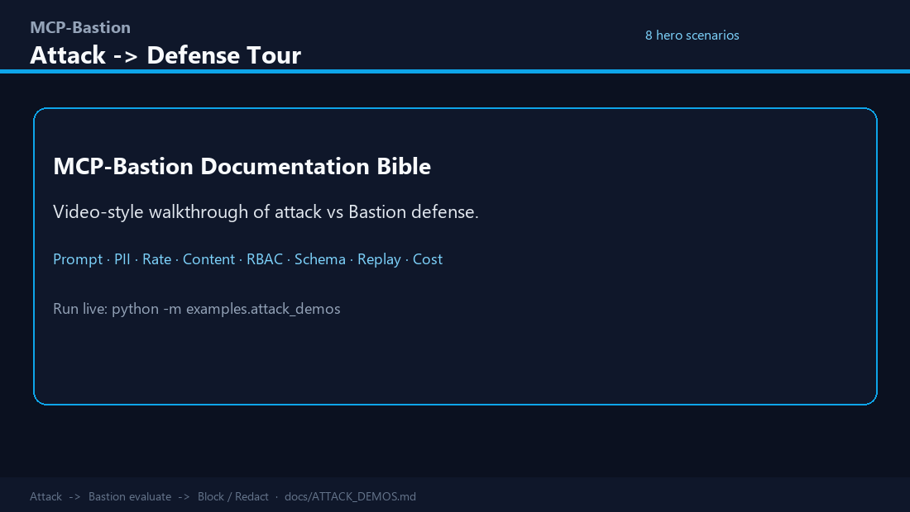
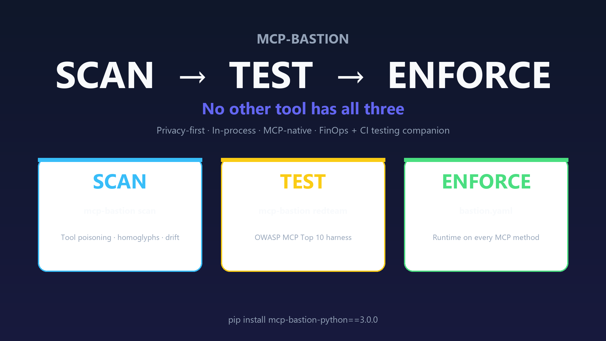
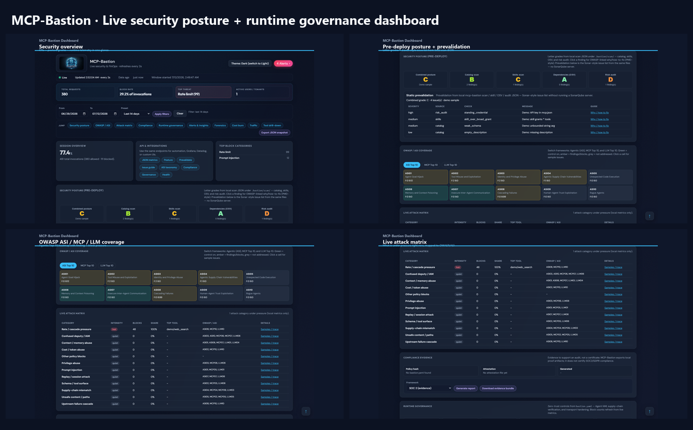

# MCP-Bastion Documentation Bible

**Version:** 4.0.0  
**Purpose:** Single entry point for the full system — concepts, every feature, attack→defense demos (with GIFs), dashboard, multi-language suite, and ops.  
**Published:** https://vaquarkhan.github.io/MCP-Bastion/guide/bible.html

> Prefer this handbook over stuffing the root README. The README stays a thin index; **this page is the bible**.

---

## Visual tour (start here)

### Attack → defense (video-style GIF)



*Scripted terminal demos: **ATTACK → BASTION → BLOCK/REDACT → VALUE** for eight hero features.*  
Live: `PYTHONPATH=src python -m examples.attack_demos --strict` · Per-feature GIFs in [ATTACK_DEMOS.md](ATTACK_DEMOS.md) and [FEATURE_DEEP_DIVE.md](FEATURE_DEEP_DIVE.md)

### Dashboard walkthrough


*Posture, OWASP heatmaps, attack matrix, governance, forensics, FinOps.*  
Local: `mcp-bastion dashboard --demo`

### Architecture at a glance

| Diagram | What it shows |
|---------|----------------|
|  | Scan → Test → Enforce lifecycle |
|  | Reversible PII abstract / hydrate |
|  | Hybrid MCP transport paths |

---

## How to use this bible

| You want… | Go to |
|-----------|--------|
| Install & first green run | [USER_GUIDE.md](USER_GUIDE.md) §3 · [QUICK_START.md](QUICK_START.md) |
| Every control: issue → solution → benefits | [FEATURE_DEEP_DIVE.md](FEATURE_DEEP_DIVE.md) |
| Runnable attack demos + per-feature GIFs | [ATTACK_DEMOS.md](ATTACK_DEMOS.md) |
| Dashboard panels explained | [dashboard/README.md](../dashboard/README.md) · Part F in deep dive |
| Java / TS / Go / .NET / Kotlin / Rust | [MULTI_LANGUAGE_SUITE.md](MULTI_LANGUAGE_SUITE.md) · [suite repo](https://github.com/vaquarkhan/mcp-bastion-suite) |
| YAML reference | [POLICY_AS_CODE.md](POLICY_AS_CODE.md) · [FEATURES.md](FEATURES.md) |
| CLI | [CLI.md](CLI.md) |
| CRA / SBOM | [CRA_COMPLIANCE.md](CRA_COMPLIANCE.md) |

**Repos:** [MCP-Bastion](https://github.com/vaquarkhan/MCP-Bastion) = security **engine** (`mcp-bastion-python`).  
**[mcp-bastion-suite](https://github.com/vaquarkhan/mcp-bastion-suite)** = multi-language **connectors** (shared `bastion.yaml`).

---

## Part 1 — What Bastion is

MCP-Bastion is **security and governance middleware** for the [Model Context Protocol](https://modelcontextprotocol.io/). It sits on the request/response path of tools, resources, and prompts — enforcing policy **before** untrusted model-driven actions reach your systems, and **before** sensitive output re-enters the model.

```text
AI agent / MCP client
        │  JSON-RPC
        ▼
┌───────────────────────────┐
│  MCP-Bastion              │  pillars: allow / block / redact / vault / observe
│  middleware or HTTP proxy │
└─────────────┬─────────────┘
              ▼
        Your MCP server / tools
```

| Property | Choice |
|----------|--------|
| Policy | One `bastion.yaml` |
| Defaults | Safe; advanced features **opt-in** |
| Infra | Zero mandatory cloud (memory default; Redis optional) |
| Deploy | In-process library **or** `serve --proxy` boundary |

---

## Part 2 — Attack → defense gallery (GIFs)

Each clip is a four-beat storyboard: **Attack → Evaluate → Outcome → Benefit**.  
Regenerate: `python scripts/generate_attack_demo_gifs.py`

### 01 Prompt injection (`prompt_guard`) — **-32001**


### 02 PII leakage (`pii`) — redaction


### 03 Rate / denial of wallet (`rate_limit`) — **-32002**


### 04 Path traversal (`content_filter`) — **-32005**


### 05 Unauthorized tool (`rbac`) — **-32006**


### 06 Schema bypass (`schema_validation`) — **-32007**


### 07 Replay (`replay_guard`) — **-32008**


### 08 Cost overrun (`cost_tracker`) — **-32009**


Full narrative + CLI: [ATTACK_DEMOS.md](ATTACK_DEMOS.md) · Issue/solution text: [FEATURE_DEEP_DIVE.md](FEATURE_DEEP_DIVE.md)

---

## Part 3 — Dashboard (local UI bible)



Zero-infra local UI: `mcp-bastion dashboard --demo` → http://127.0.0.1:7000/

| Panel | Why it exists |
|-------|----------------|
| Overview KPIs | Instant pressure signal |
| Security posture A–F | Pre-deploy ship/no-ship from scan JSON |
| Prevalidation + issue guides | Sonar-style findings → Bastion knobs → OWASP |
| OWASP / ASI / MCP / LLM heatmaps | Coverage vs taxonomies |
| Live attack matrix | Category pressure + samples |
| Runtime governance tiles | RBAC, prompt, rate/cost, PII, Agent IAM, transport |
| FinOps burn & reduction | Actual vs would-have-been; tokens avoided by blocks |
| Forensics Trace / Reproduce | Why blocked, side detail |
| Agents | Confused-deputy denials + IAM map |
| Compliance evidence | Hashes + SOC2/GDPR/ISO/NIST/ASI packs |
| Observe banner | Would-have-blocked when `mode: observe` |


Deep panel guide: [dashboard/README.md](../dashboard/README.md) · [FEATURE_DEEP_DIVE.md](FEATURE_DEEP_DIVE.md) Part F · [METRICS.md](METRICS.md)

---

## Part 4 — Feature map (all pillars)

Use the deep dive for **issue → how Bastion solves it → benefits** on every control:

**→ [FEATURE_DEEP_DIVE.md](FEATURE_DEEP_DIVE.md)** (canonical)

Quick index:

| Family | Examples |
|--------|----------|
| Core 10 | prompt_guard, pii, rate_limit, circuit_breaker, content_filter, rbac, schema, replay, cost, semantic_cache |
| Extended / FinOps | discovery_filter, output_budget, cost_policy, argument_guards, response_scan |
| Privacy | pii_vault, secrets.redact_patterns |
| Governance | agent_iam, server_verification, canary, ATR, behavior_fingerprint, catalog pin |
| Transport | serve --proxy, transport_hardening, hybrid mcp_transport |
| Compliance | SBOM / CRA, attest export, report CLI |

Enablement YAML: [FEATURES.md](FEATURES.md) · Counts: [PILLARS.md](PILLARS.md)

---

## Part 5 — Multi-language (suite)


| Stack | Path |
|-------|------|
| Python / FastMCP | This repo — in-process middleware |
| TypeScript / Nest / Express | [mcp-bastion-suite](https://github.com/vaquarkhan/mcp-bastion-suite) adapters |
| Java / Spring / Quarkus | Suite + proxy |
| Go / .NET / Kotlin / Rust | Suite tutorials + examples |

**→ [MULTI_LANGUAGE_SUITE.md](MULTI_LANGUAGE_SUITE.md)**

---

## Part 6 — Operate

| Task | Command / doc |
|------|----------------|
| Validate policy | `mcp-bastion validate -c bastion.yaml` |
| Attack demos | `python -m examples.attack_demos --strict` |
| Dashboard | `mcp-bastion dashboard --demo` |
| Scan catalog | `mcp-bastion scan tools.json` |
| Proxy boundary | `mcp-bastion serve --proxy` · [GATEWAY_BOUNDARY.md](GATEWAY_BOUNDARY.md) |
| Regenerate attack GIFs | `python scripts/generate_attack_demo_gifs.py` |
| Regenerate dashboard GIF | `mcp-bastion dashboard --demo` then `python scripts/capture_dashboard_demo.py` |
| Rebuild docs HTML | `python scripts/build_docs_site.py` |

---

## Part 7 — Learning paths

1. **Developer (30 min):** Quick start → Attack demos GIF + `--only content_filter` → Features enablement  
2. **Security reviewer:** Bible visual tour → Feature deep dive → Attack prevention → Dashboard matrix  
3. **Platform / multi-lang:** Multi-language suite → Proxy tutorial → CI Action in suite  
4. **Compliance:** CRA SBOM → attest/report → Dashboard compliance panel  

---

## Asset index

| Asset | Path |
|-------|------|
| Attack tour GIF | `docs/images/mcp-bastion-attack-defense-tour.gif` |
| Per-feature GIFs | `docs/images/attack-demos/*.gif` |
| Dashboard tour GIF | `docs/images/mcp-bastion-dashboard-tour.gif` |
| Dashboard collage | `docs/images/mcp-bastion-dashboard.png` |
| Site copies | `docs/site/assets/` (+ `attack-demos/`) |

---

## Related published pages

- https://vaquarkhan.github.io/MCP-Bastion/guide/bible.html  
- https://vaquarkhan.github.io/MCP-Bastion/guide/attack-demos.html  
- https://vaquarkhan.github.io/MCP-Bastion/guide/feature-deep-dive.html  
- https://vaquarkhan.github.io/MCP-Bastion/guide/multi-language.html  
- https://vaquarkhan.github.io/MCP-Bastion/guide/user-guide.html  
