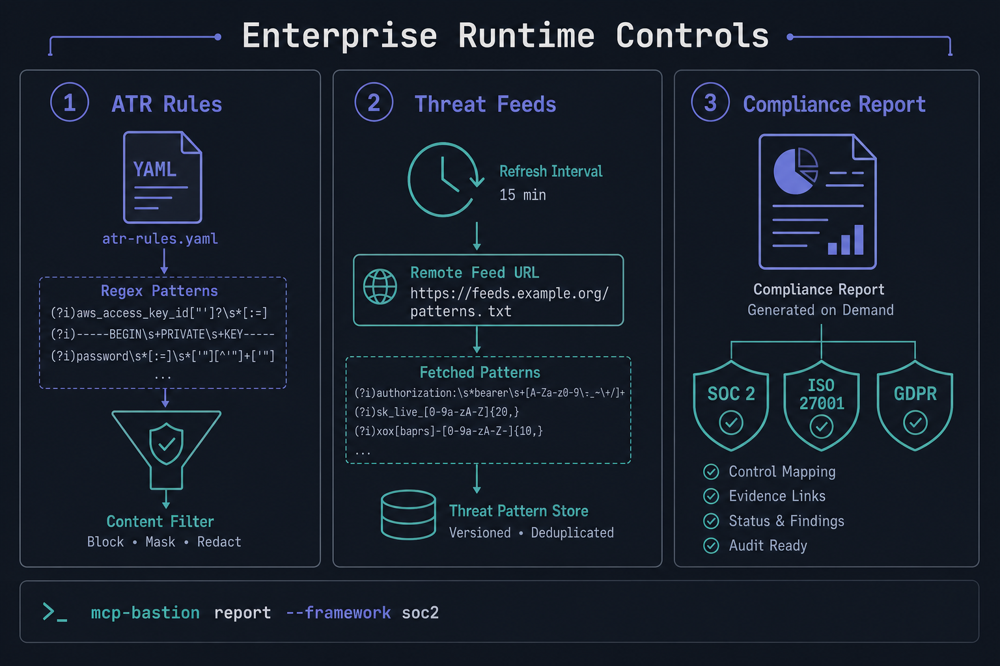
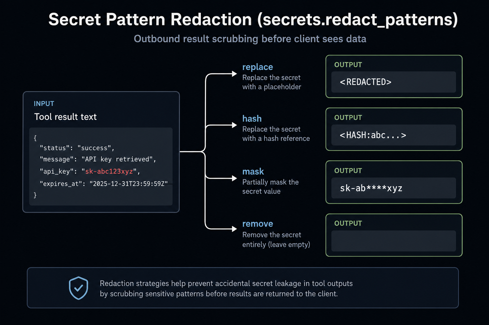

# Enterprise runtime controls (3.0+)

MCP-Bastion 3.0 adds optional runtime governance pillars for production MCP deployments.
All features are **opt-in** via `bastion.yaml`; defaults preserve existing 2.x behavior.

<p align="center">
  
</p>

## Pillars

| Pillar | Config key | Purpose |
|--------|------------|---------|
| Exfiltration canary | `canary_goallock` | Injects a session token into context; blocks tool arguments that echo it back |
| ATR rules | `atr_rules` | Loads community YAML threat rules; merges patterns into `content_filter` |
| Local LLM scanner | `llm_scanner` | Optional Ollama-compatible second tier; timeout-bounded, fail-open |
| Threat feeds | `threat_feeds` | Background refresh of remote regex rules into scanners |
| Auto-repave | `auto_repave` | Threshold-based automated response (rotate canary, reset scope) |
| Secret redaction | `secrets.redact_patterns` | Per-regex strategies on outbound tool results (`replace`, `hash`, `mask`, `remove`) |
| Observe mode | `mode: observe` | Logs `would_block` without denying (same as shadow mode) |

## Exfiltration canary

<p align="center">
  
</p>

A per-session token is planted into **MCP surface responses** (`prompts/get`, `resources/read`) so models that read those surfaces may carry it forward. The same snippet is exposed on `tools/call` as `context.metadata["bastion_canary_snippet"]` for host integrations that assemble system prompts outside MCP. If tool-call arguments contain the active token, Bastion treats it as likely context exfiltration and raises **-32025**.

> **Host integrations:** Bastion sits at the MCP tool boundary, not inside the LLM prompt. For custom orchestrators, copy `bastion_canary_snippet` from request metadata into your system prompt if the model never calls `prompts/get` or `resources/read`.

```yaml
canary_goallock:
  enabled: true
  token_prefix: BASTION-CANARY-
  rotate_on_detection: true
```

## ATR rules, threat feeds, and compliance reports

<p align="center">
  
</p>

- **ATR rules:** YAML files under `atr-rules/` (see `sample-exfiltration.yaml`). Patterns merge into `content_filter` and can raise **-32027**.
- **Threat feeds:** Optional background refresh from remote JSON pattern lists.
- **Compliance reports:** Framework-mapped summaries from audit JSONL (evidence only, not certification).

```bash
mcp-bastion report --framework soc2 --audit ./audit.jsonl --output report.md
```

Supported framework keys: `soc2`, `iso27001`, `gdpr`, `nist_ai_rmf`.

## Secret pattern redaction

<p align="center">
  
</p>

```yaml
secrets:
  redact_patterns:
    - rule: "sk-[A-Za-z0-9]{20,}"
      strategy: mask
      mask_prefix: 4
      mask_suffix: 4
```

## Quick start

Copy blocks from `bastion.yaml.example` or `examples/bastion-runtime-governance-3.0.yaml`:

```yaml
mode: enforce

canary_goallock:
  enabled: true

atr_rules:
  enabled: true
  rules_dir: ./atr-rules
```

Validate and run:

```bash
mcp-bastion validate --config bastion.yaml
mcp-bastion serve --config bastion.yaml --http 8080
```

## Observe mode

Set `mode: observe` to evaluate all pillars without denying requests. Block events appear in `context.metadata["shadow_blocked"]` and pillar traces as `would_block`.

## ATR rules directory

Place YAML rules under `atr-rules/` (see `atr-rules/sample-exfiltration.yaml`).
When vendoring third-party rule packs, keep upstream `LICENSE` files in that directory.

## Performance notes (opt-in pillars)

- **LLM scanner:** When enabled and heuristics are uncertain, adds up to **2.5s** synchronous network latency per `tools/call` (fail-open on timeout).
- **ATR rules:** Each enabled rule runs a regex scan on inbound tool text — consider consolidating rules or lowering rule count on hot paths.
- **PromptGuard + LLM scanner:** When both are enabled, Bastion reuses the PromptGuard scan result for the LLM tier (no duplicate ML inference).

## Error codes

| Code | Error | Pillar |
|------|-------|--------|
| -32025 | `CanaryExfiltrationError` | canary_goallock |
| -32026 | `LLMScannerBlockedError` | llm_scanner |
| -32027 | `ATRRuleMatchError` | atr_rules |

See [FEATURES.md](FEATURES.md) and [DEVELOPER_GUIDE.md](DEVELOPER_GUIDE.md) for the full pillar catalog.
