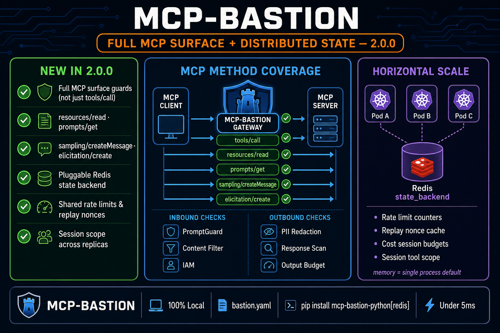

# MCP surface coverage & distributed state (2.0.0)

MCP-Bastion **2.0.0** closes two production gaps that affected every deployment:

1. **Security pillars ran only on `tools/call`**  -  other MCP methods bypassed injection, PII, and rate controls.
2. **All counters were in-process memory**  -  horizontal scale (multiple workers/pods) broke rate limits, replay protection, cost caps, and session scope.

<p align="center">
  
</p>

## Full MCP surface guards

These JSON-RPC methods now run through `_handle_guarded_surface()` in `MCPBastionMiddleware`:

| Method | Why it matters | Inbound checks | Outbound checks |
|--------|----------------|----------------|-----------------|
| **`resources/read`** | Data exfil without tool calls | IAM, replay, rate/cost, prompt/content/sensitive | PII redaction, output budget, grounding, response scan |
| **`prompts/get`** | Prompt templates are an injection vector | Same | Same (+ `messages[]` extraction) |
| **`sampling/createMessage`** | Malicious server can ask client to run LLM completions | Same | Same |
| **`elicitation/create`** | User-input solicitation (alias: `notifications/elicitation/create`) | Same | Same |

**Still `tools/call`-specific by design:** RBAC tool matrix, schema validation, semantic cache/firewall, circuit breaker, tool allowlist, tool-metadata guard on `tools/list`.

### Code reference

- Guarded method set: `GUARDED_MCP_METHODS` in `src/mcp_bastion/middleware.py`
- Handler: `_handle_guarded_surface()`
- Inbound text extraction: `_extract_inbound_text_for_method()`

### Requirements

All MCP messages must pass through the composed Bastion middleware chain. If your host only wraps `tools/call`, other methods remain unprotected.

## Pluggable shared state (`state_backend`)

For **single-process** deployments (default), `type: memory` keeps state in the local process.

For **multi-replica** deployments (Kubernetes, multiple uvicorn workers, load-balanced pods), use Redis so every instance shares:

| State | Used by |
|-------|---------|
| Rate limit / token budget counters | `TokenBucketRateLimiter` |
| Replay nonce cache | `ReplayGuard` |
| Session + daily cost totals | `CostTracker` |
| Distinct tools per session | Middleware session scope |

### Configuration

```yaml
state_backend:
  type: redis          # memory | redis
  redis_url: redis://127.0.0.1:6379/0
  key_prefix: mcp-bastion
```

Install Redis support:

```bash
pip install mcp-bastion-python[redis]
```

Environment override: `BASTION_REDIS_URL`.

### Preflight

```bash
mcp-bastion doctor --config bastion.yaml
```

When `type: redis`, doctor runs a **Redis ping** check (`state_backend_redis`).

## Production hardening (2.0.0)

| Feature | Config | CLI / install |
|---------|--------|---------------|
| JSONPath argument guards | `argument_guards` | `pip install mcp-bastion-python[policy]` |
| RBAC fnmatch globs | `rbac.permissions` |  -  |
| Audit JSONL | `audit.jsonl_path` | `mcp-bastion tail -p audit.jsonl` |
| Cost checkpoint | `cost_tracker.checkpoint_path` |  -  |

## Tests

Reproduce coverage:

```bash
PYTHONPATH=src python -m pytest tests/test_mcp_surface_guard.py tests/test_state_backend.py -v
PYTHONPATH=src python -m pytest tests/test_argument_guards.py tests/test_argument_guards_middleware.py tests/test_audit_jsonl.py tests/test_cli_tail.py tests/test_cost_checkpoint.py -v
```

Config and doctor wiring:

```bash
PYTHONPATH=src python -m pytest tests/test_config.py tests/test_doctor.py -k "state_backend" -v
```

## Hybrid stateful / stateless transport (opt-in)

For upcoming **stateless MCP** clients (explicit state handles, per-request protocol version), enable `mcp_transport` so Bastion resolves the correct FinOps / rate-limit key for both legacy sessions and stateless traffic.

<p align="center">
  
</p>

**Default OFF** - existing deployments unchanged. Pair with `state_backend: redis` when load-balancing stateless requests.

Full guide: [HYBRID_MCP_TRANSPORT.md](HYBRID_MCP_TRANSPORT.md)

## Related docs

- [HYBRID_MCP_TRANSPORT.md](HYBRID_MCP_TRANSPORT.md)  -  stateful + stateless identity, discovery, stability
- [PILLARS.md](PILLARS.md)  -  pillar ↔ `bastion.yaml` mapping
- [RUNTIME_GOVERNANCE.md](RUNTIME_GOVERNANCE.md)  -  Agent IAM & server verification
- [ROADMAP.md](ROADMAP.md)  -  shipped vs pending
- [BENCHMARKS.md](BENCHMARKS.md)  -  measured FinOps/RBAC numbers
