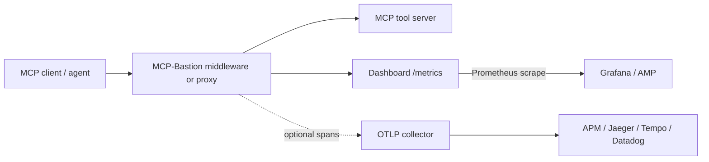
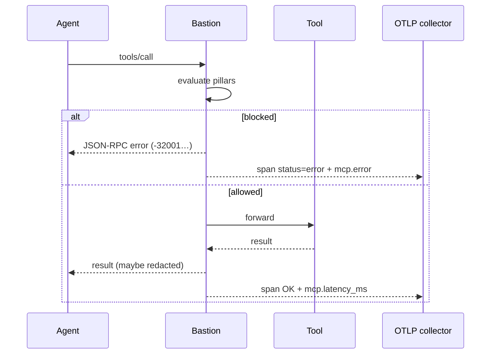
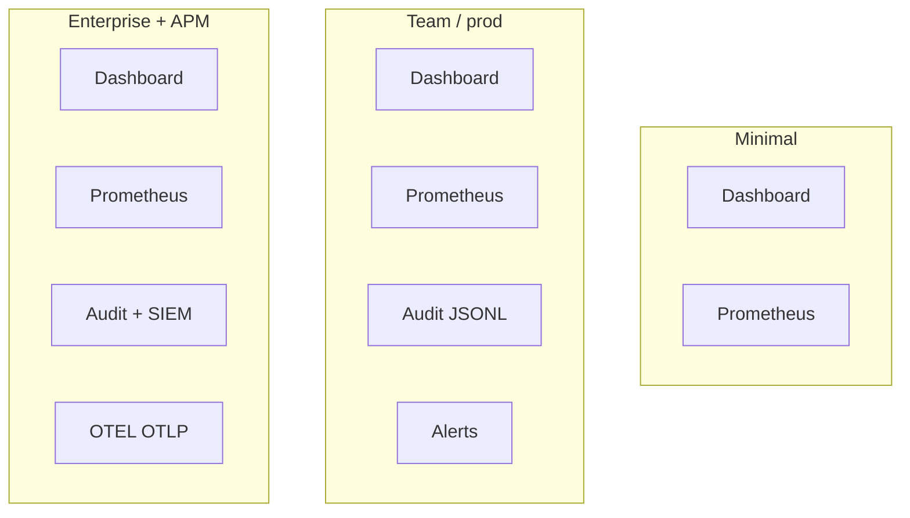

# OpenTelemetry (OTEL) — optional tracing

MCP-Bastion can export **spans** to an OTLP endpoint so Bastion decisions show up next to the rest of your services in Jaeger, Grafana Tempo, Datadog, Honeycomb, AWS ADOT, etc.

**You do not need OTEL to run Bastion.** Dashboard + Prometheus + audit JSONL cover most teams. Use OTEL when you already have (or want) distributed tracing.

Full observability map: [DASHBOARD_AND_OBSERVABILITY.md](DASHBOARD_AND_OBSERVABILITY.md).

---

## When OTEL adds value

| Situation | OTEL value |
|-----------|------------|
| Multi-service agent stack (gateway → Bastion → tools → LLM) | One trace ID across hops; see where latency/blocks happen |
| Existing APM / SRE dashboards | Bastion spans land beside app spans — no second UI to learn |
| Incident forensics | Correlate a blocked `-32001` with upstream request id |
| SLO / latency budgets | `mcp.latency_ms` on each tool span |

| Situation | Skip OTEL |
|-----------|-----------|
| Laptop / first demo | Use `mcp-bastion dashboard --demo` |
| No tracing backend yet | Prometheus scrape + audit is enough |
| Strict zero new deps | Leave `[otel]` extra uninstalled |

---

## Architecture



---

## Setup

```bash
pip install "mcp-bastion-python[otel]"
# or: pip install opentelemetry-api opentelemetry-sdk opentelemetry-exporter-otlp-proto-grpc

export OTEL_EXPORTER_OTLP_ENDPOINT=http://localhost:4317
# optional:
# export OTEL_SERVICE_NAME=mcp-bastion
```

Then run your server / `mcp-bastion serve --proxy` as usual. No Bastion code changes if you use `build_middleware_from_config()` or the audit export callback.

### Local collector (example)

```bash
# Jaeger all-in-one (OTLP gRPC 4317)
docker run --rm -p 16686:16686 -p 4317:4317 jaegertracing/all-in-one:1.57
# UI: http://localhost:16686
```

---

## Behavior

When `OTEL_EXPORTER_OTLP_ENDPOINT` is set, each tool call becomes a span:

| Span / attribute | Meaning |
|------------------|---------|
| `mcp_bastion.tool_call` | Span name |
| `mcp.tool` | Tool name |
| `mcp.action` | allow / block / redact path |
| `mcp.latency_ms` | Bastion path latency |
| `mcp.error` | Set when a pillar blocks (includes error context) |

The audit export callback (when audit + metrics are wired) calls `record_tool_span`, so policy-as-code setups get spans without extra hooks.



---

## Metrics vs traces

| Signal | Primary path | OTEL role |
|--------|--------------|-----------|
| Counters / block rates | Dashboard **Prometheus** `GET /metrics` | Optional: scrape via collector |
| Human investigation | Dashboard forensics / attack matrix | Traces add cross-service context |
| Compliance evidence | Audit JSONL / `mcp-bastion report` | Keep JSONL even if OTEL is on |

---

## Recommended combinations



1. **Minimal:** dashboard only  
2. **Team:** dashboard + Prometheus + audit (+ alerts)  
3. **Enterprise with APM:** team stack **+** OTEL  

---

## Related

- [DASHBOARD_AND_OBSERVABILITY.md](DASHBOARD_AND_OBSERVABILITY.md) — panels + “do I need OTEL?”  
- [METRICS.md](METRICS.md) — effectiveness & overhead  
- [SECURITY_OBSERVABILITY.md](SECURITY_OBSERVABILITY.md) — SIEM / fleet  
