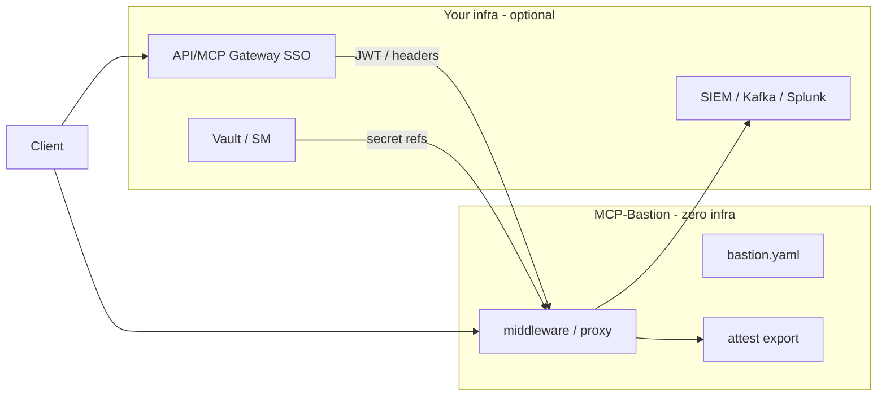

# Zero-infra strategy  -  the guardrail brain

**Guiding rule:** Stay a **zero-infra, drop-in library**. Win by being the **guardrail brain** that runs everywhere and **composes with any gateway**  -  not by becoming a gateway.

MCP-Bastion does **not** run login, store tenant databases, or require ClickHouse. It enforces **policy + live cost + attestation** on the MCP path using `bastion.yaml`, then exports proof to **your** SIEM, vault, and identity stack.

The optional **local dashboard** is the same rule applied to UX: a **read-only** view over in-process `MetricsStore` plus files you already write (`.bastion/scan/*.json`, attestations, `bastion.yaml`). Issue guides are **bundled offline**; OWASP URLs are optional outbound links only. No dashboard DB, no login, no cloud control plane. See [dashboard/README.md](../dashboard/README.md).

Competitive lens: neutralize **ThinkWatch-style gateway moats** (proxy boundary, per-user identity, SIEM, secrets) while keeping offensive wedges gateways **cannot** replicate (in-process cost policy, data-flow taint, attestation without infra).

Status key: ✅ shipped · 🟡 partial · 🔜 planned

---

## Tier 1  -  Neutralize gateway advantages (highest priority)

| Item | Status | Notes |
|------|--------|-------|
| **Sidecar/proxy from same library** (`mcp-bastion serve --proxy`) | 🟡 | Same `bastion.yaml` + middleware code; embedded **or** boundary deployment |
| **Bring-Your-Own-Identity (BYOI)** | 🟡 | Consume gateway-stamped JWT / headers; **no login server** |
| **Pluggable secrets resolver** | 🟡 | Interface + env adapter; Vault / AWS SM / GCP SM / HashiCorp via refs |
| **Pluggable SIEM exporters** | 🟡 | Webhook + OTEL + syslog today; Kafka optional extra |

### Sidecar/proxy mode

One codebase, two shapes:

```
Embedded:  Client → Your FastMCP + MCPBastionMiddleware → tools
Boundary:  Client → mcp-bastion serve --proxy URL → upstream MCP (loopback)
```

Kills the *"it's just a cooperative library"* critique. See [GATEWAY_BOUNDARY.md](GATEWAY_BOUNDARY.md), [deploy/](../deploy/README.md).

```bash
# Upstream MCP on loopback only
python my_server.py --http 9000 --host 127.0.0.1

# Bastion boundary (identical enforcement)
mcp-bastion serve --proxy http://127.0.0.1:9000/mcp --http 8080 --config bastion.yaml
```

Enable `boundary_mode` + `edge_auth` or `agent_iam` for fail-closed proxy auth.

### BYOI  -  Bring Your Own Identity

**Do not run login.** Consume an already-authenticated principal from your gateway or SSO:

```yaml
identity_adapter:
  enabled: true
  type: jwt_claim          # header | jwt_claim
  jwt_metadata_key: bastion_jwt   # token already in request metadata (gateway-stamped)
  principal_claim: sub
  role_claim: scope
  # Or header mode (gateway sets X-Principal-Id):
  # type: header
  # header: X-Bastion-Principal
  # role_header: X-Bastion-Role
```

Maps to `context.metadata` → RBAC, FinOps caps, attestation export. Counters ThinkWatch's per-user identity moat for teams with existing SSO.

### Secrets resolver (BYO vault)

```yaml
secrets:
  provider: env            # env | vault | aws_sm | gcp_sm (stubs → optional extras)
  # vault_path_prefix: secret/mcp-bastion/
```

Resolve agent tokens and upstream credentials **by reference**  -  Bastion never stores secrets in git or LLM context.

### SIEM exporters (BYO backend)

Same audit events, your sink:

| Sink | Config |
|------|--------|
| HTTP webhook | `alerts.webhooks`, `telemetry.sinks` |
| OTEL | `OTEL_EXPORTER_OTLP_ENDPOINT` |
| Syslog RFC 5424 | `telemetry.sinks` format `syslog` |
| Kafka | optional extra `[siem]` |

No ClickHouse required. See [SECURITY_OBSERVABILITY.md](SECURITY_OBSERVABILITY.md).

---

## Tier 2  -  Offensive wedge (wire-level gateways can't do)

| Item | Status | Why library-only |
|------|--------|------------------|
| **Cost-aware policy engine** | ✅ | Live spend → degrade / filter / approve / block chains  -  [COST_AWARE_GOVERNANCE.md](COST_AWARE_GOVERNANCE.md) |
| **Signed governance attestation** | ✅ | `mcp-bastion attest export`  -  hash-chained proof, any file/SIEM |
| **Data-flow / taint tracking** | 🔜 | Detect secret output → external-write arg; needs in-process call graph |
| **Behavioral fingerprinting** | 🔜 | Per-agent baselines from spend + tool telemetry |

---

## Tier 3  -  Distribution / network effects

| Item | Status |
|------|--------|
| Framework adapters (FastMCP, MCP SDK, LangChain, LlamaIndex, Bedrock AgentCore) | ✅ integrations/ |
| Policy packs / registry (shareable `bastion.yaml` bundles) | 🔜 |
| **"Runs where a gateway can't"** messaging | ✅ serverless, edge, CI, air-gapped, laptop |

Market explicitly: **no chokepoint, no new attack surface, no ops.**

---

## Tier 4  -  Credibility (honesty gaps)

| Item | Status |
|------|--------|
| Non-gated default injection model | 🟡 `prompt_guard.use_ungated_default` |
| Real embedding semantic cache/firewall | 🔜 replace lexical Jaccard |
| DAN name false positive | ✅ `\bDAN\s+mode\b` |
| Third-party security audit | 🔜 doc-only until vendor engaged |
| Injection efficacy benchmark | ✅ `benchmarks/injection_efficacy.py` |

---

## Compose field  -  how teams combine stacks



**Maximize compose:** Gateway for SSO and routing; Bastion for MCP-specific governance, cost policy, and attestation  -  embedded or `--proxy`.

---

## Non-goals (stay a library)

- Unified OpenAI/Anthropic API proxy
- MCP app store / multi-tenant admin console
- Running OAuth login servers or credential vaults as a service
- Mandatory ClickHouse / managed SIEM

---

## Related docs

- [COMPARISON.md](COMPARISON.md)  -  vs scanners, gateways, ThinkWatch
- [ROADMAP.md](ROADMAP.md)  -  release train
- [COST_AWARE_GOVERNANCE.md](COST_AWARE_GOVERNANCE.md)  -  flagship bet
- [INTEGRATION_MODELS.md](INTEGRATION_MODELS.md)  -  embed vs proxy
