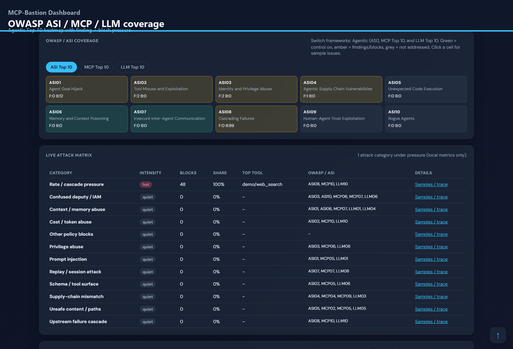
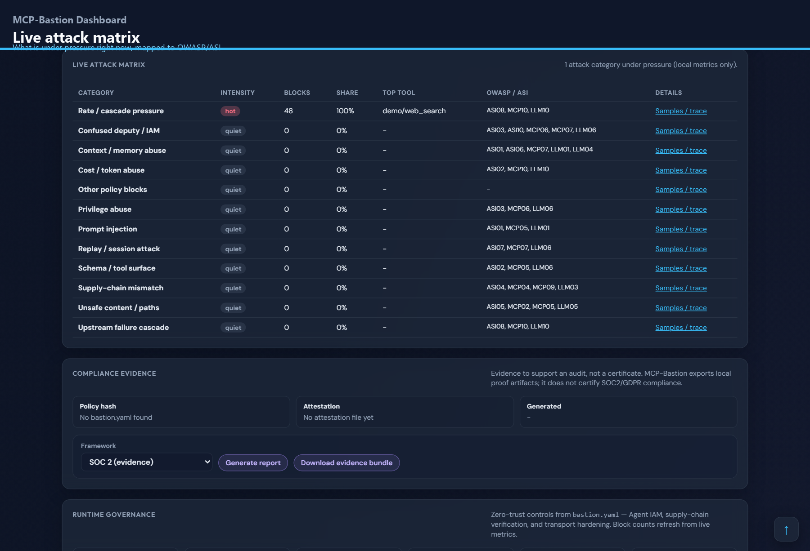
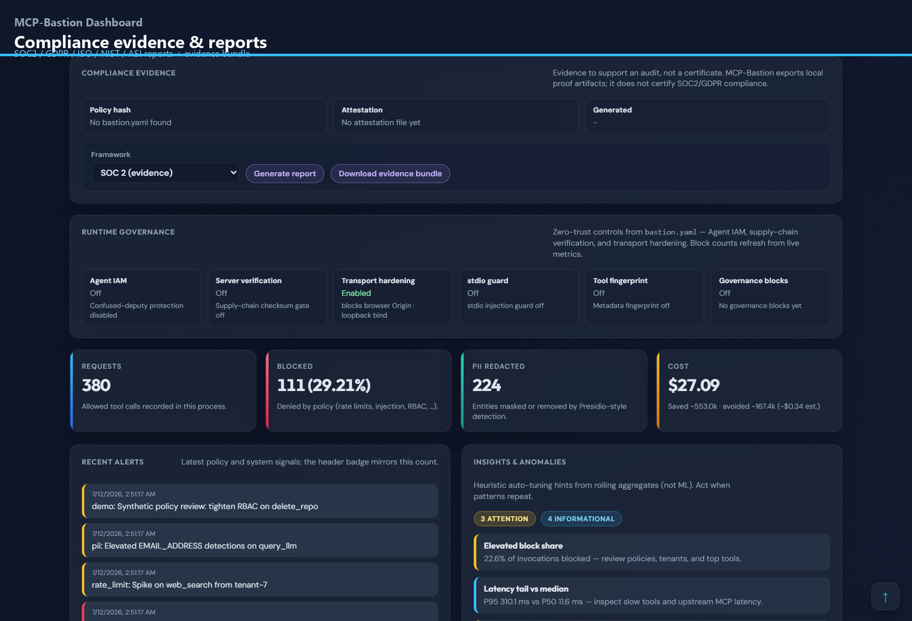
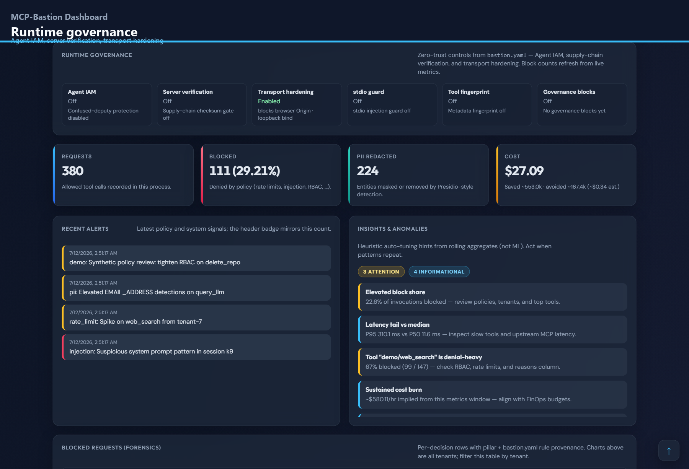
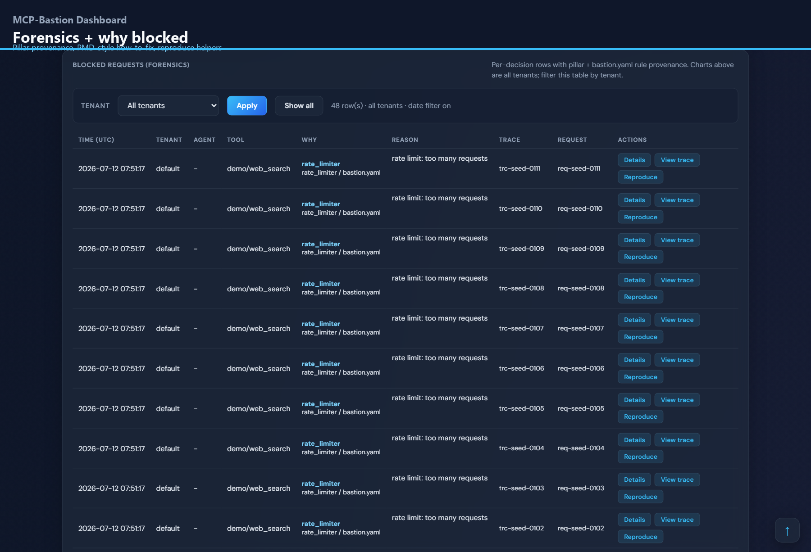
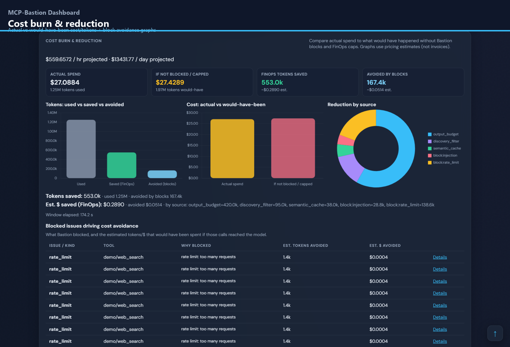
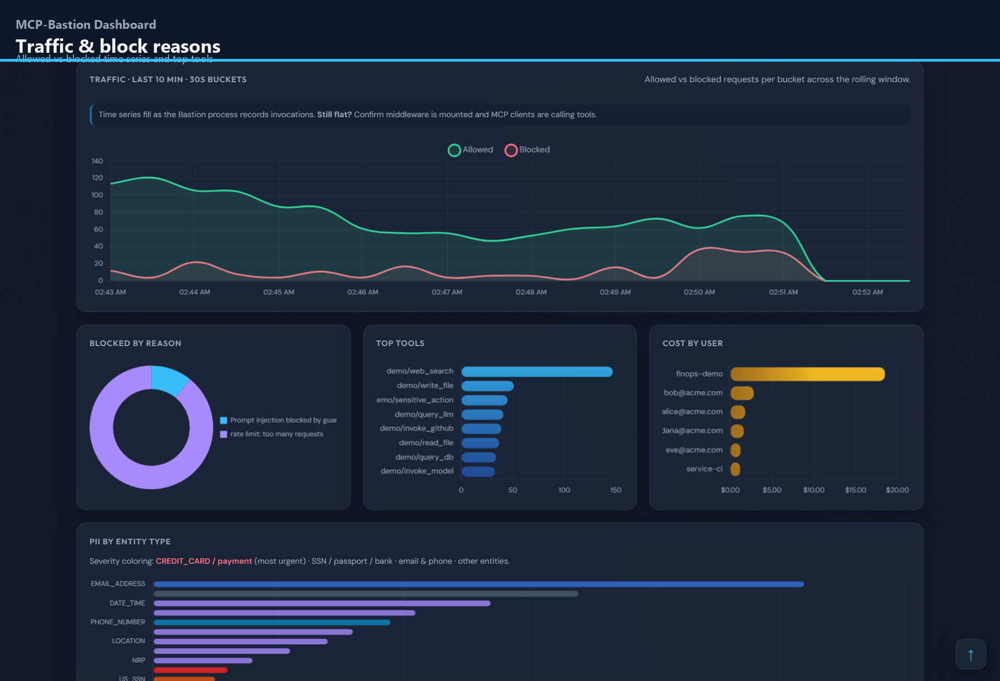

# Dashboard demo captures

Generated by `scripts/capture_dashboard_demo.py` against a local demo dashboard.

| Slide | Feature |
|-------|---------|
|  | **Security overview** — KPIs + posture grades + runtime telemetry in one glance |
|  | **Pre-deploy posture + prevalidation** — Letter grades + Sonar-style issue list from local scan JSON |
|  | **OWASP ASI / MCP / LLM coverage** — Agentic Top 10 heatmap with finding + block pressure |
|  | **Live attack matrix** — What is under pressure right now, mapped to OWASP/ASI |
|  | **Compliance evidence & reports** — SOC2 / GDPR / ISO / NIST / ASI reports + evidence bundle |
|  | **Runtime governance** — Agent IAM, server verification, transport hardening |
|  | **Forensics + why blocked** — Pillar provenance, PMD-style how-to-fix, reproduce helpers |
|  | **Cost burn & reduction** — Actual vs would-have-been cost/tokens + block avoidance graphs |
|  | **Traffic & block reasons** — Allowed vs blocked time series and top tools |

Published assets:
- `images/mcp-bastion-dashboard.png` (README hero collage)
- `images/mcp-bastion-dashboard-tour.gif` (feature walkthrough)
- `images/mcp-bastion-dashboard-tour.png` (first frame)
