# Dashboard demo captures

Generated by `scripts/capture_dashboard_demo.py` against a local demo dashboard.

| Slide | Feature |
|-------|---------|
| 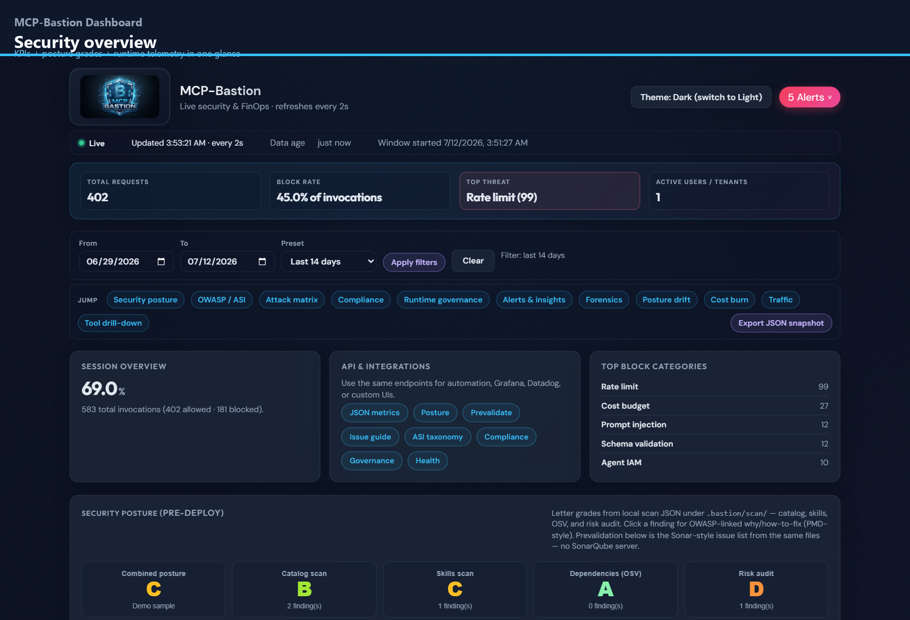 | **Security overview** - KPIs + posture grades + runtime telemetry in one glance |
| 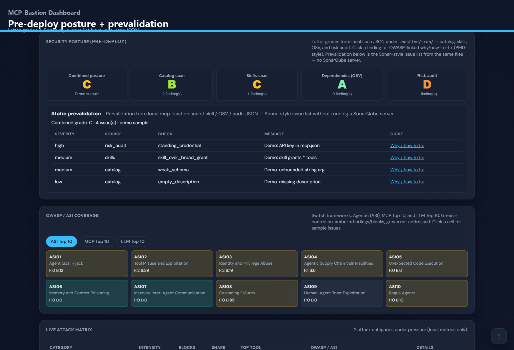 | **Pre-deploy posture + prevalidation** - Letter grades + Sonar-style issue list from local scan JSON |
| 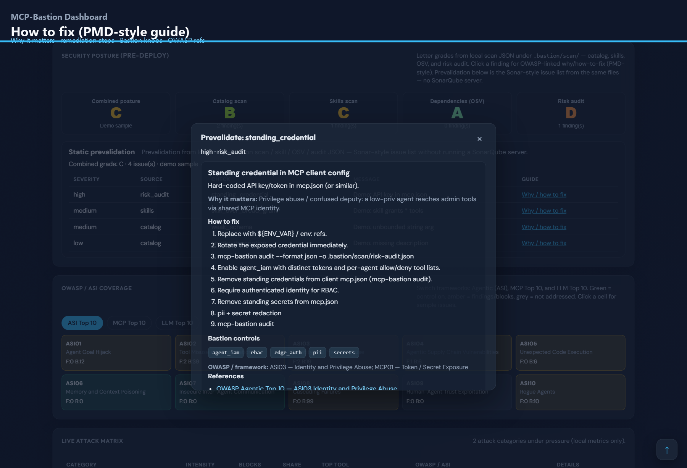 | **How to fix (PMD-style guide)** - Why it matters · remediation steps · Bastion knobs · OWASP refs |
| 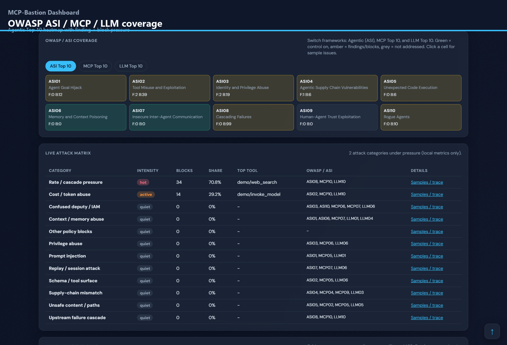 | **OWASP ASI / MCP / LLM coverage** - Agentic Top 10 heatmap with finding + block pressure |
| 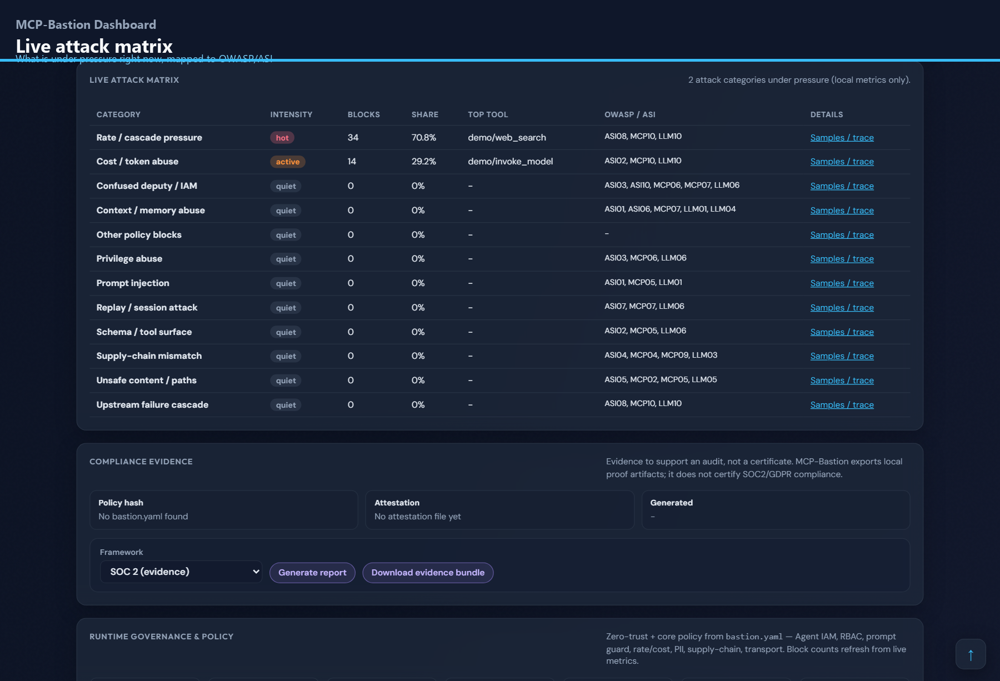 | **Live attack matrix** - What is under pressure right now, mapped to OWASP/ASI |
| 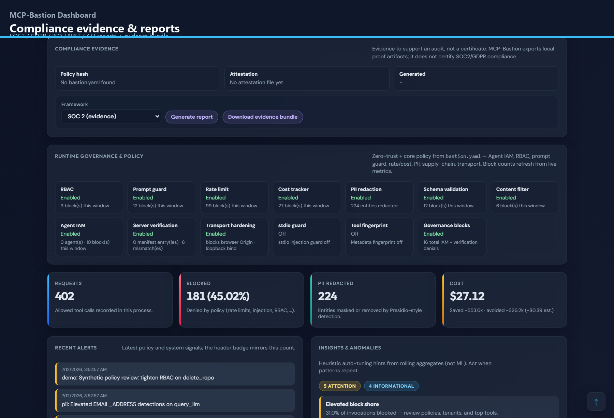 | **Compliance evidence & reports** - SOC2 / GDPR / ISO / NIST / ASI reports + evidence bundle |
| 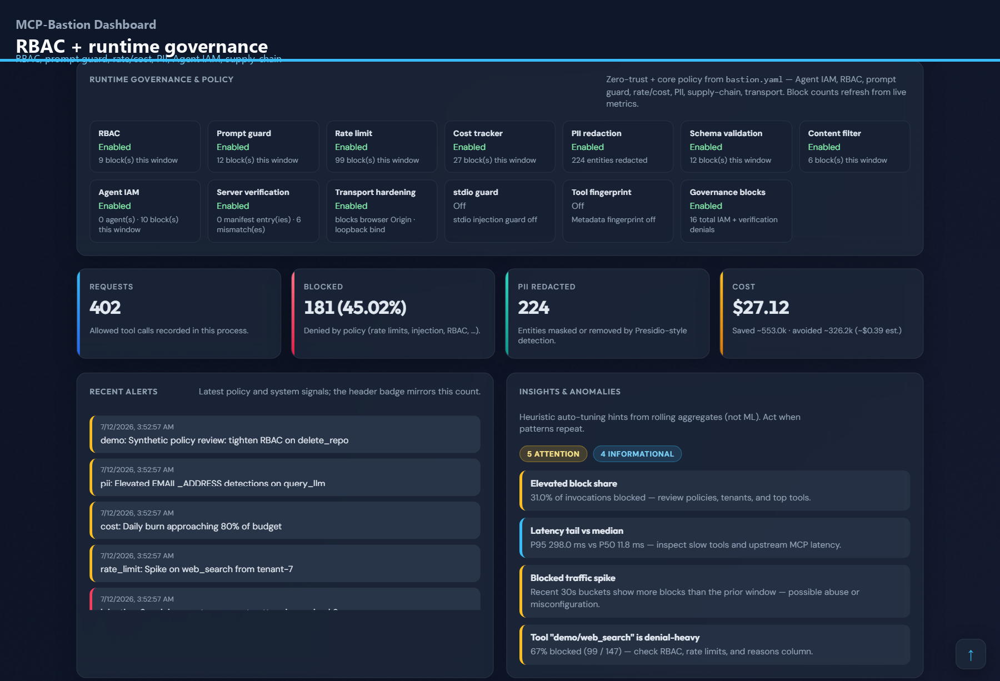 | **RBAC + runtime governance** - RBAC, prompt guard, rate/cost, PII, Agent IAM, supply-chain |
| 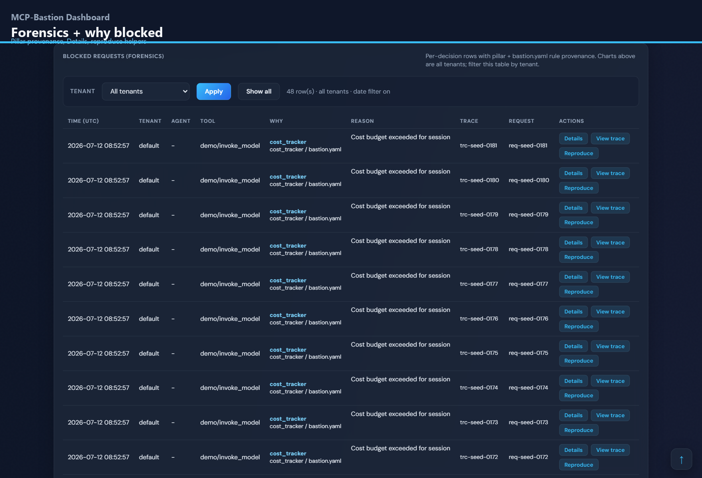 | **Forensics + why blocked** - Pillar provenance, Details, reproduce helpers |
| 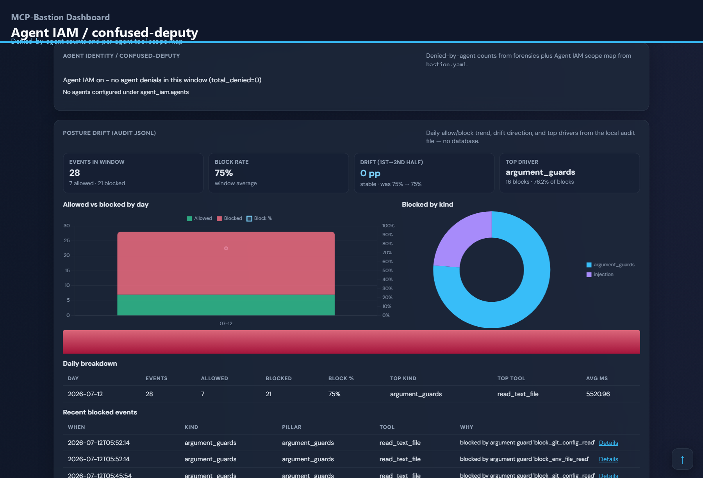 | **Agent IAM / confused-deputy** - Denied-by-agent counts and per-agent tool scope map |
| 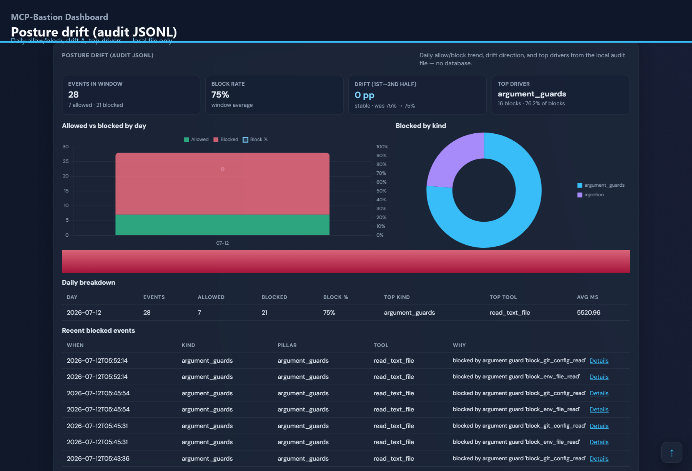 | **Posture drift (audit JSONL)** - Daily allow/block, drift Δ, top drivers - local file only |
| 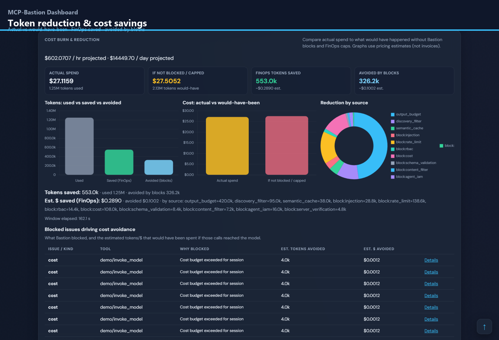 | **Token reduction & cost savings** - Actual vs would-have-been · FinOps saved · avoided by blocks |
| 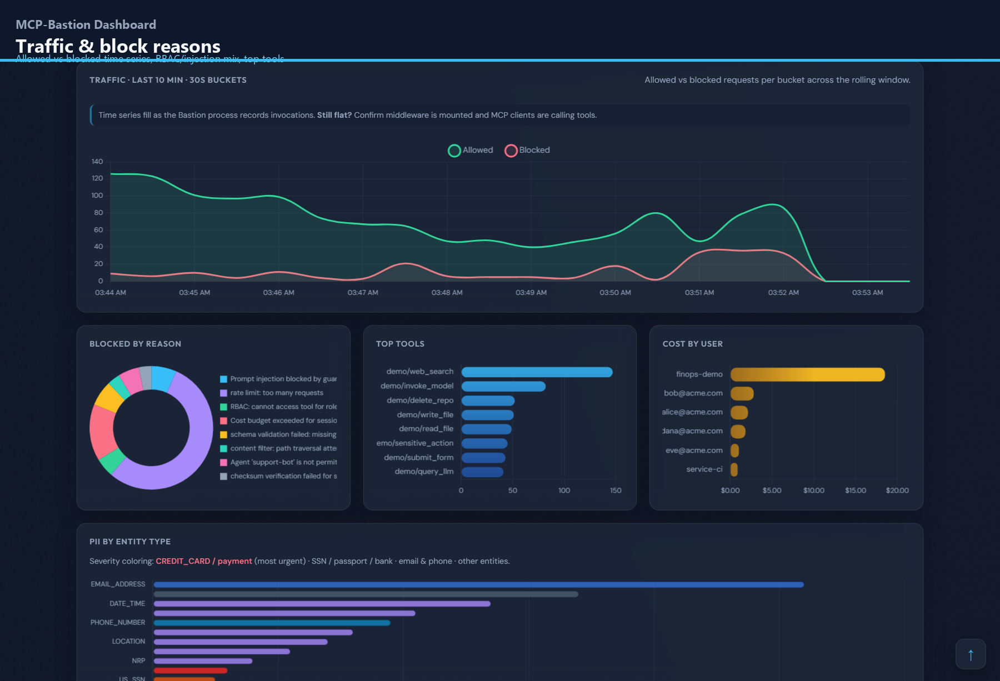 | **Traffic & block reasons** - Allowed vs blocked time series, RBAC/injection mix, top tools |

Published assets:
- `images/mcp-bastion-dashboard.png` (README hero collage)
- `images/mcp-bastion-dashboard-tour.gif` (feature walkthrough)
- `images/mcp-bastion-dashboard-tour.png` (first frame)
